# activetheory.net 渲染与动效拆解报告

> 目的：学做法，不拷资产。全程没有下载或保存对方的模型、贴图、字体文件——只记录了文件名、大小、分辨率（从文件头读取后即丢弃），以及为说明原理而摘录的少量 shader / JS 片段。
> 采集日期：2026-09-22 · 视口 1440×900 · 站点自动选了最高画质档（DPR 2，画布 2880×1800）

---

## 0. 这份报告是怎么测出来的（先说限制）

我是在云端容器里工作的，没有你桌面上的 Chrome 窗口，所以不能像你那样点开 DevTools 面板、从扩展商店装 Spector 插件。我用了等价但自动化的办法：

| 你要求的做法 | 我实际的做法 | 差别 |
|---|---|---|
| DevTools → Network 按扩展名筛选 | Playwright 驱动 Chromium，记录每个请求的 URL/类型/字节数，并从文件头读出贴图分辨率；做成表格截图（`screenshots/net_home.png`、`net_work.png`），原始数据在 `assets_home.csv`、`assets_work.csv` | 大小是**解压后**字节，比 DevTools 里的"传输大小"偏大 |
| 安装 Spector.js 插件抓一帧 | ① 自己写了一段 WebGL 拦截脚本（在页面加载前注入，记录每个 draw call、帧缓冲、纹理、shader 源码，和 Spector 记录的是同一层东西）；② 另外把 Spector.js 库注入页面，用它的界面实拍了一帧，数字对得上（见 §3.5） | 结论数据来自①，更完整 |
| 录屏 | 用"虚拟时钟"逐帧推进页面动画（每帧 1/30 秒），每帧截图，再合成 30fps 视频 | 画面是平滑的，但鼠标轨迹是脚本画的；不是实时录屏 |

另外三个会影响画面的因素：

1. **软件渲染 + GPU 伪装**：容器里没有显卡，用的是 SwiftShader（CPU 模拟 GPU）。网站有显卡黑名单，看到 SwiftShader 会把你踢到 `/unsupported`。我把显卡名字伪装成 "GTX 1660"，网站于是开了**最高档**画质。这反而正好：我们看到的是它在好显卡上的完整管线。
2. **视频纹理是静止的**：开源版 Chromium 不带 H.264 解码器，所以站点的 `reel.mp4`（它被当成全站很多材质的"光源/反射"）只显示首帧 `reel-frame.jpg`。真实 Chrome 里这些反光、粉色光带是**会流动的**。
3. **MSDF 小字发虚**：导航里的 "WORK / CONTACT" 在软件渲染下有锯齿，真机上是清晰的。

---

## 1. 一句话结论

**这个站的视觉主要靠"后期合成 + shader 动效"撑起来，不是靠模型或贴图质量。** 模型都很轻（主物体一节椎骨 15 KB，Logo 15 KB），贴图大多是 512–1024 的通用材质库（裂纹、路面、岩石法线），真正花力气的是：每帧 ~40 个渲染目标串起来的后期链（体积光、Bloom、镜头光条、色散、颗粒、磨砂玻璃扭曲）、一个真的鼠标流体模拟、GPU 粒子，以及"把一段视频当成光源/反射贴到所有玻璃材质上"这个小聪明。

---

## 2. 资源清单

完整清单见截图 `screenshots/net_home.png`、`screenshots/net_work.png` 和 CSV。首页刷新共 135 个请求、约 78 MB；`/work` 刷新 149 个请求、约 86 MB。**这是单页应用：不管从哪个 URL 进，它都会预载所有场景的资源**；`/work` 只比首页多了一个当前卡片的项目视频（`chile_1.mp4`，7.2 MB）。

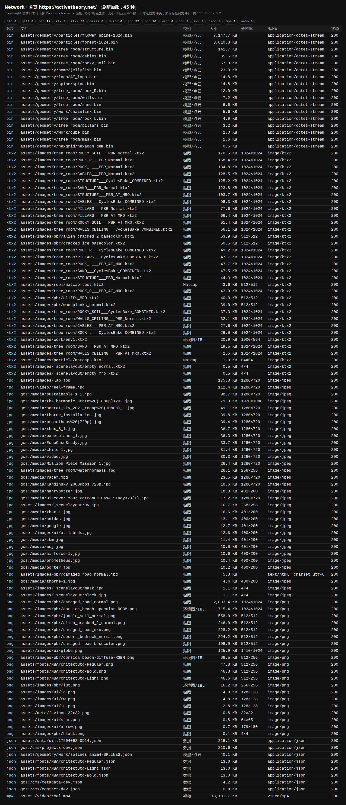

按你给的扩展名筛选的结果：

- `glb / gltf / ktx / basis / draco / hdr / exr / webp / webm`：**0 个**。
- `bin`：17 个。是他们自研引擎（Hydra）的几何格式：一段 JSON 头，后面接 **Draco 压缩**的数据。
- `ktx2`：33 个。Basis 压缩贴图，用 `basis_transcoder.wasm` 在 Web Worker 里解码。
- `png / jpg`：54 个。
- `json`：8 个。场景配置、字体排版数据、CMS 数据。
- `mp4`：首页 3 个，`/work` 4 个。

### 2.1 3D 模型 / 点云（.bin，Draco 压缩）

| 文件 | 大小 | 内容（读 JSON 头 + 帧捕获确认） | 用在哪 |
|---|---|---|---|
| `geometry/spine/spine.bin` | 15 KB | 网格：position / normal / uv，**一节椎骨**（每节 12,732 个索引） | 被程序复制 40 次、螺旋堆成"脊椎" |
| `geometry/logo/AT_logo.bin` | 15 KB | 网格，玻璃 "a" Logo | 首页中央主物体 |
| `geometry/home/jellyfish.bin` | 24 KB | 网格，水母（实例化 ×4） | 首页漂浮 |
| `geometry/particles/flower_spine-1024.bin` | **7.3 MB** | **点云**：positions + colors，1024×1024 ≈ 105 万点 | 首页/页脚的"花/脊椎"粒子 |
| `geometry/particles/forest-1024.bin` | 3.1 MB | 点云：positions + colors | 粒子"森林" |
| `geometry/tree_room/structure.bin` 等 9 个 | 1.6–145 KB | Blender 建的"树场景"房间：结构、线缆、柱子、岩石、沙、墙 | TreeScene（滚动到 ~14000px 处） |
| `geometry/work/chainlink.bin` / `cube.bin` | 6 KB / 2 KB | 链环（实例化 ×80）、立方体 | 作品区 |
| `geometry/work/splines_anim4-SPLINES.json` | 41 KB | 样条曲线数据 | 粒子/管子沿曲线流动 |

点云还有 `-128 / -256 / -512` 三个低配版本，按显卡档位选一个加载。

### 2.2 贴图（主要的）

| 文件 | 分辨率 | 大小 | 用途 |
|---|---|---|---|
| `pbr/alien_cracked_2_normal.png` | 512² | 252 KB | 法线：Logo、水母、双环柱 |
| `pbr/alien_cracked_2_basecolor.ktx2` | 512² | 55 KB | 底色：脊椎 |
| `pbr/damaged_road_normal.png` | 1024² | 2.0 MB | 法线：脊椎；**以及最终合成里的"磨砂玻璃"扭曲** |
| `pbr/cliffs_MRO.ktx2` | 512² | 41 KB | 金属/粗糙/AO 三合一：脊椎、管子 |
| `room/matcap-test.ktx2` | 512² | 45 KB | 通用 matcap（代替环境光） |
| `particle/matcap3.ktx2` | 64² | 2 KB | 粒子"气泡"质感 |
| `pbr/desert_bedrock_normal.png` | 512² | 230 KB | 树场景水面的波纹法线 |
| `tree_room/waternormals.jpg` | 256² | 27 KB | 作品卡玻璃的水波法线 |
| `tree_room/*_CyclesBake_COMBINED.ktx2` ×8 | 1024² | 27–128 KB | **Blender Cycles 烘焙好的整体光照** |
| `tree_room/*_PBR_Normal / *_PBR_AT_MRO.ktx2` ×16 | 1024² | 3–175 KB | 树场景的法线 / MRO |
| `pbr/damaged_road_basecolor / _mro.png` 等 | 512² | 200–570 KB | 链条等杂项 |
| 字体图集 `fonts/NBArchitektStd-*.png` + `.json` | 512×256 | 48 KB | MSDF 文字（WebGL 里画字） |
| 作品缩略图 `gcs:/media/*.jpg` ×24 | 1280×720（logo 400×200） | 10–100 KB | 作品卡封面 |

### 2.3 环境图（IBL）

| 文件 | 分辨率 | 说明 |
|---|---|---|
| `pbr/corsica_beach-diffuse-RGBM.png` | 512×256 | 漫反射环境，RGBM 编码（用 PNG 存 HDR） |
| `pbr/corsica_beach-specular-RGBM.png` | 1024² | 高光环境（按粗糙度分层） |
| `pbr/lut.png` | 256² | BRDF 查找表 |
| `work/env1.ktx2` | 1000×564 | 作品卡玻璃的反射环境 |

没有 `.hdr` / `.exr`。**大部分主物体其实不用这套 IBL，而是用 matcap + 屏幕折射**（见 §3）。

### 2.4 视频

| 文件 | 大小 | 说明 |
|---|---|---|
| `video/reel.mp4` | 18.5 MB | 全站共用的**视频纹理**（`tVideo`）。在 Logo、双环柱、水母、水面、天花板、粉色光带等材质里都被采样 |
| `video/reel-frame.jpg` | 1280×720，115 KB | 视频没加载好时顶替的首帧 |
| `gcs:/media/<项目>.mp4` | 每个 2–19 MB，共 65 个，合计 828 MB | 作品视频。只在该卡片**离相机最近**时才加载播放（如 `paperplanes_1.mp4` 7.6 MB、`chile_1.mp4` 7.2 MB） |

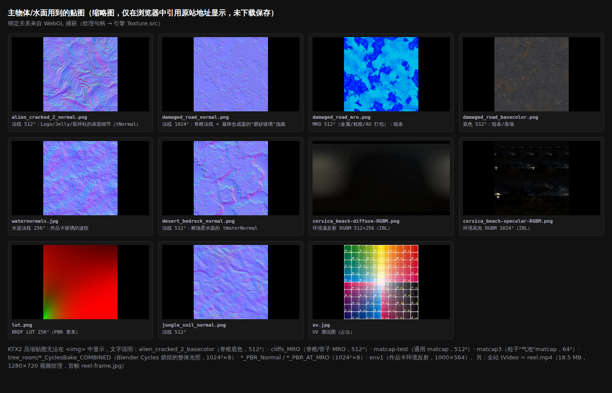

### 2.5 重点问题：中央那个"树 / 脊椎"是模型还是程序生成？

网站里其实有三个"树 / 脊椎"一样的东西，做法各不相同（位置见总览 `screenshots/scroll_map_sheet.jpg`）：

1. **首页顶部和作品区的"脊椎"**：用**加载的小模型 + 程序摆放**。`spine.bin` 只是一节椎骨（15 KB）。代码里循环 40 次，每节下移 0.65、转 0.4 弧度（约 23°），用一次实例化绘制（帧捕获里 `SpineShader inst=40`）堆成螺旋。见 `screenshots/js_6_layout.png`。
2. **首页 / 页脚那团红橙色"花脊椎、森林"**：用**加载的点云**（`flower_spine-1024.bin`、`forest-1024.bin`）。每个点自带位置和颜色（像是从 Blender / Houdini 模型上采样出来的），再在 GPU 上用 shader 让点云旋转、扭成螺旋、随滚动下落。
3. **TreeScene 里笼子中的那棵"树"**：笼子、线缆、岩石是 Blender 建模，**光照在 Blender Cycles 里预先烘焙**进贴图。中间那团"树"是 **65,536 个点精灵**（`LogoParticleShader`，帧捕获实测）。

**颜色 / 法线 / 粗糙度是贴图还是 shader 算的？两者混合，而且 shader 的比重更大：**

- **贴图提供"底子"**：法线（`damaged_road_normal`、`alien_cracked_2_normal`）、MRO 粗糙度（`cliffs_MRO`）、底色（`alien_cracked_2_basecolor`）。都是通用的可平铺材质，不是为这个模型专门画的。
- **Shader 决定"长相"**：
  - 光照用 **matcap**（一张球形光照图）代替真实环境光，粗糙度只是用来决定 matcap 采样的范围。
  - 玻璃感来自**屏幕空间折射**：先把整个场景渲一遍存成图，玻璃物体按法线偏移去采样这张图。
  - 彩虹边是**菲涅尔 + 手写彩虹渐变函数**，完全是代码算的。
  - 还叠了一层**视频纹理**，并做色相偏移。
  - 粒子颜色来自点云自带颜色，再叠一张 64² 的气泡 matcap。

---

## 3. WebGL 帧分析（相当于 Spector 的内容）

在四个位置各抓了一帧，截图分别是 `screenshots/frame_hero.png`、`frame_home_mid.png`、`frame_work.png`、`frame_tree.png`：

| 位置 | draw call 数 | 本帧用到的渲染目标数 | 主画面分辨率 |
|---|---|---|---|
| 首页开屏（scroll 0） | **57** | 41 | 2880×1800，**同时输出 3 张图（MRT）** |
| 首页中段（scroll 2400） | 56 | 41 | 同上 |
| 作品区（scroll 7200） | **77** | 37 | 2880×1800，MRT×2 |
| 树场景（scroll 15100） | 65 | 37 | 2880×1800 |

全站一共创建了 106 个帧缓冲、125 个 shader 程序、212 张纹理。**draw call 很少**（57–77），因为大量东西是实例化或点精灵一次画完。

### 3.1 渲染目标（按一帧里的执行顺序）

| 渲染目标 | 分辨率 | 做什么 |
|---|---|---|
| 场景主 RT | 2880×1800（DPR 2），**MRT×3**：颜色 / 折射用 / 体积光用 | 所有 3D 物体。一次绘制同时写 3 张图 |
| 折射快照 | 2880×1800 | 上一帧场景拷贝，给玻璃采样 |
| 体积光链 | 288×180（1/10 分辨率）×4 | 两次高斯模糊 + 一次径向模糊（god rays） |
| 场景合成 | 2880×1800 | 对比度 + 加体积光 |
| 鼠标流体 | 速度/压力/散度/涡度 256²，染料 512²，mask 1440×900 | 每帧 13 个 pass（见 §4） |
| 粒子/管子模拟 | 128²、32²、256² | GPU 算粒子位置（位置存在纹理里） |
| 镜头光条（lens streak） | 1440×450 → 一路减半到 11×450 → 再升回 | 横向变形镜头光条（只压宽度） |
| 场景切换 | 2880×1800 | 段落之间的噪声圆形擦除过渡 |
| Bloom | 216×135 → 108×68 → 54×34 | 3 级高斯 mip，再合回去 |
| 水面镜像（树场景） | 1024² | 镜像相机再渲一次场景 |
| 作品卡 UI | 每张可见卡 1024² | 把卡片上的 logo 和文字先画进纹理，再贴到 3D 卡片上 |
| 屏幕 | 画布 | 最终合成 + 导航 + 文字 |

### 3.2 后期处理有几道？

主要 **6 道**，按顺序：

1. **体积光 / god rays**：从发光物体的"体积光" MRT 输出做径向模糊，1/10 分辨率。首页强度 1.1。
2. **场景合成**：对比度 0.98 / 1.2。
3. **段落切换过渡**：噪声扰动的圆形擦除，外加轻微色散。
4. **Bloom**：UnrealBloom 式 3 级 mip，阈值 0（全部亮部都发光）。强度按段落不同，约 0.5–1.2。
5. **镜头光条**：横向拉长的光斑。
6. **最终合成（GlobalComposite，一个 pass 做完）**：
   - 鼠标流体扭曲 + "磨砂玻璃"：用一张法线图偏移 UV，右上角最明显。
   - **色散**：RGB 三通道错位采样，强度随流体边缘和滚动速度变化。
   - 对比度。
   - 加 Bloom、加光条。
   - **四角噪声彩色渐变**：画面角落缓慢流动的青、紫色光。
   - **胶片颗粒**：overlay，强度 0.15。
   - 开场淡入。

**没有**：景深、SSAO、屏幕空间反射、FXAA（抗锯齿靠 DPR 2 超采样）。雾只在个别材质里用。

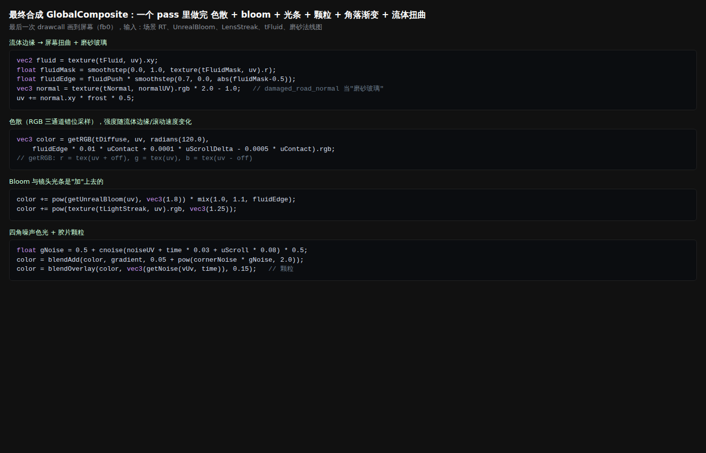

### 3.3 主物体用了哪些贴图

用"纹理句柄 → 引擎里的 Texture.src"反查得到，并和配置文件 `uil.json` 交叉核对：

- **玻璃 Logo（HomeLogoShader）**：
  - `tMap = matcap-test`，UV 随时间旋转，当底纹用。
  - `tNormal` = 岩石法线（`alien_cracked_2_normal` / `desert_bedrock_normal`）。
  - `tRefraction` = 场景快照（屏幕折射）。
  - `tVideo = reel.mp4`。
- **脊椎（SpineShader）**：
  - `tBaseColor = alien_cracked_2_basecolor`
  - `tNormal = damaged_road_normal`
  - `tMRO = cliffs_MRO`
  - `tMatcap = matcap-test`
  - `tRefraction`（屏幕折射）
- **双环柱（HomeColumnShader）**：屏幕折射 + 视频 + 法线。
- **树场景各部件（TreeFBR）**：`*_CyclesBake_COMBINED`（烘焙光照）+ `*_PBR_Normal` + `*_PBR_AT_MRO`，每个部件 3 张 1024²。

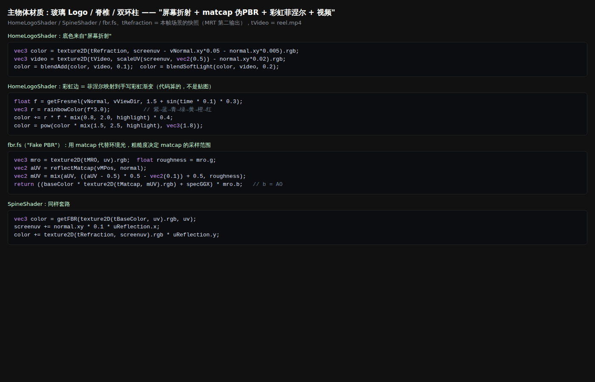

### 3.4 粒子是怎么画的、多少个

- **绘制方式**：`GL_POINTS` **点精灵**。片元里用 `gl_PointCoord` 裁成圆，再贴一张旋转的 64² matcap 当"气泡"。
- **运动方式**：GPGPU，也就是把每个点的位置存进一张浮点纹理，每帧用一个全屏 pass 更新。更新规则有三条：
  - 往目标点（或样条上的点）弹回；
  - 加 curl 噪声；
  - 被鼠标流体的速度推开（先把点投影到屏幕，在流体纹理上取速度，再转回 3D）。
- **数量**：
  - 树场景：实测一次绘制 **65,536 点**，外加 1,000 个漂浮点。
  - 首页 / 页脚的大点云：代码配置按显卡档位分级，16,384 / 65,536 / 262,144 / 524,288 / 1,048,576 五档。最高档加载 `-1024` 文件，约 **105 万点**。
  - 首页那串白色"光管"：**1,365 根实例化的小管子**，每根 216 个索引，由 128² 的粒子模拟驱动（`TubesInteraction`）。它们**跟着鼠标轨迹飞**：静止时排在 Logo 上方，鼠标一划就沿轨迹拉成一条光带（见 `videos/fluid.mp4`）。
- 说明：首页那两帧里大点云没有被绘制。原因是我在捕获时直接"跳"到滚动位置，跳过了它的淡入触发；逐帧滚动录的视频里它是正常出现的。上面的点数取自配置和文件分辨率。

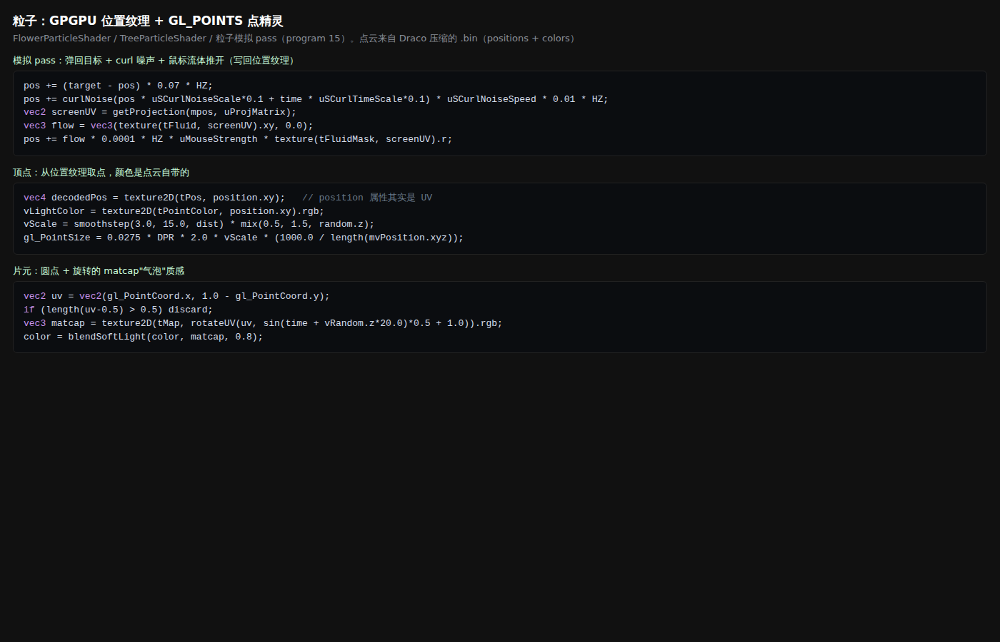

### 3.5 Spector.js 实拍

我把 Spector.js 0.9.30 注入页面。前两次它提示 "No frames detected"：网站在启动时就把 `requestAnimationFrame` 存成了自己的引用，Spector 后装的钩子拦不到。第三次先在页面启动前放了一个转发函数，Spector 才正常抓到一帧（实时渲染，首页）：**1,397 条 WebGL 命令、56 个 draw call**，和我自己的拦截结果（56–57）一致。

| 截图 | 内容 |
|---|---|
| `spector_0_information.png` | 上下文信息：WebGL2，`antialias:false`、`alpha:false`、`powerPreference: high-performance`。命令统计：总 1,407 条，其中 draw 56、clear 34、bindFramebuffer 106。这一次画布是 2160×1350：实时帧率太低，站点自动把 DPR 从 2 降到了 1.5（它有自适应分辨率） |
| `spector_1_commands.png` | 命令列表：每帧先绑一个全分辨率 FBO、清屏、画一个全屏三角形（`drawArrays TRIANGLES 3`），后期 pass 基本都是这个形态 |
| `spector_2_drawcall.png` | 一个 256² 全屏 draw，右侧是**鼠标流体的染料缓冲**（红色那团就是鼠标刚划过的地方） |
| `spector_draw_logo.png` | 玻璃 Logo 的 draw call：`drawElements 14664 indices`，左侧能看到它**同时写 3 张图（COLOR_ATTACHMENT0/1/2，MRT）** |
| `spector_shader_logo.png` | 这个 draw 的片元 shader：声明了 `tMap / tVideo / tNormal / tRefraction` 四张贴图，和 §3.3 的结论一致 |

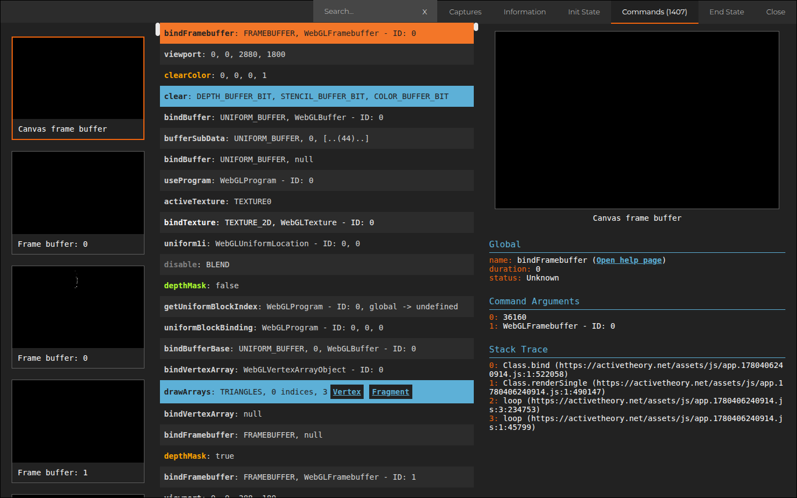
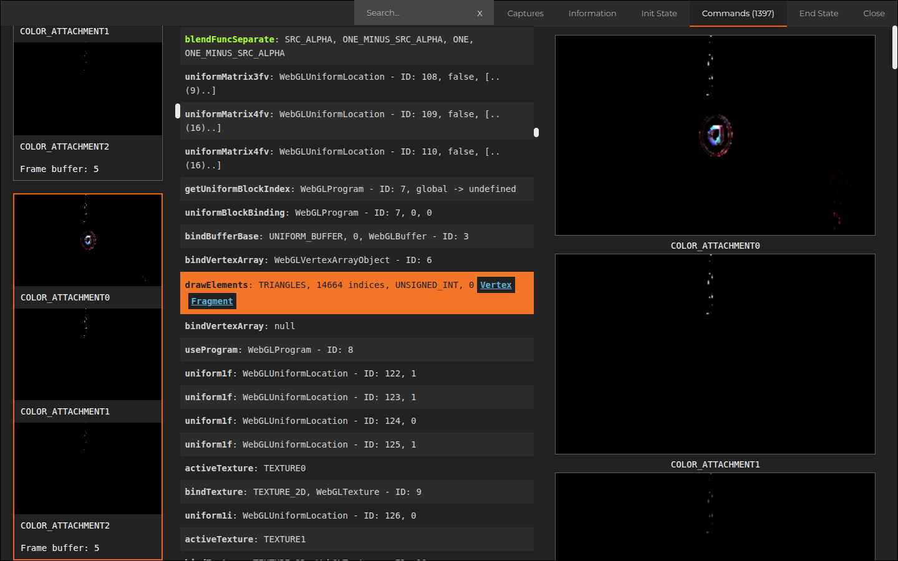
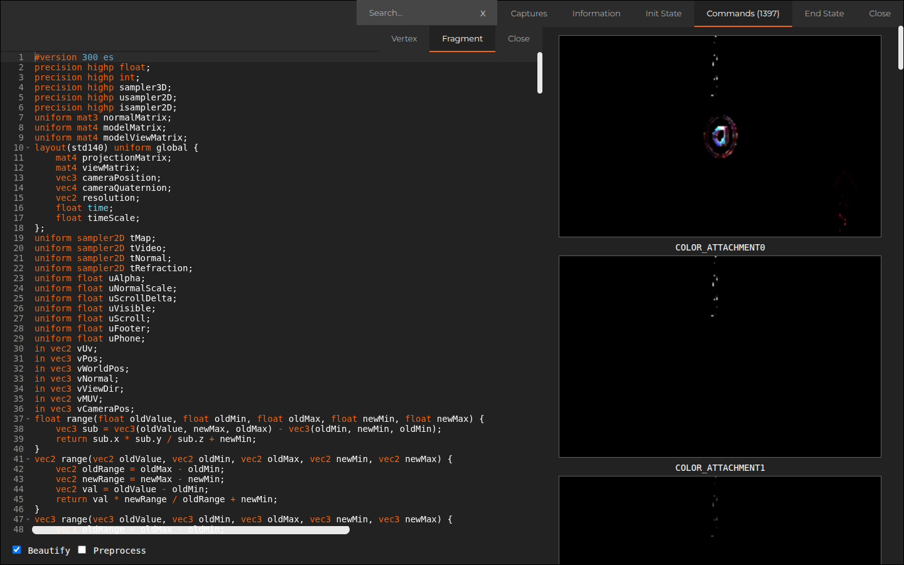

---

## 4. 水波纹 / 液态 / 流动效果：怎么实现的

站里有 **四处**看起来像"水 / 液体"的效果，做法各不相同：

| 在哪 | 看起来像 | 实际做法 | 归类 |
|---|---|---|---|
| **全屏鼠标拖尾**（首页最明显：鼠标划过，粒子被冲开、画面边缘有扭曲和色散） | 液体被搅动 | **真的 2D 流体模拟**（Navier–Stokes，同 Pavel Dobryakov 的 WebGL-Fluid 算法）：速度场 256²、染料 512²，每帧依次 splat → curl → vorticity → divergence → pressure ×5 → gradient subtract → advect。结果只作为数据用：在最终合成里扭曲 UV、加色散（d），在粒子模拟里推开粒子，在作品卡里扭动视频 UV。同时，1,365 根白色小管子沿鼠标轨迹飞行，这一路是另一套粒子模拟 | **a + d** |
| **树场景地面的水** | 有倒影的积水、细碎波纹 | **平面镜反射**（1024² 镜像 RT）+ **一张静态法线图按 4 个尺度、4 个方向滚动后叠加**，用来抖动反射的 UV。水面本身只是一个四边形（6 个索引） | **c**（程序化滚动；不是模拟，也不是序列帧） |
| **首页中段的粉色"液态光带"** | 流动的光 | 一块**弯曲的大平面**（顶点里按 UV 往后弯），贴 **reel.mp4 视频**，径向淡出。同时写进"折射"和"体积光"两张 MRT，所以玻璃 Logo 能折射到它，还会拖出 god rays | **b 的变体**：预录好的视频内容，不是法线序列 |
| **CleanRoom 的"水面天花板"**（从水下往上看的焦散网） | 焦散光纹 | 一张**静态的碎冰底色图** `cracked_ice_basecolor` 放大、做色相偏移、径向淡出，再 overlay 一点视频 | 静态贴图 + 视频（不是模拟） |

**总判断**：真的在做物理模拟的只有"鼠标流体"一处，而且它只在 256² 的小网格上算，然后**当成屏幕空间扭曲来用**。其余所有"水"都是便宜的假象：滚动法线图、镜面反射、视频、静态图。这正是它性能好的原因。

- 录屏：
  - `videos/fluid.mp4`（10 秒，首页鼠标搅动 → 流体推开粒子、扭曲画面）
  - `videos/water.mp4`（10 秒）：前半段是树场景水面，镜面倒影加滚动法线波纹；后半段继续往下滚，能看到段落切换的圆形擦除，以及 CleanRoom 那片"水面天花板"所在的段落
- Shader 摘录：`screenshots/shader_1_fluid.png`、`screenshots/shader_3_water.png`

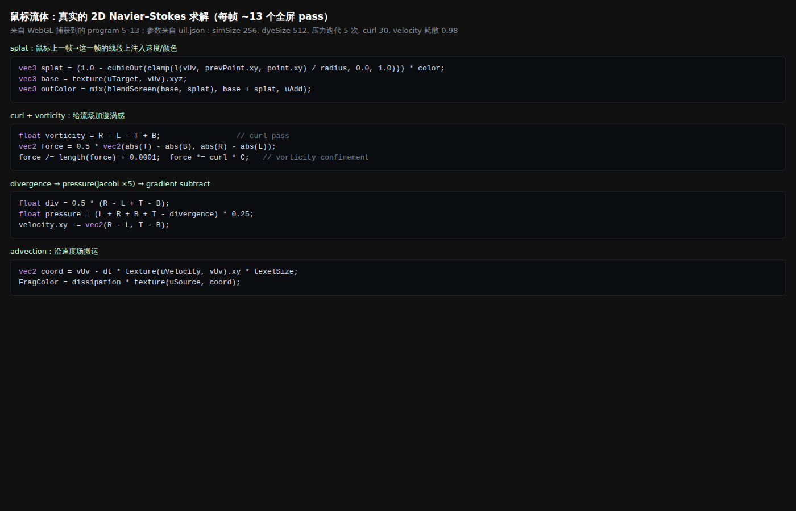
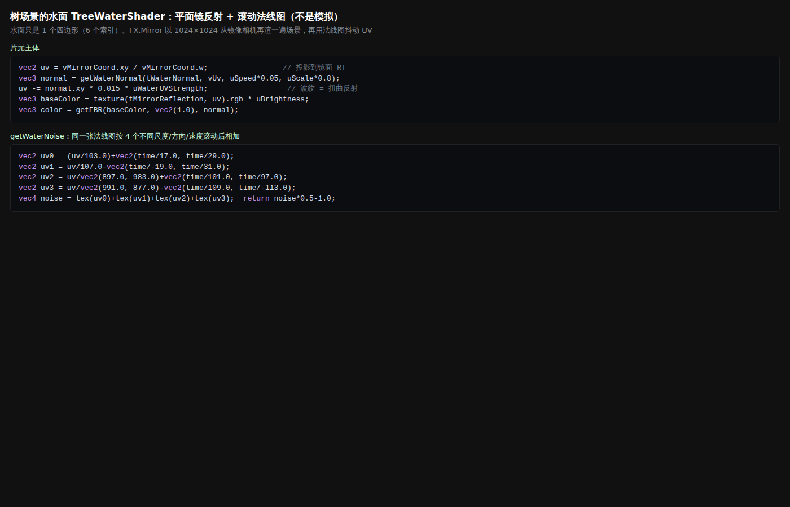

---

## 5. 镜头与滚动

录屏 `videos/scroll.mp4`（30 秒，首页一路滚进作品螺旋）。全站滚动总览：`screenshots/scroll_map_sheet.jpg`（每 1000px 一张）。

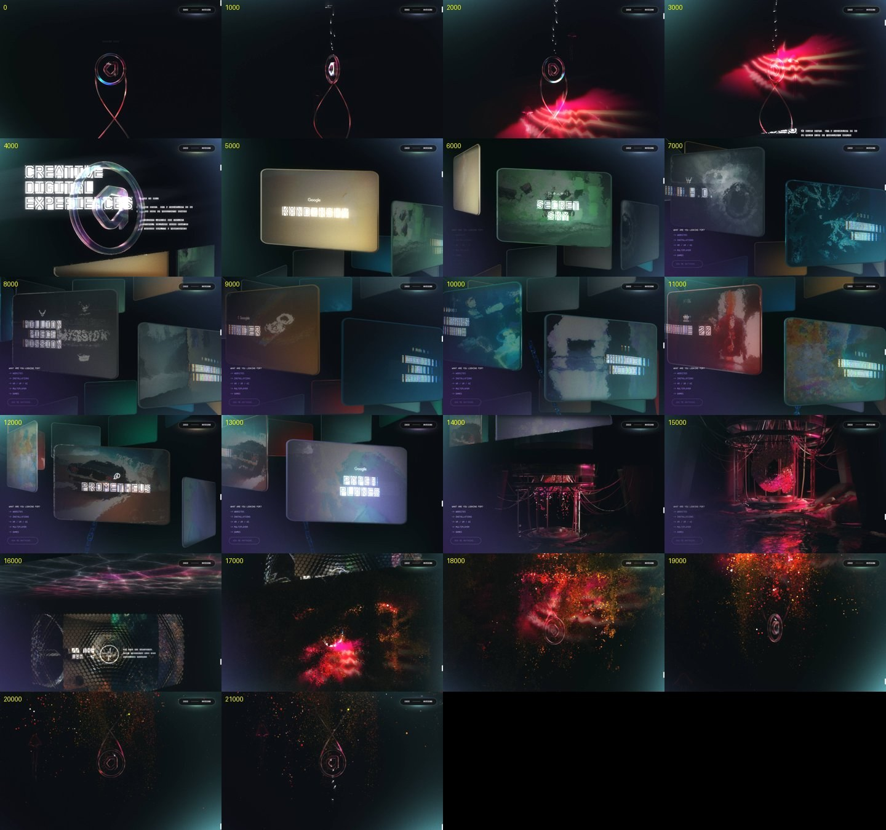

录屏关键帧（0 / 5 / 10 / 15 / 20 / 25 / 30 秒）：

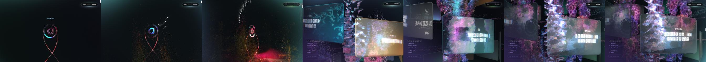

**滚动机制**：不用浏览器原生滚动。页面 `overflow:hidden`，滚轮只累加一个"虚拟滚动值"，总长 **20,979px**。显示位置每帧向目标靠近 10%（lerp 0.1），这就是那种"黄油感"。整条路被切成 6 段：

| 段落 | 虚拟滚动区间 |
|---|---|
| Home | 0–3780 |
| About | 3780–4725 |
| Work（最长） | 4725–14175 |
| TreeScene | 14175–16065 |
| CleanRoom | 16065–17199 |
| Footer | 17199–20979 |

每段内部把滚动换算成 0–1 的进度，再驱动该段的镜头和物体；段与段之间用 §3.2 的"噪声圆形擦除"过渡。滚动进入 Work 段时 URL 会变成 `/work`。

**镜头路径：**

- **首页**：主要是**竖直下沉 + 推近**，没有真的侧绕：
  - 相机高度从 40 降到 −7，同时向前推近 15 个单位；
  - Logo 被绑在相机高度 +4.5 的位置，所以 Logo 始终在画面中央，世界从它身边往上滑过；
  - "绕行感"来自**物体转、相机不转**：整团粒子随滚动转 190°（`90° − 190° × 进度`），Logo 转两倍的角度；
  - 按住鼠标拖动还能额外转粒子团（带惯性，lerp 0.07）。
- **作品区**：**螺旋绕行 + 下降**：
  - 卡片摆在半径 3.8 的圆柱面上，每张转 50°、往下降一点，朝外；
  - 相机的"机位"在每张卡正前方（半径 7.6 处）；
  - 滚动时在相邻两个机位之间插值：位置 lerp、朝向 slerp，然后相机每帧再追 20%。所以看起来是**绕着一根柱子边转边往下**，每张卡轮流正对你。
- **树场景**：相机从 z=35 推到 z=20，同时整个场景左右摆 ±30°（像是慢慢侧绕），灯光位置也跟着移动。

**作品卡怎么排布、怎么进出场：**

- 排布：上面说的螺旋。离相机越远越先画（按距离排序），所以玻璃叠加的次序是对的。
- 进场：每张卡从缩放 0 弹到 1，1.2 秒 easeOutQuint，每张依次延迟 0.2 秒。
- 退场：0.4 秒 easeInQuart 缩到 0。
- 最近的那张：自动加载并播放自己的项目视频（0.5 秒淡入）。点开某个项目时，导航胶囊和画面角落的光会在 1.5 秒内换成这个项目的主题色。
- 悬停：卡片的折射扭曲变强（`uHover`）。
- 卡片本身是厚玻璃：屏幕折射 + 环境图 `env1` + 水波法线 `waternormals` + 视频。
- 卡上的标题是 MSDF 文字，带 RGB 分离和故障风格的"扫描"。

**粒子和主物体在滚动中怎么变：**

- **粒子团（顶点 shader 里全靠 `uScroll` 驱动，没有关键帧）**：
  - 开头：少数粒子（`random^30` 的那些）被抬高，形成向上散开的尾巴；
  - 中段：做"顶部螺旋"扭动，幅度随 |进度−0.5| 变化；
  - 另有 5% 的粒子在半径 25 的大圈上绕；
  - 到底部：粒子按 `进度^4` 往下坠，并收拢到中轴，像被吸进管子。
- **Logo 和双环柱**：跟着相机下沉并旋转，`uVisible` 控制高光扫过和淡入。
- **导航胶囊**：滚动速度越快，内部的竖条"光栅"越亮、胶囊越弯（`uScrollDelta`）。

镜头和卡片的代码片段：`screenshots/js_6_layout.png`。

---

## 6. 界面层

| 元素 | 实现 | 字体 / 字号 / 颜色 | 边框 / 微光 |
|---|---|---|---|
| **右上导航胶囊**（WORK —— CONTACT） | **全部在 WebGL 里画**（GLUI），不是 DOM | NB Architekt Std Regular，12px，白色，MSDF 字体图集 | 胶囊底是一个 shader：圆角矩形内底 `#111`（透明度 0.7）+ 外圈柔和光晕。光晕颜色是青绿色 HSV 加噪声流动（随时间和滚动慢慢变色）。内部有一排竖条"光栅"，滚动越快越亮；看项目时整体混入项目主题色 |
| **SCROLL DOWN** | WebGL 文字 | NB Architekt，浅青色，透明度 0.6，加载后 5 秒淡入 | 滚动到 20% 时淡出 |
| **About 大标题**（CREATIVE DIGITAL EXPERIENCES） | WebGL MSDF 文字 | NB Architekt，约 100–110px，白，全大写 | 靠 Bloom 发光；玻璃 Logo 从前面折射过去 |
| **作品卡标题**（PAPER PLANES 等） | 先画进 1024² 纹理，再贴到 3D 卡片上 | NB Architekt，100px 标题 + 18px 正文，白，全大写 | RGB 分离 + 故障扫描；客户 logo 在标题上方 |
| **分类标签 / 聊天框**（WHAT ARE YOU LOOKING FOR? / -> WEBSITES / INSTALLATIONS / XR/VR/AI / MULTIPLAYER / GAMES / ASK ME ANYTHING…） | **普通 DOM**（`<p>` / `<input>`），带一个 AI 助手 | `"nbarchitekt", monospace`，13–14px，全大写。问题文字 `#f4f4f4`，筛选项**淡紫 `#9ca5ff`**，光标 / 强调色**青色 `#00ffff`** | 输入框：`2px solid rgba(255,255,255,.3)`，全圆角 `50px`，底色 `rgba(0,0,0,.2)`；悬停变亮（边框 0.5 → 0.9 不透明，底色 0.5 黑）。强调元素 `box-shadow: 0 1px 6px #00ffff` 发青光。左下角还有一块紫色渐变光斑（在最终合成 shader 里画的） |

整体排版风格：**一种等宽、方块感的建筑字体（NB Architekt）全大写 + 大字距 (letterSpacing 0.1)**，颜色只有白、淡青、淡紫三种，**所有"发光"都交给 Bloom 和合成 shader**，CSS 几乎不做特效。

截图：
- `screenshots/ui_nav.png`
- `screenshots/ui_scroll_label.png`
- `screenshots/ui_about_title.png`
- `screenshots/ui_card_title.png`
- `screenshots/ui_filters_chat.png`

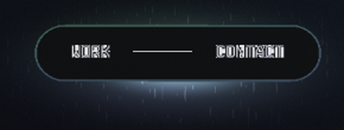 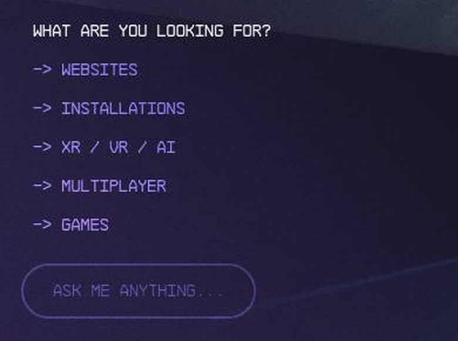

---

## 7. 渲染管线图

```
【几何】
  ├─ 小模型（Draco .bin，15–145 KB）→ 实例化复用：椎骨×40、链环×80、水母×4、管子×1365
  ├─ 点云（Draco .bin，每点自带颜色）→ 位置存进浮点纹理 → GPGPU 每帧更新（弹回 + curl 噪声 + 流体推力）
  ├─ Blender 场景（树场景，~24 万索引）→ 光照在 Cycles 里预烘焙
  └─ 平面：视频光带（弯曲平面）、水面（1 个四边形）、作品卡（圆角厚板）
        │
【材质】（全是自写 ShaderMaterial，没用标准 PBR）
  ├─ "Fake PBR"：matcap 当环境光 + 法线图 + MRO + GGX 高光
  ├─ 玻璃：屏幕空间折射（采样本帧场景快照）+ 菲涅尔彩虹边 + 视频叠加
  ├─ 视频纹理 reel.mp4 = 全站共用的"光源/反射"
  ├─ 树场景：烘焙光照图 × 底色，再叠法线 / MRO
  ├─ 水：镜面 RT + 4 层滚动法线扰动
  └─ 粒子：GL_POINTS 圆点 + 旋转 matcap 气泡 + 点云自带色 + 色相噪声
        │   （一次绘制同时输出 3 张图：颜色 / 折射源 / 体积光源）
【后期】
  ① 体积光（1/10 分辨率径向模糊）→ ② 场景合成（对比度 + 体积光）
  ③ 段落切换（噪声圆形擦除）
  ④ Bloom（3 级 mip，阈值 0）+ ⑤ 横向镜头光条
  ⑥ 最终合成：流体扭曲 + 磨砂玻璃 + 色散 + 加 Bloom / 光条 + 四角彩色噪声光 + 胶片颗粒
     输入还有：鼠标流体（256² Navier–Stokes，13 pass / 帧）
        │
【输出】画布 2880×1800（DPR 2，显卡差会自动降到 1–1.5）+ WebGL 导航和文字直接画在上面
        + 少量 DOM（聊天 / 筛选）叠在画布上
```

---

## 8. 对你这个 three.js 项目的可借鉴清单

### 照做（便宜、效果大）

1. **一个最终合成 pass 做完所有"氛围"**：色散（RGB 错位采样）、胶片颗粒（overlay 0.1–0.15）、角落的噪声彩色渐变、对比度。一个 `ShaderPass` 就够，几乎不花性能，但质感提升最大。
2. **Bloom 阈值设 0、强度低（0.3–0.8）**：让所有亮部都有一点辉光，而不是只有高光爆掉。
3. **玻璃 = 屏幕空间折射**：先把场景（不含玻璃）渲到一个 RT，玻璃材质用 `gl_FragCoord.xy / resolution + normal.xy * k` 去采样它，再加菲涅尔边。比 `MeshPhysicalMaterial` 的 transmission 更可控、也更便宜。
4. **菲涅尔彩虹边**：`rainbow(fresnel * 3.0)` 叠加在边缘。一行代码就有"镭射 / 薄膜"感。
5. **视频纹理当光源**：准备一段 10–20 秒的抽象彩色循环视频（自己做的），做成 `THREE.VideoTexture`，在玻璃、水面、光带材质里混 10–20%。所有反光都会"活"起来。
6. **小模型 + 实例化 + 程序摆放**：一节模型用 `InstancedMesh` 复制 40 份，按 `y = -0.65*i`、`rotY = 0.4*i` 螺旋排。一两个参数就能换出完全不同的造型。
7. **虚拟滚动 + lerp**：滚轮只改目标值，每帧 `current += (target - current) * 0.1`。滚动进度映射成相机位置（线性插值即可），不要用关键帧动画。
8. **作品卡螺旋布局 + 机位插值**：卡片放在圆柱面上（半径 R、每张转 θ、下降 h），相机机位放在 2R 处；滚动在相邻机位之间 lerp / slerp，再用 0.2 系数平滑追随。
9. **水面 = `Reflector` + 滚动法线图扰动 UV**（多层不同速度叠加），不要做真模拟。
10. **资源压缩**：模型用 Draco / Meshopt，贴图用 KTX2（Basis）；按显卡分档切 DPR 和粒子数（可用 `detect-gpu`）。

### 简化后做

1. **鼠标流体**：可以直接移植 WebGL-Fluid（256² 足够，压力迭代 5 次）。更简单的替代：一张鼠标轨迹纹理，ping-pong 每帧衰减 0.95，只用它在最终合成里扭曲 UV 和加色散，视觉上能达到它 70% 的效果。
2. **GPGPU 粒子**：用 three 自带的 `GPUComputationRenderer`，先做 65k 点（256²），规则只写"弹回原位 + curl 噪声 + 鼠标推开"三条。点云可以用 Blender 在自己的模型上采样导出。
3. **体积光 / god rays**：用 1/4–1/8 分辨率的径向模糊，只对"发光物体"那层做；或者直接省掉，用 Bloom 代替。
4. **Matcap 伪 PBR**：直接用 `MeshMatcapMaterial` + `normalMap`，或者在 `onBeforeCompile` 里按粗糙度缩放 matcap UV。
5. **段落切换**：做一个"噪声圆形擦除"的 transition pass；也可以简化成亮度淡入淡出加一点色散。
6. **3D 里的文字**：用 `troika-three-text`（MSDF）代替它自研的 GLUI；导航可以直接用 DOM + CSS，光晕交给合成 shader 的角落渐变。
7. **镜头光条**：pmndrs `postprocessing` 里有现成的 lens flare / streak；或者只做一次横向模糊叠加。

### 不用做

1. 整间房的 Cycles 烘焙光照：除非你真有一个室内场景。
2. 它自研的 UIL 编辑器、场景图、Hydra 引擎，以及 106 个 RT 的完整管线。
3. PCSS 软阴影、8 级 downsample 的光条链、MRT×3 这种优化手段：你的项目规模用不上。
4. 65 个作品各配一个 2–19 MB 的视频：用缩略图，最近那张再懒加载一个短视频就够。
5. AI 聊天式的分类筛选：普通标签按钮即可。
6. 百万级粒子：6.5 万到 26 万点在观感上已经足够密。

---

## 9. 可以直接发给另一个 AI 的技术指令

```text
你在用 three.js（r16x+，WebGL2）实现一个深色 3D 作品集网站。视觉参考 activetheory.net 的"做法"，
不要使用它的任何资源。请按以下规格实现：

【渲染基础】
- WebGLRenderer({antialias:false, alpha:false, powerPreference:'high-performance'})；
  用 DPR 超采样代替抗锯齿：pixelRatio = 显卡档位 高2 / 中1.5 / 低1（用 detect-gpu 分档）。
- 背景近黑 #07090c。全部物体用自写 ShaderMaterial / onBeforeCompile，不依赖场景灯光。

【材质】
1. Fake PBR：matcap 贴图代替环境光。matcapUV 按粗糙度向中心缩放：
   uv = mix(uv, (uv-0.5)*0.5+0.4, roughness)，再乘 AO，加一个 GGX 高光。
   法线贴图用可平铺的岩石 / 裂纹法线（自备或 CC0）。
2. 玻璃（主物体 Logo / 作品卡）：每帧先把不含玻璃的场景渲到 refractionRT（全分辨率）。
   玻璃片元：col = texture(refractionRT, gl_FragCoord.xy/res - normal.xy*0.05).rgb；
   f = pow(1-dot(N,V), 1.5)；col += rainbow(f*3.0)*f*0.4；col = pow(col*1.5, vec3(1.8))。
3. 视频光源：准备一段自制抽象循环视频做 VideoTexture（uVideo），在玻璃里
   blendAdd 0.1 + softLight 0.2；在一块向后弯曲的大平面上直接显示（径向淡出），当"光带"。
4. 主体造型：一节小模型（Draco）用 InstancedMesh ×40：position.y=-0.65*i, rotation.y=0.4*i。

【粒子】
- GPUComputationRenderer，256×256（=65,536 点，高档可 512²）。位置纹理更新规则：
  pos += (origin-pos)*0.07；pos += curlNoise(pos*0.8+t*0.2)*0.01；
  pos += 鼠标轨迹速度（把点投影到屏幕 UV，采样轨迹纹理的速度，再乘系数推开）。
- 渲染：THREE.Points，gl_PointSize = k*DPR*scale*(1000/-mvPos.z)；片元里 length(pc-0.5)>0.5 就 discard；
  颜色 = 点云自带颜色 softLight 一张 64² 的气泡 matcap（按时间旋转 UV）。
- 顶点 shader 里用 uScroll(0..1) 做形变：
  顶部螺旋 pos.xz -= vec2(cos,sin)(uScroll*5+pos.y*0.5)*0.5*smoothstep(0,0.5,abs(uScroll-0.5))；
  底部下坠 pos.y -= pow(uScroll,4)*20*pow(rand,15)。

【鼠标流体（简化版）】
- 用一张 256² 的 half-float ping-pong 纹理：每帧先整体乘 0.96，
  再沿"上一帧鼠标 → 这一帧鼠标"的线段 splat 速度（xy）。
  （可选：整套移植 WebGL-Fluid：curl 30，压力迭代 5 次，velocity 耗散 0.98。）
- 输出 tFluid，给粒子和最终合成使用。

【水面（如需要）】
- three/examples 的 Reflector（textureWidth 1024）。水面 shader：
  n = 同一张法线图按 uv/103 + t*(1/17,1/29)、uv/107 - t*(-1/19,1/31) 等 4 层尺度方向滚动后相加；
  reflUV -= n.xy*0.015。

【后期（EffectComposer 或 pmndrs/postprocessing）】
1. UnrealBloomPass(threshold 0, strength 0.6, radius 0.8)，在 1/4 分辨率上做。
2. 最终 ShaderPass（一个 pass 完成）：
   - uv += texture(tFluid,uv).xy * 0.002；右上角用一张法线图做"磨砂玻璃"扭曲（半径 0.3 衰减）；
   - 色散：r=tex(uv+o), g=tex(uv), b=tex(uv-o)，o = dir(120°)*(0.0005 + 0.0001*|scrollDelta| + fluidEdge*0.01)；
   - 对比度 (c=0.98, m=1.2)；
   - 四角噪声彩色光：hsv(0.6~0.9 + cnoise(uv*0.65 - t*0.04)*0.065)，按到中心距离 smoothstep 加上去；
   - 胶片颗粒：overlay(color, hash(uv*t), 0.15)。
3. 段落切换：fbm 噪声扰动的圆形擦除，擦除边缘加色散。

【滚动与镜头】
- 禁用原生滚动。wheel/touch 累加 target（总长约 20000）；每帧 current += (target-current)*0.1。
- 分段：Hero 0–0.18、About、Works（约占一半）、结尾。每段内部 progress 0..1。
- Hero：camera.y = lerp(40,-7,p)；camera.z 推近 15；主物体跟随 camera.y+4.5 保持在画面中央；
  粒子团 rotation.y = 90° - 190°*p（物体转、相机不转）；按住拖动可额外旋转（lerp 0.07 惯性）。
- Works：卡片放在圆柱上：x=3.8cos(a), z=3.8sin(a), a -= 50°/张, y -= 0.12*N/张，lookAt 朝外。
  每张卡一个机位（卡片位置 ×2，朝向与卡片相同）。滚动在相邻机位间 lerp(position) / slerp(quaternion)，
  相机每帧再 lerp 0.2 追随。
  卡片进场 scale 0→1（1200ms easeOutQuint，依次延迟 200ms）；最近的卡加载并播放它的视频（500ms 淡入）；
  hover 时 uHover 增强折射扭曲；按与相机的距离排序 renderOrder。

【UI】
- 字体：一款方块感等宽 / 建筑风格字体（找可商用的替代），全大写，letter-spacing 0.1em，12–14px；
  标题 100px。颜色只用 #fff、淡青 #00ffff（强调）、淡紫 #9ca5ff（次级）。
- 导航：右上角胶囊，半透明深底 #111（透明度 0.7）+ 1px 浅色描边 + 外发光。
  输入 / 标签：2px 白色 30% 描边，50px 圆角，悬停时描边提到 90%。
- 光效交给 Bloom 和合成 shader，CSS 不做发光。

【性能预算】
- draw call < 80（多用 InstancedMesh / Points）；
- 模型用 Draco，贴图用 KTX2 512–1024；
- 视频懒加载；显卡低档时粒子 16k、关体积光和色散、DPR 1。
```

---

## 附：文件说明

```
activetheory-research/
├─ 报告.md                  ← 本文件
├─ assets_home.csv / assets_work.csv   ← 资源清单原始数据（URL、字节数、分辨率）
├─ screenshots/
│  ├─ net_home.png / net_work.png       Network 筛选结果
│  ├─ load_home.png / load_work.png     刷新后 45 秒的画面
│  ├─ frame_hero|home_mid|work|tree.png 帧捕获时的画面
│  ├─ scroll_map_sheet.jpg              每 1000px 一张的全站滚动总览
│  ├─ textures.png                      主物体 / 水面贴图缩略图
│  ├─ shader_1_fluid … shader_5_particles.png、js_6_layout.png   关键代码摘录
│  ├─ spector_*.png                     Spector.js 实拍（命令列表 / 流体 draw / Logo draw + shader）
│  └─ ui_*.png                          界面层局部放大
└─ videos/
   ├─ fluid.mp4    10 秒 鼠标流体
   ├─ water.mp4    10 秒 树场景水面
   └─ scroll.mp4   30 秒 首页 → 作品螺旋
```
