# alche.studio 设计与渲染拆解报告

> 目的：学做法，不拷资产。全程没有下载保存对方的模型、贴图、字体、视频文件。只记录了文件名、大小、分辨率（从文件头读取后即丢弃），外加为说明原理而摘录的少量 shader / JS 片段。
> 采集日期：2026-09-23 · 视口 1440×900 · 方法与 activetheory 那份报告相同

---

## 0. 怎么测的（和上次一样，先说限制）

- **没有打开真的 DevTools：** 在云端用 Playwright 驱动 Chromium。网络清单来自请求日志，截图是我生成的表格（`screenshots/net_home.png`、`net_works.png`），原始数据在 `assets_home.csv`、`assets_works.csv`。
- **帧分析有两套数据：** 一套是我注入的 WebGL 拦截脚本，记录每个 draw call、渲染目标、shader 源码；另一套是注入 Spector.js 实拍了一帧。两边的数字对得上：**30 个 draw call / 305 条命令**。
- **录屏是逐帧生成的：** 用"虚拟时钟"每次推进 1/30 秒，截图后合成 30fps 视频。滚动和鼠标用真实的滚轮、鼠标事件驱动，所以 Lenis 平滑和 ScrollTrigger 吸附都正常生效。
- **渲染环境：** 没有显卡，用软件渲染。这个站没有显卡黑名单，所以画面和真机一致。
- **两点和真机不同：**
  - 视口的设备像素比（DPR）是 1，所以画布是 1425×900。真机上 DPR 最高到 1.5。
  - 开场的"是否开启声音"对话框我选了"不开启"。

---

## 1. 一句话结论

**这个站的视觉 90% 来自 shader 和版式设计，模型和贴图几乎可以忽略。**

- 整站只有一个 685 KB 的 `scene.glb`（18 个小网格，约 1.5 万顶点，**一张贴图都没有**），外加一套 512² 的立方体环境图。
- 画面的份量来自四样东西：
  1. **一面程序生成的"LED 屏幕墙"**
  2. **屏幕空间折射的水晶 A**
  3. **鼠标驱动的流体**，扰动几乎所有画面
  4. **每一段用一个独立场景渲染，再用 shader 做转场**
- 再配上黑白 + 荧光黄绿的极简配色、等宽字体排版，以及音效。

和 activetheory 相比，它更"平面设计化"：相机几乎不动，靠构图、转场和质感取胜。

---

## 2. 资源清单

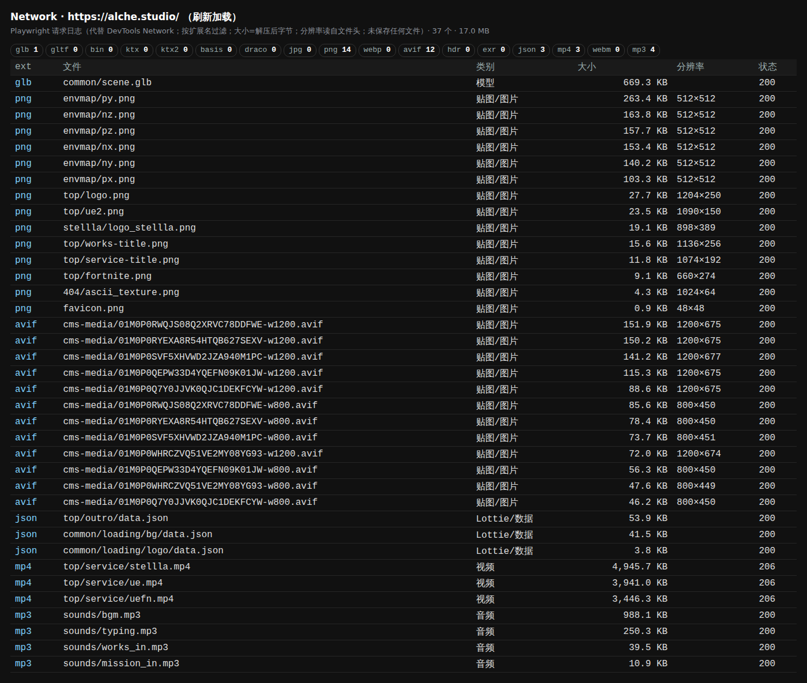

**总量：**
- 首页刷新 79 个请求、34 MB；`/works` 刷新 97 个请求、32 MB。
- 真正的 3D 资源不到 2 MB。大头是 3 段服务介绍视频（12.3 MB）和 Adobe Fonts 日文字体（约 14 MB，按字符分片加载）。

**按扩展名筛选：**
- `gltf / bin / ktx / ktx2 / basis / draco / hdr / exr / webp / webm / jpg`：**0 个**。代码里虽然引入了 DRACOLoader 和 KTX2Loader，但实际没用上。
- `glb`：1 个。`png`：14 个。`avif`：12 个。`json`：3 个。`mp4`：3 个。`mp3`：4 个。

### 2.1 模型

| 文件 | 大小 | 内容 |
|---|---|---|
| `common/scene.glb` | 669 KB | 18 个网格、4 个材质（只有颜色，**没有贴图**），总计约 15,186 顶点。 |

`scene.glb` 里的主要节点：
- `Alche_A`：水晶 A 本体
- `Alche_Outline`：A 的线框描边
- `Alche_SideScreen`：A 侧面的一块"屏幕"
- `CrackedLogo`：13 块碎片（`testtest.*`），碎裂的 Logo
- `Curve.*`：3 条带顶点色的曲线
- `Infinite`
- `ThumbnailScreen`：缩略图屏幕

**中央的 A 是加载的模型，不是程序生成的。** 但它的颜色、法线、粗糙度都**不来自贴图，而是 shader 计算**：
- 颜色来自折射背景和环境反射；
- 法线就是模型自带的顶点法线；
- 粗糙度用一张实时生成的噪声图控制。

### 2.2 贴图 / 图片

| 文件 | 分辨率 | 大小 | 用途 |
|---|---|---|---|
| `envmap/px,nx,py,ny,pz,nz.png` | 512² ×6 | 103–263 KB | 立方体环境图，给水晶 A 做反射 |
| `top/logo.png` | 1204×250 | 28 KB | LED 墙上平铺滚动的 ALCHE 字样 |
| `top/works-title.png` | 1136×256 | 16 KB | 环绕圆柱的 "WORKS" 文字带 |
| `top/service-title.png` | 1074×192 | 12 KB | Service 段标题 |
| `top/fortnite.png`、`top/ue2.png`、`stellla/logo_stellla.png` | 660×274 / 1090×150 / 898×389 | 9–23 KB | 服务 Logo |
| `404/ascii_texture.png` | 1024×64 | 4 KB | 16 个灰阶字符的图集，404 页的 ASCII 效果用 |
| `cms-media/*.avif` | 1200×675 / 800×450 | 46–244 KB | 作品封面（CMS），AVIF 格式，两档尺寸 |

**噪声图不是文件**：每帧用 shader 实时生成一张 570×360 的噪声纹理，LED 图案、A 的磨砂、彩虹薄膜都从它取值。

### 2.3 视频 / 音频 / 动画数据

| 文件 | 大小 | 用途 |
|---|---|---|
| `top/service/stellla.mp4` / `ue.mp4` / `uefn.mp4` | 4.9 / 3.9 / 3.4 MB | Service 段的缩略视频（贴在 3D 面板上） |
| `sounds/bgm.mp3` | 988 KB | 背景音乐 |
| `sounds/typing.mp3`、`works_in.mp3`、`mission_in.mp3` | 11–250 KB | 打字音效（配合乱码出字）、段落进场音效 |
| `common/loading/logo/data.json`、`loading/bg/data.json`、`top/outro/data.json` | 4–54 KB | Lottie 动画：加载动画、页尾 Logo 组装 |

`/works` 页也会加载同一个 `scene.glb`、环境图和服务视频：WebGL 画布是常驻的，换页用 Swup 不刷新，所以从任何页面进站都会预加载整套 3D 资源。`/works` 只是多了一批作品封面图（12 张 1200 宽的 AVIF）。

全站滚动总览（每张约 800px，左上角是滚动位置）：

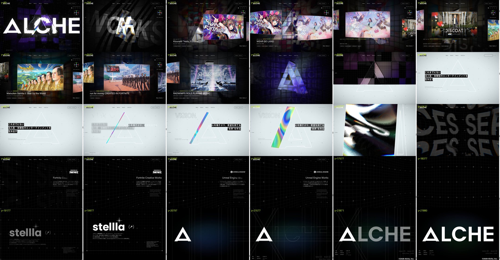

---

## 3. WebGL 帧分析

在 7 个段落各抓了一帧，截图为 `screenshots/frame_*.png`：

| 段落 | draw call | 渲染目标 | 画面里有什么 |
|---|---|---|---|
| KV（开场） | **32** | 20 | LED 墙 + 网格 + 水晶 A + 大 Logo |
| Works | **36** | 21 | 同上 + 4 张作品卡 |
| Mission / Vision | 30 | 19 | 白底网格 + A 的线框 + 侧面彩虹屏 |
| Service | 36 | 20 | 服务列表面板 + 缩略视频 + 十字网格 |

- 全站共 41 个 shader 程序、53 个帧缓冲、73 张纹理。
- 画布设置：WebGL2，关闭抗锯齿，DPR 上限 1.5。

**draw call 这么少的原因：** LED 墙的全部格子（136–172 个，随机布局）是**一次实例化绘制**，网格上的十字（81 个）也是一次。

### 3.1 一帧的执行顺序（渲染目标）

| 步骤 | 分辨率 | 做什么 |
|---|---|---|
| ① 鼠标流体 | 256×161（按屏幕比例） | Stable Fluids：curl → 速度+鼠标 → 散度 → 压力 ×4 → 梯度 → 平流，共 9 个 pass |
| ② 噪声图 | 570×360 | 实时生成的彩色噪声 |
| ③ LED 图案 | 213×135 | 3 种程序化图案，轮流切换 |
| ④ 主场景 | 1425×900 | 背景层：LED 墙（1 次实例化）、网格线、十字、大 Logo |
| ⑤ 作品图预模糊 | 512² | 作品封面先高斯模糊一次，再上墙 |
| ⑥ 水晶 A | 1425×900 | 以背景层为底做折射 |
| ⑦ 作品卡 | 1425×900 | 和 DOM 位置同步的 WebGL 图片，单独一层 |
| ⑧ 场景合成 | 1425×900 | 主场景 / Mission-Vision / Service / 子页面之间切换，流体扭曲，暗角 |
| ⑨ Bloom | 356×225 → 178×112 → 89×56 | 先提取亮部，每级做一次竖向加一次横向高斯模糊 |
| ⑩ 最终合成 | 屏幕 | 流体再扭一次，叠加 3 级 Bloom，整体 ×1.3；404 页额外加 ASCII 字符效果 |
| ⑪ 加载 / 转场层 | 屏幕 | 用 SVG 纹理做的加载遮罩和页面转场 |

### 3.2 后期处理有几道

**4 道：**
1. **场景合成**：包含弯曲的擦除转场、运动模糊、流体 UV 扭曲，以及流体区域提亮。
2. **Bloom**：阈值提取加 3 级模糊。
3. **最终合成**：流体扭曲、Bloom 叠加、整体提亮。
4. **转场遮罩**。

**没有**：景深、胶片颗粒、雾、SSAO。色散不是后期做的，而是写在各个材质里：水晶 A 和作品卡都自带 RGB 分离。

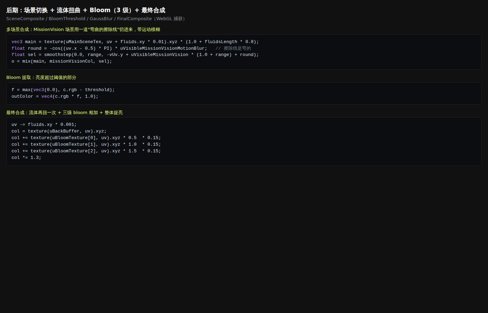

### 3.3 主物体（水晶 A）用了什么

- **没有贴图文件。** 输入只有 4 样：
  - `uTrnsTex`：先渲好的背景层
  - `uNoiseTex`：实时噪声
  - `uEnvMap`：6 张 png 的立方体环境图
  - 模型自带的法线
- **核心算法：**
  - 按法线偏移屏幕坐标去采样背景层，这就是折射。
  - R/G/B 三个通道偏移量为 1×/2×/4×，产生彩色边。
  - 多次采样，每次加随机抖动，产生磨砂感；抖动强度由噪声图控制，所以有的地方清透、有的地方磨砂。
  - 再加 GGX 高光，以及按菲涅尔比例混入的环境反射。
- 截图：`screenshots/shader_2_glass.png`。

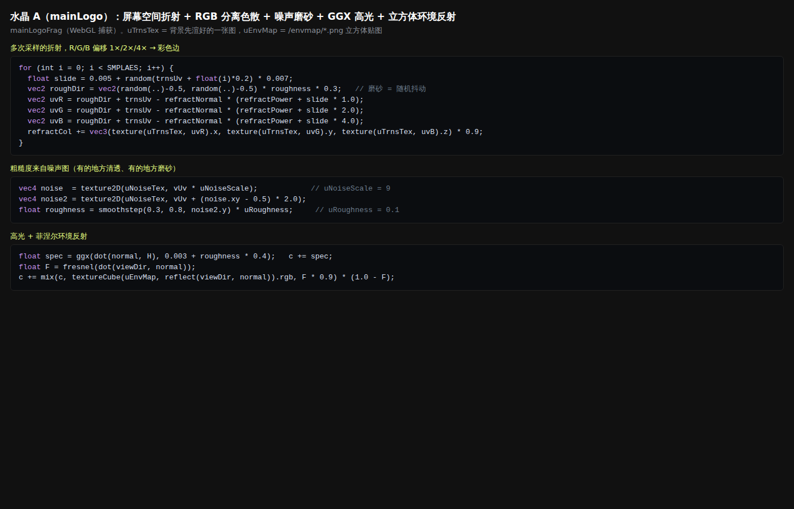

### 3.4 "粒子"

**这个站没有粒子系统。** 看起来像粒子的是：

- **LED 墙的点阵：** 每个格子里用 shader 画 LED 圆点。
- **网格十字：** 实例化的小十字，每次 81 个。
- **Service 段的十字网格：** 实例化 176 个。

### 3.5 Spector.js 实拍

截图：
- `spector_1_commands.png`：命令列表。
- `spector_2_fluid_pass.png`：第一个 draw，是流体的 256×161 计算 pass。
- `spector_3_shader_source.png`：three.js 自动生成的 shader 头部（能看出是 `ShaderMaterial`）。
- `spector_4_ledwall_instanced.png`：**LED 墙那一次实例化绘制**，`drawElementsInstanced`，288 个索引（一个细分过的薄盒子），**172 个实例**。右侧预览是它画完后的样子：WORKS 字样铺在 LED 格子上。
  - 我自己的抓帧那次是 136 个实例，两次数量不一样，正好说明**四叉树布局每次随机生成**。

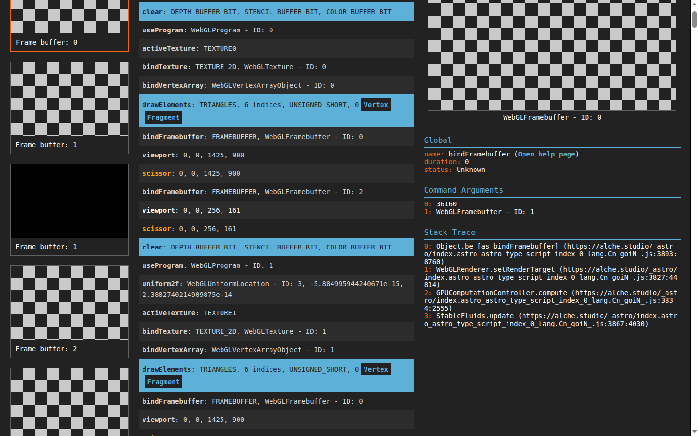
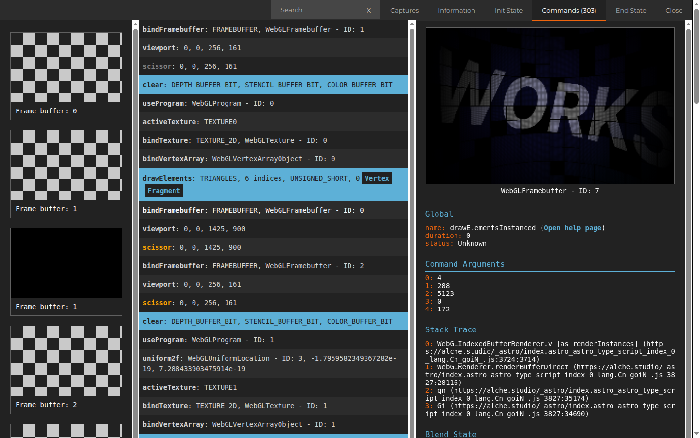

---

## 4. 流动 / 液态效果怎么做的

| 在哪 | 看起来像 | 实际做法 | 归类 |
|---|---|---|---|
| **全站鼠标拖尾**：画面被鼠标"搅"动，LED 格子侧面发光，网格线弯曲 | 液体 | **真的 2D 流体模拟**（Stable Fluids）。256×161 网格，压力迭代 4 次，curl 0.02，速度衰减 0.99。**只在桌面端开。** 结果当成数据用：场景合成和最终合成都用它扭 UV（d），并按流速提亮；LED 格子用流速点亮侧面 | **a + d** |
| **Vision 段的彩虹薄膜** | 流动的镭射膜 | A 侧面那块屏幕（`Alche_SideScreen`），颜色是**实时噪声图做两次扭曲采样**得到的，本质是域扭曲噪声 | **c**（程序化噪声） |
| **Vision → Service 的"液态金属"全屏** | 金属液体铺满屏幕 | 同一块侧面屏幕，顶点 shader 把四个角**插值到全屏**，内容从噪声**溶解**成 Service 场景的渲染画面，同时带逐渐减弱的镜头畸变和色差 | **c + d** |
| **作品切换** | 图像像水一样滑过去 | LED 墙上两张作品图按横向进度做软边混合，每个格子的采样坐标随机错开，形成故障感 | **d**（屏幕空间） |

**结论：** 真在"算"流体的只有鼠标拖尾那一处，而且分辨率很低（256 宽），只当成一张"扭曲力场"贴图用。其余液态感全是**噪声 + UV 扭曲 + 色差**。

- 录屏：`videos/fluid.mp4`（10 秒，开场鼠标搅动）、`videos/vision.mp4`（10 秒，Vision 彩虹薄膜 → 侧面屏幕放大铺满全屏 → 溶解成 SERVICES → Fortnite 服务页，这就是那个"钻进屏幕"的转场）。
- Shader 摘录：`screenshots/shader_5_fluid.png`。

---

## 5. 镜头、滚动、作品区排布

录屏 `videos/scroll.mp4`（30 秒，开场 → 作品轮播 → 转白底 Mission → Vision → Service 开头）。关键帧：

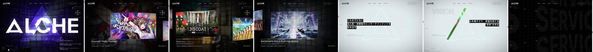

**滚动系统：**
- **Lenis** 做平滑滚动，**GSAP ScrollTrigger** 按段落注册触发器。
- 页面是真实的 DOM 高度（22,780px），每段是一个 `data-top_section` 元素。
- 各段的起止位置如下：

| 段落 | 起点 px | 高度 px | 这一段发生什么 |
|---|---|---|---|
| kv | 0 | 900 | 开场：ALCHE 大字、LED 墙、水晶 A |
| works_intro | 1000 | 900 | WORKS 文字带绕圆柱转进来 |
| works | 1900 | 5400 | 作品轮播，**每件作品吸附一次** |
| works_outro | 7300 | 1350 | 相机从透视**插值成正交**，墙退场 |
| mission_in / mission | 8650 / 9550 | 900 / 1440 | 转白底，A 变线框，标语出现 |
| vision / vision_out | 10990 / 12790 | 1800 / 1350 | 彩虹薄膜旋转 → 铺满全屏 |
| service_in / service | 14140 / 15040 | 900 / 4590 | 服务列表（Fortnite / Unreal Engine） |
| stellla | 19630 | 1350 | 自家产品 |

**镜头：几乎不动。**
- 相机固定在 (0,0,10) 看原点。
- 只跟随鼠标偏移 ±0.5，插值速度 3/秒。
- 视角 FOV = `35 + 18/宽高比`：竖屏时视角更大，保证构图不变。
- 开场有个 kvZoom，推近 0.5、视角收窄 4°。
- 滚动时变化的是**物体和 shader 参数**，不是镜头位置。
- 唯一一次"镜头变化"是 works_outro：**透视投影矩阵插值到正交投影**，画面从有纵深突然变"平"。

**作品区排布与进出场：**
- **背景墙：** LED 墙卷成圆柱，把镜头包在里面。作品图按整面墙的屏幕坐标铺满格子，吸附切换时新旧两张图在横向做软边过渡，每个格子随机错位。
- **前景卡片：** 同时显示当前作品的卡片，是和 DOM 位置同步的 WebGL 图片。形状是厚、带弧度的板，带镜头畸变和色差，侧面拉伸边缘像素，滚得越快图片横移越多。
- **吸附：** ScrollTrigger `snap: 1/(n-1)`，耗时 1 秒。每件作品进入画面中线时触发一次 `works/item_enter`，更新下方的标题、日期、标签，文字用 ScrambleText 乱码出字。
- **WORKS 文字带：** 一圈半径 3 的圆柱文字，随进度旋转进场、旋转出场。

**水晶 A 在各段的"性格"（`sectionRotationSettings`）：**
- KV：跟随鼠标悬停转动。
- Works：自己慢慢转（速度 0.5），滚动速度会带动它转，回正力很弱（0.1）。
- Mission / Vision / Service：不转，被强力拉回正面。

---

## 6. 界面层

| 元素 | 字体 | 字号 / 字重 / 字距 | 颜色 | 边框 / 光效 |
|---|---|---|---|---|
| 顶部导航 News / Works / About / stellla | **IBM Plex Mono**（等宽） | 14px / 400 / 1.4px (0.1em) | #fff | 无 |
| Contact / Recruit 按钮 | IBM Plex Mono | 11px | #fff | **1px 半透明白边、全圆角 999px 的胶囊按钮** |
| 左上 Logo | 图片（白色 ALCHE） | | #fff | |
| 大标题 "Works" | **Acumin Pro**（Adobe Fonts） | 80px / 600 | #fff | 无 |
| 分类筛选 ALL / In-Game-Concert… | Acumin Pro | 16px / 400 / 1.28px | #fff | 后面的数量 `[17]` 用**明朝体 ten-mincho 8px**，小而有衬线，形成反差 |
| 作品日期 2026 01.17 | **Google Sans Code**（等宽） | 14px | #fff | |
| 作品标签 [In-Game-Concert, …] | Google Sans Code | 12px | 灰 #bababa | 方括号包裹 |
| 作品标题 | **IBM Plex Sans JP** | 18px / 700 | #fff | |
| 日文正文 / 声音提示 | IBM Plex Sans JP、小塚ゴシック | 13px / 字距 0.05em | #fff / #bababa | |
| 大标语（白底段） | 日文黑体 | 大号 | **白字黑底的色块**，像字幕 | |
| 左侧段落指示器 TOP / VISION … | 等宽 | 小 | #fff | 细横线刻度 |
| 调参面板（MainLogo Quaternion 等） | Tweakpane 默认 | | 半透明黑底 | **桌面端默认显示**，访客可以拖动旋转 A，Ctrl+T 开关。把开发工具当成设计元素 |

**配色：**
- 只有黑 `#000`、白 `#fff`、灰 `#bababa` / `#7e7e7e`，外加一个点缀色**荧光黄绿 `#d7ff00`**（Logo 和强调元素）。
- Mission / Vision 段整体反转成浅灰白底 + 黑线。

**光效：**
- 全部交给 WebGL：Bloom、流体提亮、LED 格子侧面发光。
- CSS 几乎不做发光，只用细边框和胶囊形。

**动效：**
- 文字用 GSAP SplitText + ScrambleText（乱码逐字出现），配 `typing.mp3` 打字音效。
- 缓动曲线统一用 `cubic-bezier(.53,.25,.3,.99)`。

截图：
- `ui_header.png`
- `ui_filters.png`
- `ui_card_normal_vs_hover.png`（悬停时图片放大、带畸变）
- `ui_contact_hover.png`
- `ui_works_page.png`

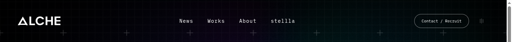
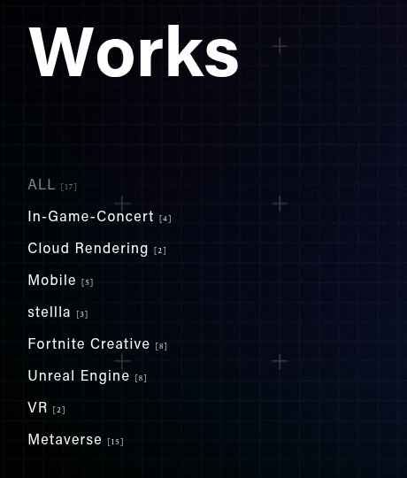

---

## 7. 渲染管线图

```
【页面架构】Astro 静态页 + Swup 无刷新换页；一块 WebGL 画布常驻，换页时只切换场景
        │
【几何】
  ├─ scene.glb（669 KB，无贴图）：A、A 的线框、A 的侧面屏幕、碎片、曲线
  ├─ 程序生成：LED 墙 = BoxGeometry(1,1,.005) × 四叉树实例（约 136 个），顶点里卷成圆柱
  ├─ 程序生成：网格线平面、实例化十字、环绕圆柱的文字带
  └─ DOM 同步平面：每张作品图（data-gl_img）→ 一块弯曲厚板网格
        │
【材质】（全部自写 ShaderMaterial）
  ├─ LED 墙：程序化图案（3 种）+ LED 圆点遮罩 + 作品图 + 故障（UV 错位 / 熄灭 / 翻转）
  ├─ 水晶 A：屏幕折射（RGB 1×/2×/4×）+ 噪声磨砂 + GGX 高光 + 立方体环境反射
  ├─ A 侧面屏幕：域扭曲噪声（彩虹薄膜）→ 变形到全屏 → 溶解成下一个场景
  ├─ 作品卡：镜头畸变 + 色差 + 侧面拉伸边缘像素
  └─ 共享输入：uFluidsTex（鼠标流体）、uNoiseTex（实时噪声）、uTime
        │   每一段一个 Scene → 各自渲到一张图（RT）
【后期】
  ① 场景合成：主场景 / MissionVision / Service 之间弯曲擦除 + 运动模糊 + 流体扭曲 + 暗角
  ② Bloom：阈值提取 → 1/4、1/8、1/16 三级高斯模糊（横竖分开）
  ③ 最终：流体扭曲 + 3 级 Bloom 相加 ×0.15 + 整体 ×1.3（404 页再加 ASCII）
  ④ 加载 / 转场遮罩
        │
【输出】画布（DPR ≤ 1.5）+ 上面叠 DOM 文字 / 导航 / Tweakpane 面板
```

---

## 8. 从零复刻：底层分步路线（照这个顺序做）

你说"做不出来"，其实这个站的难点不在单个效果，而在**架构**：先把架子搭对，每个效果都只是一个 shader。按下面顺序做，每一步都能单独跑起来。

### 第 1 步：架子（一天）

- Astro 或 Vite 都行。页面是正常的 HTML，高度就是真实高度。
- `position: fixed` 放一块全屏 canvas，放在 DOM 下面。
- Lenis 负责平滑滚动，GSAP ScrollTrigger 按段落注册，**只输出进度 0–1**，不直接改 3D 物体。
- 一个 `GL` 总控类，每帧做四件事：更新鼠标 → 更新流体 → 更新每个场景 → 走渲染管线。

```js
const lenis = new Lenis();
lenis.on('scroll', ScrollTrigger.update);
gsap.ticker.add(t => lenis.raf(t * 1000));
gsap.ticker.lagSmoothing(0);

const progress = {};   // 各段进度，给 shader 用
document.querySelectorAll('[data-section]').forEach(el => {
  ScrollTrigger.create({ trigger: el, start: 'top bottom', end: 'bottom bottom',
    onUpdate: s => progress[el.dataset.section] = s.progress });
});
// 渲染循环里：uniform.value = damp(uniform.value, progress.works, 4, dt)  ← 再平滑一次
```

### 第 2 步：多场景 → RT → 合成（最关键的一步）

- 每一段一个 `THREE.Scene` 加一个相机，渲到自己的 `WebGLRenderTarget`。
- 最后用一个全屏 `ShaderPass` 按进度 mix 这些 RT。转场线用 `smoothstep(-uv.y + p + cos(...) * k)`，就是它那道弯曲的擦除线。
- 这样每个段落可以独立开发，转场只是一个 uniform。

### 第 3 步：LED 墙（这个站的灵魂）

- **几何：** 用递归四叉树生成实例数据，然后 `InstancedBufferGeometry` 加 `BoxGeometry(1,1,0.005)`。
  - 每个实例 4 个属性：位置、缩放、随机 ID、深度。
  - 切分规则：最多 4 层，第 3 层以后 50% 概率停止切分。
- **顶点 shader：** `theta = pos.x * PI`，绕 y 轴转，把平面卷成圆柱内壁，镜头放在圆柱里面。
- **片元 shader：** 用 `vGlobalUv` 采样一张"内容图"（程序图案或作品图），乘以 LED 圆点遮罩：

```glsl
float dot = smoothstep(.5, .2, length(fract(vGlobalUv * 400.) - .5));
color *= mix(dot, 1., .6);
```

- **故障效果：** 用随机 ID 和一个整数化的时间 hash，一部分格子 UV 错位，一部分熄灭。每隔几秒随机改一次参数，用 GSAP 做过渡。

### 第 4 步：水晶 A（屏幕折射）

- 先把 A 后面的所有东西渲到 `bgRT`，再画 A。
- A 的片元里用 `gl_FragCoord.xy / resolution - normal.xy * 0.1` 去采样 `bgRT`。
  - R/G/B 三通道分别乘 1、2、4 倍偏移，产生色散。
  - 循环 4–8 次，每次加随机抖动，产生磨砂；抖动强度用一张噪声图控制。
- 加 GGX 高光，按菲涅尔比例 mix 一张 `CubeTexture` 做反射。
- 模型只要一个干净的 A 形 glb，不需要贴图。

### 第 5 步：DOM 同步的 WebGL 图片（作品卡）

- HTML 里正常放 ``，但设成 `opacity: 0`。
- 每帧用 `getBoundingClientRect()` 算出屏幕位置，换算成平面的位置和缩放。
- 平面网格细分一些，顶点里按余弦弯曲。片元里做镜头畸变加色差，按滚动速度横移 UV。
- 好处：排版完全由 CSS 控制，WebGL 只负责质感。

### 第 6 步：鼠标流体

- 别自己写，直接用现成的 Stable Fluids / WebGL-Fluid 实现，256 宽就够。
- 输出一张速度纹理 `uFluidsTex`，**把它传给所有 shader**：合成里 `uv += fluid.xy * 0.01`，LED 里用流速点亮。
- 手机上关掉。

### 第 7 步：后期与细节

- **Bloom：** 用 pmndrs `postprocessing` 的 `BloomEffect`，阈值低、强度低。
- **ScrambleText + 打字音效：** 文字出场的质感一半来自声音。
- **性能：** DPR 上限 1.5；在 loading 阶段调用 `renderer.compile(scene, camera)` 预编译所有 shader，避免第一次滚到某段时卡一下。

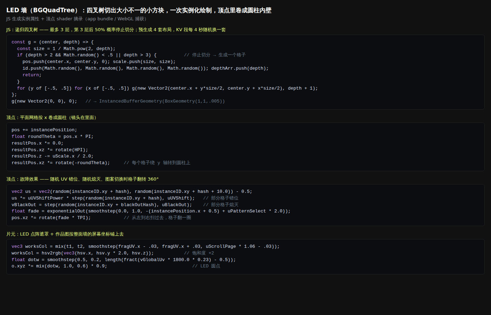
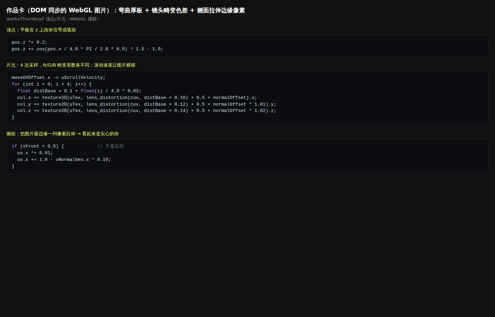
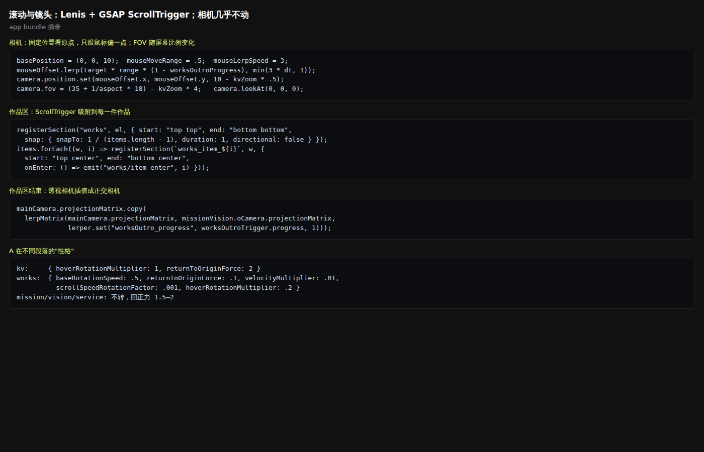

---

## 9. 可借鉴清单

### 照做

1. **一块常驻 canvas + 每段一个场景 + 全屏合成转场。** 这是整个站的骨架。
2. **LED 四叉树墙**，一次实例化绘制，程序化图案 + 作品图 + 故障。性价比最高的"大场面"。
3. **屏幕空间折射玻璃**，带 RGB 1/2/4 倍色散和噪声磨砂。
4. **DOM 同步的 WebGL 图片**：排版归 CSS，质感归 shader。
5. **流体纹理作为全局"扰动源"**：一张贴图传给所有材质。
6. **ScrollTrigger snap 做作品吸附**，每件作品进入时乱码出字。
7. **相机不动、物体和 shader 动**；FOV 随屏幕比例自适应。
8. **字体系统：** 等宽（导航、日期、标签）+ 无衬线粗体（标题）+ 一处小号明朝体做点缀。颜色只用黑、白、灰加一个荧光色。
9. **DPR 上限 1.5，loading 阶段预编译 shader。**

### 简化后做

1. **流体：** 用现成库；或者更简单，用鼠标轨迹纹理（每帧衰减）代替。
2. **Bloom：** 直接用库，不必自己写三级模糊。
3. **透视 → 正交插值：** 可以简化成 FOV 从 35° 快速降到 5°，同时把相机拉远，效果很接近。
4. **彩虹薄膜转全屏：** 可以简化成一个全屏 quad，用噪声溶解切换两个 RT。
5. **Lottie 加载 / 页尾：** 可以用 SVG 描边动画（`stroke-dashoffset`）代替。

### 不用做

1. Swup 无刷新换页 + 多页面场景状态机（单页作品集用不上）。
2. 404 的 ASCII 效果、AI / CMS 相关、Tweakpane 公开面板（除非你想要这种"技术展示"气质）。
3. 3 段服务视频、BGM（先把画面做对）。
4. 在所有材质里单独写色差：先在最终合成里做一次统一的色差就够了。

---

## 10. 可以直接发给另一个 AI 的技术指令

```text
用 three.js（r17x，WebGL2）+ GSAP ScrollTrigger + Lenis 实现一个深色极简 3D 作品集。
参考 alche.studio 的"做法"，不使用它的任何资源。规格如下：

【架构】
- HTML 正常排版（真实滚动高度），每段 <section data-section="kv|works|about|contact">。
- 一块 position:fixed 全屏 canvas 在 DOM 底层；antialias:false，pixelRatio=min(devicePixelRatio,1.5)。
- Lenis 平滑滚动，接 gsap.ticker；每段一个 ScrollTrigger，只写 progress[段名]（0..1），
  渲染循环里再用 damp(λ=4) 平滑后传给 uniform。
- 每段一个 Scene+Camera，渲到各自的 WebGLRenderTarget；最后一个全屏合成 pass 按进度切换，
  转场线：sel = smoothstep(0., .02 + motionBlur*.2, -uv.y + p*(1.+r) - cos((uv.x-.5)*PI)*motionBlur)。
- loading 阶段对每个场景 renderer.compile() 预编译。

【相机】
- 固定在 (0,0,10) lookAt 原点；鼠标偏移 ±0.5，lerp 系数 min(3*dt,1)；fov = 35 + 18/aspect。
- 作品区结束时：projectionMatrix 在透视与正交之间逐元素 lerp（progress 驱动），做"压平"转场。

【LED 墙（背景主视觉）】
- 递归四叉树生成实例：depth>3 或 (depth>2 且 random<.5) 时停止；每个实例 position(xy)、scale、
  随机 id(vec4)、depth；几何 BoxGeometry(1,1,.005,4,4,1) + InstancedBufferGeometry，一次绘制。
- 顶点：theta = pos.x*PI，绕 y 旋转，把平面卷成半径 R 的圆柱内壁（相机在内）。
- 片元：content = mix(patternA, patternB, sel)，其中 pattern 是用实时噪声 RT 生成的程序图案；
  作品区时 content = 作品图（按整面墙的屏幕 UV 采样，饱和度 ×2）；
  LED 点：dot = smoothstep(.5,.2,length(fract(vGlobalUv*400.)-.5))；color *= mix(dot,1.,.6)。
- 故障：每 0.1–2s 随机一次 hash，step(random(id+hash), uShift) 的格子 UV 偏移，
  step(random(id+hash2), uBlackOut) 的格子熄灭；切图案时格子按 x 从左到右 exponentialOut 翻转 360°。
- 格子侧面亮度 = length(fluid.xy)。

【主物体：玻璃 Logo】
- 自己建一个 Logo 形 glb（只要法线，不要贴图）。
- 先把背景层渲到 bgRT；片元：循环 6 次，
  uvR/G/B = fragUV - N.xy*(0.1 + slide*[1,2,4]) + randJitter*roughness*0.3，
  roughness = smoothstep(.3,.8, noise(uv*9 + noise*2).y) * 0.1；
  + GGX 高光(roughness .003..) + fresnel 混合 CubeTexture 反射。
- 按段落设不同行为：KV 跟随悬停；作品区自转 0.5 + 滚动速度带动，回正力 0.1；其它段强回正。

【作品卡】
- DOM 里  opacity:0，每帧用 getBoundingClientRect 对齐一块平面（细分 32×32）。
- 顶点：z = cos(x*PI/8)*1.5 - 1（弯曲）；片元：4 次采样的镜头畸变，R/G/B 系数 .10/.12/.14；
  uv.x -= scrollVelocity；侧面：uv.x = 1. - .19*normal.x（拉伸边缘像素）；暗角。
- 作品区 ScrollTrigger snap: 1/(n-1)，duration 1；每张进入中线时用 ScrambleText 刷新标题 / 日期 / 标签。

【流体】
- Stable Fluids 256×(256/aspect)，pressure 迭代 4，curl .02，velocity 衰减 .99，只在桌面端开启；
  输出 uFluidsTex 给所有材质和合成：合成 uv += fluid.xy*.01，亮度 *= 1 + |fluid|*.8。

【后期】
- Bloom：阈值提取后在 1/4、1/8、1/16 三级做横竖高斯模糊，每级 ×0.15 叠加，最后整体 ×1.3。

【UI】
- 字体：等宽（IBM Plex Mono 或同类）用于导航 14px / 字距 .1em、日期 14px、标签 12px（#bababa，方括号）；
  标题用无衬线粗体（80px/600）；作品数量用 8px 衬线体做点缀。
- 颜色只用 #000 / #fff / #bababa + 一个荧光强调色（例：#d7ff00）。
- 按钮：1px rgba(255,255,255,.5) 边框，border-radius 999px，11px 等宽字。
- 全局缓动 cubic-bezier(.53,.25,.3,.99)；文字出场用 SplitText + ScrambleText，可配打字音效。

【性能预算】
- 每帧 draw call ≤ 40（实例化）；模型总计 < 1MB、无贴图；图片 AVIF 两档（800 / 1200）；手机关流体。
```

---

## 附：文件说明

```
alche-research/
├─ 报告.md
├─ assets_home.csv / assets_works.csv
├─ screenshots/
│  ├─ net_home.png / net_works.png          Network 筛选
│  ├─ load_home.png / load_works.png        加载后画面
│  ├─ scroll_map_sheet.jpg                  全站滚动总览（30 张）
│  ├─ frame_kv|works|works_outro|mission|vision|service|stellla.png  每段抓帧时的画面
│  ├─ shader_1_ledwall … shader_5_fluid.png、js_6_scroll.png          关键代码摘录
│  ├─ spector_*.png                         Spector.js 实拍（命令列表 / 流体 pass / LED 墙实例化绘制）
│  └─ ui_*.png                              界面层截图
└─ videos/
   ├─ fluid.mp4    10 秒 鼠标流体
   ├─ vision.mp4   10 秒 Vision 彩虹薄膜 → 全屏转场 → Service
   └─ scroll.mp4   30 秒 开场 → 作品区 → Mission → Vision → Service
```
