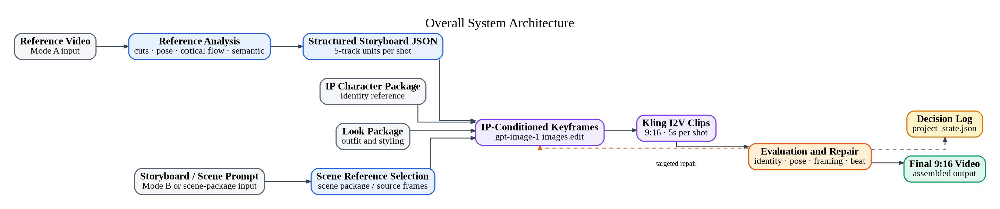
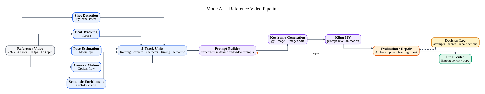
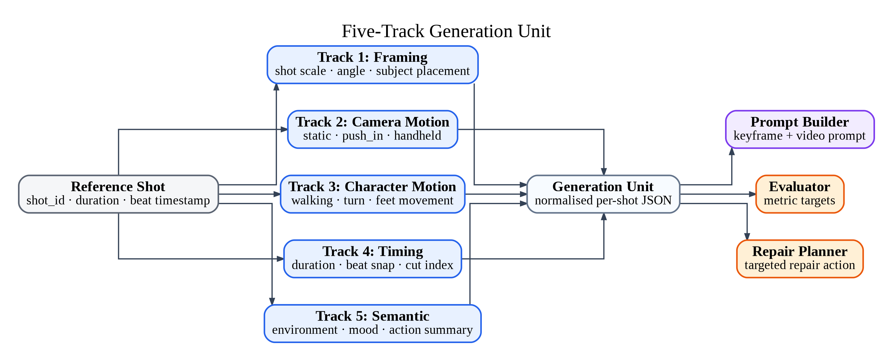
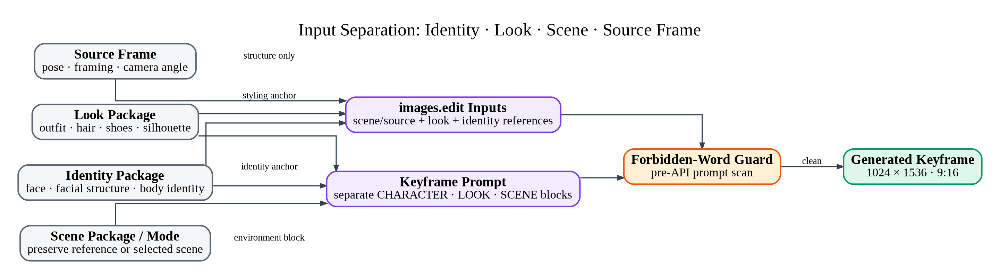
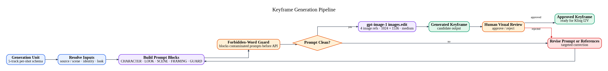
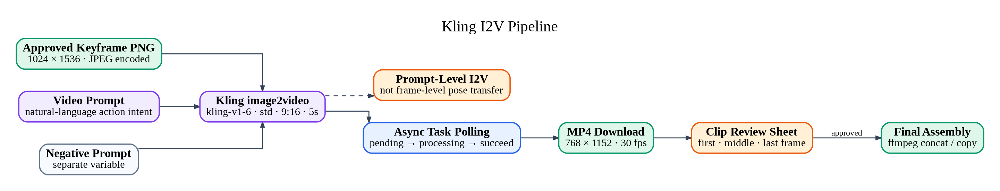
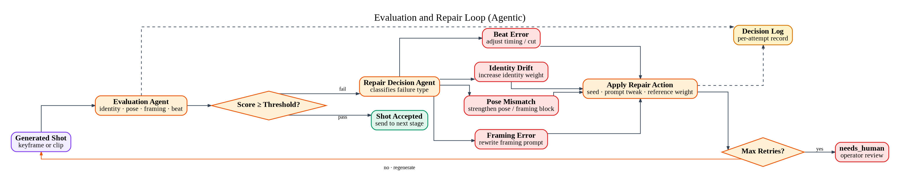
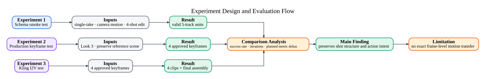
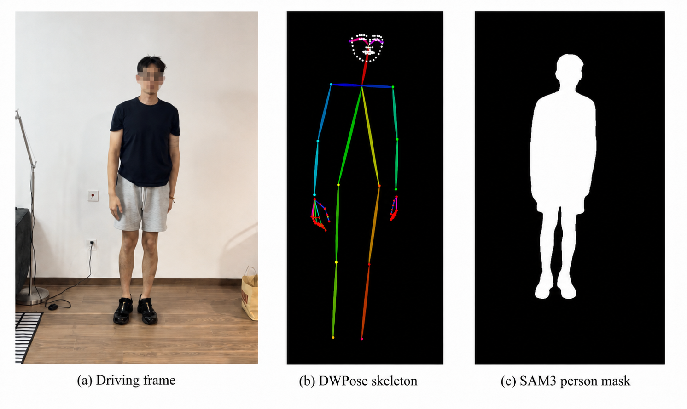
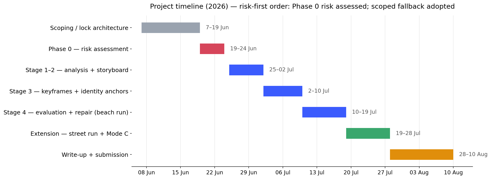

# Chapter 3 — Methodology and System Design

---

## 3.1 Motivation and design rationale

**Contributions.** This work contributes: (i) a reference-video decomposition into a five-track,
beat-aligned storyboard representation (shots, timing, framing, camera motion, character motion)
computed by deterministic tools rather than LLM guessing; (ii) an IP-conditioned, keyframe-first
per-shot regeneration pipeline that separates identity, look and scene; (iii) an agentic
evaluation–repair loop with a per-shot decision log that repairs only the failed shot and records
an explicit `needs_human` terminal state; (iv) a graded structural-conditioning strategy that
matches conditioning strength to the reliability of the reference pose per shot; and (v) an honest
executed-vs-pending evaluation, including a negative result (skeleton-image guidance is too weak a
control signal for `gpt-image-1`) and an identity-metric audit showing that face-embedding distance
under-scores a synthetic character a human reader accepts.

### 3.1.1 From interactive assistance to reproducible orchestration

A useful way to frame this system's contribution is by contrast with how the same creative task
is carried out inside a hosted conversational image assistant (for example, ChatGPT's image
mode). There, a user uploads a few images and issues a terse instruction — *"keep this person,
put her in a street scene, in this outfit"* — and a satisfactory result appears, often after a
little back-and-forth. What is invisible to the user is that the assistant performs a series of
steps **implicitly**, behind the conversational interface: it interprets each image (which
region is the face, which is clothing, which is background), it carries the running intention
("stay this person") across turns, it expands the terse instruction into a stronger visual
prompt, it decides which reference should dominate, and — crucially — it can *see its own
output* and revise on the next turn.

The OpenAI Images API exposes only the generation primitive that sits underneath such an
experience. `images.edit` accepts one or more source images plus a prompt and returns an edited
image; it does **not** know that one input is meant to fix composition, another only the face,
or that identity must be preserved above outfit. Absent explicit instruction, multiple
conditioning images *compete for control* and the model settles on a compromise — a recurring
failure mode being that the scene and the outfit come through while the **face drifts**. The
orchestration that a hosted assistant hides therefore has to be rebuilt, explicitly, outside the
API.

This is precisely where the contribution lies, and it must be stated correctly. The goal is
**not** to reproduce a hosted assistant's hidden helper. That helper is *opaque* (its choices
cannot be inspected), *non-reproducible* (the same request may weight references differently on
different runs), and *non-measurable* (it returns no score for whether identity was preserved).
This system instead turns each hidden step into an **explicit, reproducible, auditable and
measurable** component of an agentic orchestration layer around the image API: the API generates,
and the system decides, constrains, organises and repairs. The creative outcome is re-cast as an
engineering pipeline whose every decision is logged (§3.7) and whose output quality is scored
(§3.6) — which is what makes it valid both as a dissertation artefact and as evidence of applied
agentic engineering, rather than a one-off interactive result.

Table 3.1 maps each implicit step to the explicit component that realises it here.

**Table 3.1 — Implicit hosted-assistant steps vs. explicit pipeline components**

| Implicit step (hosted assistant) | Explicit component (this system) |
|---|---|
| Understand image content (face / outfit / background) | GPT-4o Vision semantic pass + source-frame structural anchor (Stage 1) |
| Hold the running "keep this person" intention | Identity anchor + locked `images.edit` slot order (slot `[0]` primary) |
| Expand a terse instruction into a strong visual prompt | Block-structured prompt (CHARACTER / LOOK / SCENE / FRAMING) |
| Decide which reference dominates | Fixed slot priority + input separation (identity / look / scene / source frame) |
| Suppress unwanted content | Forbidden-word guard (positive-only prompt; negatives stored, never sent) |
| "It doesn't look right — try again" | Human review gate + decision log + evaluation→repair loop |
| See the result and judge it | Evaluator: ArcFace identity, DWPose pose, framing, beat — a *score*, not a feeling |

The rest of this chapter details these components. The difference to keep in view is that where
the hosted assistant *feels* whether a result is right, this system *measures* it (§3.6) and
records the decision (§3.7), converting an opaque interaction into reproducible, evaluable
evidence.

### 3.1.2 Design principles

The system is built as a **four-stage agentic pipeline** organised around a single,
human-readable state file rather than as a linear generator or an ensemble of chat agents.
The design follows one governing principle:

> **Tools compute; agents decide.**

Deterministic tools (shot-cut detection, beat tracking, pose estimation, face embedding,
rendering) produce measurable signals. Language-model agents (Template Builder, Generation
Planner, Evaluator, Repair Decision-Maker) consume those signals and take structured
decisions that are written back to the state file. This separation is what allows the
pipeline's behaviour to be audited: every decision is a logged transition over shared state,
not an opaque conversation.

The task is framed narrowly and deliberately. It is **reference-video decomposition +
IP-conditioned regeneration + an automatic evaluation–repair loop** — not a general
"AI watches a video and makes a video" generator. The reference video is analysed only for
*formal structure* (shot cuts, rhythm, framing, body orientation, timing); no reference
pixels or reference audio appear in the output. This scoping is both a technical decision
(structure is measurable and reusable; content is not) and a copyright decision (§3.8).

The single feature that makes the system *agentic* rather than a fixed pipeline is the
feedback edge from Stage 4 back to Stage 3: **Evaluation → Generation**. A shot that fails
evaluation is diagnosed and only that shot is regenerated, guided by the diagnosis. The rest
of the sequence is untouched. Without this edge the system would be a one-shot generator; with
it, the system reasons about its own output and repairs selectively.

## 3.2 System architecture

The pipeline has four stages and one shared artefact:

1. **Reference Analysis** — extract shot cuts, beats, camera-motion class, pose/motion, and
   framing from the reference video using deterministic tools.
2. **Template Builder** — synchronise shot cuts, pose timestamps and audio beats into a
   single **beat-aligned storyboard JSON**.
3. **IP-Conditioned Generation** — generate each shot from the fixed IP character plus a
   per-shot scene prompt, keyframe-first, then image-to-video, then assemble.
4. **Evaluation & Repair** — score each shot on identity, pose/motion, framing and beat
   alignment; on failure, diagnose and regenerate only the failing shot.

All four stages read from and write to **`project_state.json`**, the central state file
(§3.7). The system is delivered as a single Flask dashboard exposing two input modes that
share this architecture: **Mode A** (reference video → shot analysis → IP-conditioned
photoreal regeneration) and **Mode B** (natural-language prompt → animated storyboard sheet →
panel review → JSON → video). This chapter documents Mode A, which exercises the full
reference-decomposition pipeline; Mode B is described as a scoped variant in §3.8.

**Figure 3.1** — Overall system architecture: reference video → structured storyboard JSON →
IP-conditioned keyframes → Kling I2V clips → evaluation & repair, with the targeted-repair edge
back into keyframe generation and the decision log written to `project_state.json`.

### 3.2.1 Creative-design intent: character and look development

Although this dissertation is framed as an engineering system, the artefact it produces is a piece of
character-driven media, and several of its core mechanisms are creative-design decisions rather than
purely technical ones. Making that design layer explicit is important both to the work's originality
and to reading it as an animation project rather than a generic generation demo.

The first design decision is the IP character itself: a fixed, project-owned identity that the
pipeline is built to reproduce consistently across shots and scenes. Designing such a character —
its facial structure, silhouette and a controlled set of *looks* — is a small but genuine act of
character design and look development, the same discipline that in a production pipeline yields a
character sheet and a set of approved looks before any shot is animated. In this system that practice
is concretely embodied: the "Look 3" identity is captured not as a single image but as a small
purpose-built reference set — a front-facing facial anchor, a side/profile anchor, and outfit
references — each authored to control a specific axis of appearance. The main Mode A reference
material is an author-created AI-generated beach performance clip used as a structural source for
shot order, framing and action intent. It is not presented as a separate creative short film within
this dissertation.

The second design decision is the pipeline's **identity / look / scene separation** (§3.5.1). Rather
than a technical convenience, this mirrors how look development is organised in practice: *who the
character is* (identity), *how they are dressed and styled for this piece* (look), and *where the shot
takes place* (scene) are treated as independent, separately-authored channels. This is what lets the
same character be re-staged — the completed beach demonstration and the Parisian-street run reuse one
identity under two art directions — and it is what makes a design change (a new look, a new location)
a first-class, controllable operation rather than a re-roll.

The third is **staging as a per-shot design choice**. The framing track carried through the
storyboard (over-shoulder medium, wide back-view, low-angle insert, side-profile) is a compositional
decision in the animation sense of staging (Lasseter, 1987): each shot is framed to present one clear
idea, and that framing is authored and repaired as deliberately as the identity is. Taken together,
the character and its looks, the separation of design axes, and per-shot staging are the creative
contribution that sits alongside the engineering one; the system is a tool for *directing* a fixed
character through a reference-derived structure, not only for synthesising frames.

## 3.3 Stage 1 — Reference Analysis

Stage 1 converts the reference clip into structured, per-shot signal. It runs a bank of
deterministic tools and merges their outputs conservatively; it does **not** ask a language
model to guess shot boundaries or motion.

| Signal | Tool / method | Output |
|---|---|---|
| Shot cuts | PySceneDetect | Cut list with timestamps |
| Beats / tempo | librosa | Beat grid, BPM |
| Camera motion | Optical-flow classifier | Discrete camera-motion class (e.g. push-in, static) |
| Pose / character motion | MediaPipe keypoints | Per-shot body orientation and motion type |
| Semantic description | GPT-4o Vision | Framing / content labels per shot |

On the reference run, a 7.92 s, 30 fps, 123 bpm four-shot beach-sunset clip was decomposed
into **four shots** with per-shot duration, framing class and camera-motion class. Signals
from independent tools are combined by a **conservative multi-signal merge**: where tools
disagree, the pipeline prefers the more reliable structural signal (the detected cut) over
weaker inferred signals, rather than averaging them. This keeps the extracted template honest
about what was actually measured.

Two properties of Stage 1 are load-bearing for the honesty of the whole system. First, camera
motion and character motion are **estimated heuristically** — the optical-flow class and the
MediaPipe-derived motion type are categorical, not exact trajectories. Second, the semantic
layer (GPT-4o Vision) is used only for description and enrichment; it never overrides a
deterministic measurement. These are stated as limitations in the evaluation chapter, not
hidden.

**Figure 3.2** — Mode A reference-video pipeline: the deterministic analysis bank
(PySceneDetect, librosa, MediaPipe, optical flow, GPT-4o Vision) feeds the five-track units and
prompt builder, then keyframe generation, Kling I2V, evaluation/repair, and ffmpeg assembly.

### 3.3.1 Start–middle–end pose sampling for temporal shot structure

In the initial implementation, each detected shot was represented by a single **middle frame**.
This is enough to fix a representative composition, but it does not capture how the subject's
pose and orientation change *within* a shot. Stage 1 was therefore extended to sample **three
frames per shot** — start, middle and end — and to run MediaPipe Pose on each, recording
per-frame pose confidence and keypoint count alongside the keypoints themselves. On the
reference clip (237 frames, 30 fps) this yields twelve pose samples across the four shots.

The purpose of this sampling is not to drive generation directly but to **measure how reliable
pose is for each shot before deciding how much to trust it** — a "tools compute, agents decide"
step. Pose reliability varies sharply by shot type (reported quantitatively in §4.11): full-body
walking shots yield stable skeletons, whereas close-up and feet-only shots yield sparse or empty
detections. This measurement is what makes the graded structural-guidance policy of §3.5.5
possible: rather than assuming every shot can be pose-guided, the system first checks pose
quality per shot and selects a conditioning strength accordingly. (This analysis writes to a
separate report and does not itself modify `project_state.json` or call any paid API.)

## 3.4 Stage 2 — Template Builder (beat-aligned storyboard)

Stage 2 is the contribution that is easy to under-sell as "format conversion" but is not.
It takes three time-stamped signal streams — **shot cuts**, **pose timestamps** and **audio
beats** — and synchronises them into a single beat-aligned storyboard JSON. Each shot becomes
a **generation unit** carrying five parallel tracks:

- `framing` — shot size / composition
- `camera_motion` — camera-motion class from Stage 1
- `character_motion` — body orientation / motion type
- `timing` — shot duration and its position on the beat grid
- `semantic` — content / scene description

On the reference run all four units reached `track_completeness = full`.

The alignment step snaps shot cuts to the nearest audio beat, but under an explicit
**maximum snap distance**. If a cut lies within the threshold of a beat, it is snapped and the
timing is beat-locked; if the nearest beat is *too far*, the **original cut is kept** rather
than forcing a musically wrong alignment. This guard is deliberate: forcing every cut onto a
beat would corrupt the timing of shots that were never beat-driven in the reference. The
storyboard therefore records, per shot, whether its timing is beat-locked or cut-preserved —
this distinction later feeds the beat-alignment metric in Stage 4.

**Figure 3.3** — Five-track generation unit: each reference shot (`shot_id`, duration, beat
timestamp) expands into framing, camera-motion, character-motion, timing and semantic tracks,
normalised into a per-shot JSON that feeds the prompt builder, evaluator and repair planner.

## 3.5 Stage 3 — IP-Conditioned Generation

Stage 3 regenerates each shot with the fixed IP character in the new scene. It is
**keyframe-first**: the pipeline first produces one approved keyframe per shot, then animates
that keyframe to a clip, then assembles the clips. Generation is always **per-shot, never
one-shot-whole-video**, so that a single failed shot can be repaired without re-rolling the
sequence.

### 3.5.1 Identity / look / scene / source-frame separation

A shot's conditioning is factored into four independent sources so that each can be controlled
and, on failure, adjusted in isolation: the **IP identity** (who the character is), the
**look** (the specific outfit/styling for this run), the **scene** (environment/lighting),
and the **source frame** (structural anchor from the reference). Keeping these separate is
what lets the repair layer target one axis — e.g. fix the outfit without disturbing identity
or framing.

**Figure 3.4** — Input separation: source frame (structure only), look package, identity
package and scene package/mode are kept as independent conditioning sources feeding the
`images.edit` inputs and the block-structured keyframe prompt, gated by the forbidden-word guard.

### 3.5.2 Keyframe generation

Keyframes are generated with `gpt-image-1` via the `images.edit` endpoint at 1024×1536,
medium quality by default. (The street identity-repair run raises this for identity-critical
face-visible shots, using `quality="high"` and `input_fidelity="high"` to strengthen facial
preservation; see §4.12.) Each keyframe is conditioned on **four input images in a locked slot
order**:

| Slot | Content | Role |
|---|---|---|
| `[0]` | Source frame | **Primary** structural anchor (framing, body scale, camera distance) |
| `[1]` | Look front/body | Outfit reference |
| `[2]` | Look sheet | Look overview |
| `[3]` | Look close-up | Face reference |

The slot order is fixed because slot `[0]` carries the strongest structural weight; anchoring
on the source frame is what preserves the reference's composition while the character and
scene are replaced. One principled exception was applied on the reference run: for a
**feet-only shot** (shot_003) where the face is out of frame, the face close-up was left in
the weakest slot `[3]` to avoid "face-bleed" into a shot that should contain no face.

Scene continuity is controlled by a `scene_mode` flag. The reference run used
`scene_mode = preserve_reference_scene`, so the beach-sunset environment, wet sand, warm amber
light and ocean horizon were rendered consistently across all four keyframes with no stale
scene prompts injected.

A **forbidden-word guard** runs on every keyframe prompt. Only a positive prompt is sent to
the image API; the negative prompt (identity-drift and unwanted-content terms) is stored
separately in state and **never** passed to the API. This both satisfies the image model's
input contract and keeps a clean, auditable record of what was and was not requested. On the
reference run this guard is itself part of the decision log: shot_002's first attempt was
blocked pre-API because bridal terms sat in the negative instructions, and was resolved by
separating positive from negative language.

**Figure 3.5** — Keyframe generation pipeline, including the forbidden-word guard (blocks
contaminated prompts before the API) and the human visual review approve/reject gate that
routes rejected candidates to a targeted prompt/reference revision — the keyframe-approval loop
that operated on the reference run (§3.7).

### 3.5.3 Image-to-video and assembly

Each approved keyframe is animated with **Kling v1.6** (standard mode, 9:16, 5 s clips) driven
by a natural-language **video prompt** describing the intended motion (walk direction, camera
movement, body pose). Clips are concatenated by `ffmpeg` with stream copy (no re-encode) into
the final vertical short (768×1152 / 20.4 s on the reference run).

An honesty boundary is fixed here and carried into every claim about the system:

> **The system preserves reference shot structure and action intent, but does not perform
> exact frame-level motion transfer.**

Motion is **prompt-level image-to-video**, not skeleton- or optical-flow-conditioned pose
transfer. No per-frame keypoint sequence, ControlNet pose map or flow field is transmitted to
the video model. Step cadence, exact stride length and inter-frame body position are therefore
not controlled; only action *intent* is. This is the designed behaviour of the current Mode A
pipeline, and it reflects a deliberate scoping decision discussed next.

**Figure 3.6** — Kling I2V pipeline: the approved keyframe (1024×1536) plus a natural-language
video prompt and a separately stored negative prompt drive `kling-v1-6` (prompt-level I2V, *not*
frame-level pose transfer); async polling → MP4 (768×1152, 30 fps) → clip review → ffmpeg
assembly.

### 3.5.4 Scoping note: pose control vs. identity

The project's identified make-or-break risk is the tension between **strong pose conditioning**
(which preserves motion) and **character identity** (which strong pose conditioning can
distort). The planned Phase 0 feasibility test — IP reference + pose skeleton + simple scene,
checking that identity holds across poses against a pre-defined quantitative threshold — was
**not run** before the reference build. In line with the pre-committed fallback, the pipeline
was therefore scoped to **keyframe-first generation with prompt-level I2V** rather than full
skeleton-driven motion transfer. This is treated as a scoping decision, not a failure: a
short-form vertical clip is, structurally, a sequence of key poses plus beat-driven cuts, and
the keyframe-first route delivers that while sidestepping the identity-distortion risk of
aggressive pose conditioning. Full pose-transfer is documented as future work (§3.9), and the
identity-vs-pose evaluation it would require is specified in §3.6.

### 3.5.5 Graded structural guidance (pose as soft conditioning)

Because `gpt-image-1` exposes no hard structural-control interface — there is no ControlNet-style
pose-map input to `images.edit` — the system does **not** attempt exact pose transfer. Instead,
pose is used as **soft, graded-strength structural guidance**, realised through two channels of
differing strength:

1. **Pose-derived textual cues** — orientation, body direction, gait phase and walking posture,
   distilled from the keypoints into the natural-language prompt. *(Implemented: such cues
   already appear in the per-shot prompts, e.g. "natural walking stride", "side profile, raised
   foot mid-stride".)*
2. **Identity-neutral skeleton reference image** — the keypoints rendered as a clean
   stick-figure skeleton on a neutral background and supplied as an additional `images.edit`
   slot for pose-driven shots, so that structure is conveyed without leaking the reference's
   identity or scene. *(Implemented and tested in the street start/end system
   (`generate_street_start_end.py`): it reads the beach start/mid/end pose metadata and renders a
   skeleton per pose-reliable shot (shot_002, shot_004) as an `images.edit` pose slot; the beach run
   used channel 1 only. On inspection the channel did **not** reliably control the output —
   `gpt-image-1` treats the skeleton as weak guidance and does not follow it — so the branch was
   **archived and excluded from the final output** (§4.12). Reliable structural control is future
   work, requiring a pose-conditioned backend.)*

These structural signals are combined with the **identity anchors** (who the character is) and
the **scene package** (where the shot takes place), so that structure, identity and environment
are contributed by separate, controllable sources. The **strength** of the structural channel is
set per shot from the pose-reliability measurement of §3.3.1: reliable full-body shots can take
strong structural guidance, close-ups fall back to orientation cues only, and detail inserts use
framing/text alone (the per-shot grading is reported in §4.11).

The honest reading of this design is therefore **structure-guided regeneration, not motion
cloning**: the pipeline preserves shot structure and action intent and reuses reference
structure through guidance compatible with the current model's capabilities, but it does not
guarantee frame-level agreement with the reference motion. Stronger structural control still lies
ahead: extending the skeleton-reference channel across all runs and carrying it through to the
I2V stage, or moving to a ControlNet-class model, is future work, consistent with the scope
boundary in §3.5.3.

## 3.6 Stage 4 — Evaluation and Repair

Stage 4 is what closes the loop. It scores each generated shot, decides a verdict, and — on
failure — diagnoses the cause and triggers a targeted regeneration of only that shot. The
metrics are defined as follows:

| Metric | Method | Interpretation |
|---|---|---|
| IP identity consistency | Face-embedding (ArcFace) cosine distance, generated vs. IP reference | Lower distance = identity held |
| Pose / motion similarity | Keypoint distance (DWPose on generated keyframe) vs. source-frame pose | Lower = closer to reference motion |
| Framing accuracy | Composition / shot-size match vs. reference framing class | Match / mismatch |
| Beat alignment error | Cut timestamp vs. nearest beat, in ms | Smaller = tighter to the beat grid |

Two further run-level metrics are recorded: **regeneration success rate** (fraction of failing
shots repaired within the retry budget) and **number of manual interventions** (`needs_human`
escalations).

### 3.6.1 Two-layer repair

Repair is deliberately split into a base layer that must work and an enhanced layer that is a
bonus:

- **Base layer (guaranteed).** On failure: change seed / apply a small prompt tweak /
  regenerate, up to a maximum of *N* retries. This guarantees the loop runs and produces
  ablation data even when diagnosis is unavailable.
- **Enhanced layer (bonus).** On failure, classify the failure reason and apply a *targeted*
  repair: identity drift → raise IP/LoRA conditioning weight; pose mismatch → strengthen pose
  conditioning; bad framing → rewrite the framing prompt; beat error → adjust cut timing.
  Diagnosis is treated as *imperfect* and is itself evaluated (where it helps vs. where it
  misjudges); the dissertation does not depend on diagnosis being perfect, only on it being
  honestly assessed.

When retries hit the maximum and a shot still fails, it is moved to an explicit terminal state
**`needs_human`** — the pipeline never leaves a shot resting on a bare "fail", and never
loops indefinitely. `needs_human` shots are counted as manual interventions in the evaluation.

### 3.6.2 Core experiment

The central experiment is an **ablation of the loop itself**: run the pipeline with the
evaluation–repair loop **OFF** (one-shot generation) versus **ON** (auto-detect failures +
repair), and compare on the metrics above plus regeneration success rate and manual-intervention
count. The loop-OFF condition is the baseline; the loop-ON condition tests whether selective,
diagnosis-guided repair improves per-shot quality at acceptable cost.

**Figure 3.7** — The *designed* Stage-4 automatic evaluation–repair loop: the Evaluation Agent
scores each shot; on pass the shot is accepted, on fail the Repair Decision Agent classifies the
failure (identity drift / pose mismatch / framing error / beat error) and applies a targeted repair,
logging every attempt, escalating to `needs_human` at max retries. This is the *designed* automatic
loop; the executed runs (§3.6.3, §4.4) used a **human-gated** diagnose-and-retry loop that writes the
**same decision-log schema**. The fully automatic, scoring-driven loop was not fully executed.

**Figure 3.8** — The *designed* experiment and evaluation flow. **Executed** (human visual review,
§4.3–§4.7): the schema smoke test, per-shot keyframe generation and Kling I2V. **Planned / pending**
(§4.2, §4.9): the automated comparison analysis — success rate, iteration counts, metric deltas — and
the loop-off-versus-loop-on ablation are designed but not yet executed. The executed finding is that
reference shot structure and action intent are preserved; exact frame-level motion transfer is out of
scope.

### 3.6.3 Loop trigger on the reported run (honest note)

On `live_test_03_4shots`, the automated scoring in this section was **not yet executed**:
identity (ArcFace) and pose-keypoint (DWPose) distances were not computed on this batch,
framing was assessed by human visual review, and the automatic repair loop was **not
triggered**. The loop that *did* operate on this run was the **keyframe-approval loop** — a
human-in-the-loop gate that diagnoses a failed keyframe and regenerates it before the shot is
animated (§3.7). The automated Stage-4 loop described above is the designed mechanism; §3.9
states precisely what has and has not been run so that no evaluation claim outruns its evidence.

## 3.7 Central state file and decision log

The pipeline's core is not "several agents chatting" but a single readable/writable
**`project_state.json`** that every stage transitions. Its most important element for this
dissertation is the **per-shot decision log**, which is the concrete evidence that the system
is agentic: each shot records its attempts, and each attempt records the action taken, the
outcome, and — where applicable — the diagnosis that motivated the next attempt.

The reference run's decision log (`decision_log.json`, schema `decision_log_v1`) demonstrates
this at the keyframe stage. Each shot stores the model and slot configuration, the exact
prompt used, the number of attempts, the issue encountered, and the fix applied:

| Shot | Keyframe attempts | Issue diagnosed | Repair action | Improved? |
|---|---|---|---|---|
| shot_001 | 1 | — | v3 prompt (preserve scene, over-shoulder MCU) | approved first attempt |
| shot_002 | 2 | v1 blocked by forbidden-word guard (bridal terms in negatives) | separate positive/negative prompts; v2 natural-realism language | yes |
| shot_003 | 2 | v1 described a face-forward pose — wrong for the source frame | inspect source frame → v2 rewritten as extreme low-angle feet close-up | yes |
| shot_004 | 3 | v1–v2 rendered a generic business blazer, not the specified look | v3: labelled BLAZER/TIE/TROUSERS subsections + stronger negatives + look-front to slot `[1]` | yes |

This table is a **diagnose → act → re-evaluate** trace: each retry is a decision conditioned on
an observed failure, not a blind re-roll. It is exactly the shape the automated Stage-4 loop is
designed to produce, executed here through the human-approval gate. The decision log therefore
doubles as dissertation evaluation data, and the same schema (attempts, scores, verdict,
diagnosis, repair action, terminal `needs_human`) is the container the automated loop writes
into when it runs.

## 3.8 Copyright-aware workflow and Mode B

**Copyright.** The workflow is designed so that no protected reference content can reach the
output. References are authorised, self-created or royalty-free, and are analysed only for
formal structure (rhythm, shot structure, generic motion, framing). Reference **audio** is used
for beat analysis only and never appears in the output. Outputs use the original IP character,
new scene prompts, and royalty-free or original assets. The governing intent is
**"extract structure, regenerate content,"** never a re-skinned copy of the reference — the
reference run explicitly records that no reference pixels or audio are reproduced.

**Mode B (scoped variant).** Alongside the reference-video path, the same dashboard exposes a
natural-language path: story prompt + template → GPT-4o panel plan → `gpt-image-1` animated
storyboard sheet → panel review → storyboard JSON → core loop. Mode B is deliberately scoped —
**animation only, single character, no photoreal, no multi-strategy analysis** — so that it
demonstrates the storyboard-JSON-to-video half of the architecture without duplicating Mode A's
reference-decomposition machinery.

## 3.9 Implementation status (what is built vs. what is designed)

To keep every downstream claim bounded, the state of each stage on the reference run is stated
explicitly:

| Component | Designed | Executed (status) |
|---|---|---|
| Reference analysis (cuts/beats/motion/pose/semantic) | ✔ | ✔ — 4 shots from 7.92 s / 123 bpm |
| Beat-aligned storyboard, five-track units | ✔ | ✔ — all units `track_completeness = full` |
| Keyframe-first IP-conditioned generation | ✔ | ✔ — 4 keyframes approved |
| Kling prompt-level I2V + ffmpeg assembly | ✔ | ✔ — 20.4 s, 768×1152 final video |
| Keyframe-approval loop (human-in-the-loop, logged) | ✔ | ✔ — decision log, 1/2/2/3 attempts |
| Automated Stage-4 scoring (ArcFace / DWPose / framing / beat) | ✔ | ✘ — pending; not computed on this batch |
| Automated evaluation→repair loop | ✔ | ✘ — not triggered on this run |
| Start/mid/end pose sampling (Stage 1 analysis) | ✔ | ✔ — 12 samples; pose conf/keypoints per shot |
| Graded structural guidance — textual cues (channel 1) | ✔ | ✔ — pose-derived cues present in per-shot prompts |
| Graded structural guidance — skeleton reference image (channel 2) | ✔ | Tested, then **archived** — implemented in the street start/end run but skeleton too weak for `gpt-image-1`; not final output (§4.12) |
| Street run — scene replacement, keyframe → I2V | ✔ | ✔ — `live_test_04_street_look3`: 4 keyframes + 4 clips + assembled final video (human review; ArcFace pending) |
| Motion-energy audit (optical flow, street vs. reference) | ✔ | ✔ — street clips 14–64% of reference per-frame motion (Table 4.10) |
| Motion-prompt repair (separate appearance from motion) | ✔ | ✔ — executed on shot_001/003, prompt-only (no keyframe regen): 14→52%, 19→48% of reference motion (Table 4.11) |
| Mode C Condition A — background-preserving replacement (Wan2.2-Animate) | ✔ (future-work extension) | ✔ Phase 0 only — 480×848 / 81f on RTX 4080 via Wan2GP; motion follows + background preserved; full run not validated (§3.10, §4.17) |
| Mode C Condition B — full replacement + scene regeneration | ✔ (designed) | ✘ — not yet run; no output on disk (§3.10, §4.17) |
| Phase 0 pose-vs-identity feasibility test | ✔ (planned) | ✘ — not run; pipeline scoped to keyframe-first I2V |
| Loop ON vs OFF ablation (core experiment) | ✔ | ✘ — pending automated scoring |

The foundation is valid on its own terms: a working reference-decomposition → beat-aligned
storyboard → keyframe-first IP-conditioned generation → logged diagnose-and-retry loop, end to
end, on a real four-shot run. The automated Stage-4 loop and its ablation are the immediate
next work, and are the components whose *design* — not yet whose *results* — this chapter
documents.

## 3.10 Mode C — pose-conditioned driving-video backend (two conditions)

Sections §3.5.5 and (in the evaluation) §4.15 repeatedly flag one direction as future work:
reliable structural control needs a **pose-conditioned / driving-video backend** rather than
`gpt-image-1`, which follows a skeleton image only weakly. **Mode C** is a probe of exactly that
direction. It is presented here as a scoped extension, not as a mode on equal footing with Mode A:
the argument of this dissertation rests on Mode A, and Mode C is reported only to establish whether
the flagged backend is feasible and how it behaves. Rather than treat these as two separate modes,
Mode C is one backend (**Wan2.2-Animate**) with **two conditions** that differ only in what happens
to the scene.

**Condition A — background-preserving replacement.** Given a **driving performance video**, the
system preserves the original background, camera and timing and replaces only the performer. Two
per-frame conditioning signals are extracted from the driving video: a **DWPose skeleton** and a
**SAM3 person mask** (Figure 3.9). These condition Wan2.2-Animate (Replacement Mode) so
the target character follows the driving motion while the background *outside* the mask is
preserved. Unlike Mode A's prompt-level I2V, the pose here is a genuine per-frame structural control
consumed by the backend.

**Figure 3.9** — Mode C (Condition A) preprocessing. The driving performance video is decomposed
into a per-frame **DWPose skeleton** and a **SAM3 person mask**; these condition the Phase 0 Mode C
backend (Wan2.2-Animate replacement) so the target character follows the driving motion while the
background outside the mask is preserved. The driving performer's face is anonymised (§5.2). This
figure shows preprocessing only; it does not depict production-quality full-video output.

**Condition B — full replacement / animation (planned).** The same backend can instead
**regenerate the scene**: the performer is replaced *and* a new environment is generated, keeping
only the driving motion and the target character. Condition B therefore drops the
background-preservation constraint of Condition A and is evaluated differently (§4.17) — **scene
coherence** replaces background preservation, alongside the same motion-follow and identity checks.
Condition B is **designed but not yet run** (no Condition B output exists on disk at the time of
writing); it is reported as the backend's second condition and will become an executed result once
generated.

**Boundaries relative to Mode A (kept explicit).** Mode C uses a **different backend**
(Wan2.2-Animate via Wan2GP, not `gpt-image-1` keyframes + Kling I2V), a **different character**
(Look 1, matched to the workout driving video), **no** beat-aligned storyboard JSON, and is **not**
keyframe-first; it also runs on a separate GPU host, not the dashboard environment. It is therefore
a genuinely separate second generation backend, reported as a feasibility extension and **not
integrated** into the Mode A pipeline. Its results are reported under the same reporting rule in
§4.17.

> Mode C is a Phase 0 feasibility probe of the pose-conditioned, driving-video backend flagged as
> future work in §3.5.5 and §4.15. It is not integrated into the Mode A pipeline and uses a
> different backend (Wan2.2-Animate via Wan2GP) and a different character; it is reported only to
> establish whether such a backend is feasible on available hardware and to characterise its
> reference-role behaviour.

## 3.11 Project planning, milestones and risk management

The project was planned around a single organising principle: **build the riskiest unknown first**.
The standard temptation in a pipeline of this kind is to begin with the parts that are certain to
work — the deterministic analysis tools (PySceneDetect, librosa, MediaPipe) all function out of the
box — and defer the hard question. That ordering is inverted here. The central technical risk, the
tension between strong pose conditioning and character-identity preservation (§3.5.4), was addressed
first, as a **Phase 0 feasibility test** with a pre-declared quantitative pass criterion, so that the
whole build could be re-scoped early if it failed rather than after months of investment.

### 3.11.1 Milestones

The work was organised into the sequence below. Dates are indicative of the phase order and duration
and were executed against the submission calendar over roughly a ten-week window in summer 2026.

| Phase | Milestone | Window (2026) |
|---|---|---|
| Scoping | Problem definition, reference-driven concept, locked four-stage architecture | 7–19 Jun |
| Phase 0 | Feasibility test: IP identity vs. pose conditioning, with a pre-set pass threshold | 19–24 Jun |
| Stage 1–2 | Reference Analysis + beat-aligned storyboard (five-track units) | 25 Jun – 2 Jul |
| Stage 3 | IP-conditioned keyframe-first generation; identity-anchor system | 2–10 Jul |
| Stage 4 | Evaluation + repair loop; decision log; end-to-end beach run | 10–19 Jul |
| Extension | Scene-replacement street run; Mode C driving-video probe | 19–28 Jul |
| Write-up | Evaluation, ethics, dissertation, submission | 28 Jul – 10 Aug |

The build order within the milestones follows the same risk-first logic: Phase 0, then the analysis
and template stages, then per-shot generation, then the automatic evaluation and repair loop, with
interface and packaging deliberately last. Figure 3.10 shows the schedule as a timeline. The plan is
notable for placing the highest-risk task (Phase 0) second, immediately after scoping, so that the
feasibility of the whole approach was settled in the first week of build rather than discovered late.

**Figure 3.10** — Project timeline (2026). The build follows a risk-first order: the highest-risk
component, the Phase 0 pose-vs-identity feasibility test, is scheduled immediately after scoping so
that the viability of the whole approach is resolved in the first week of the build rather than
discovered late; the analysis, generation and evaluation–repair stages follow, with the
scene-replacement and Mode C extensions and the write-up last.

### 3.11.2 Risk register and contingencies

Risk management was explicit and, in several cases, is directly visible in the results as executed
decisions rather than after-the-fact rationalisation.

| Risk | Likelihood / impact | Mitigation | Contingency (downgrade path) |
|---|---|---|---|
| Pose conditioning distorts the IP identity | High / high | Phase 0 test with a quantitative pass gate before full build | **Keyframe-remake**: drop full motion transfer, deliver consistent key poses + beat-driven cuts (§3.5.4) |
| Closed-API identity drift on face-visible shots | High / med | Front/profile identity anchors + reference-role separation + high input fidelity (§4.12) | Human-gated acceptance; stronger identity (LoRA/InstantID) deferred to future work |
| Pose-as-image guidance too weak to control the API | Med / med | Graded structural conditioning matched to per-shot pose reliability (§3.5.5) | Branch tested and **archived** as a negative result rather than forced (§4.12) |
| Auto-analysis (Stage 1–2) unreliable on a given clip | Low / high | Deterministic, validated tools with a schema smoke test (§4.3) | **Hand-authored storyboard JSON** keeps the downstream pipeline valid |
| Scope creep beyond an MSc timeline | Med / med | Locked architecture; start/end frames and Mode C explicitly bounded as enhancements | Cut enhancements first; the core loop is the deliverable |
| GPU / cost constraints | Med / med | Closed inference APIs + zero-cost local analysis; attempt counts tracked | Mode C limited to a Phase 0 window on available 16 GB hardware |

The two downgrade paths — **keyframe-remake** in place of full motion transfer, and a
**hand-authored storyboard** in place of auto-analysis — were designed in from the start as
deliberate scoping moves, not as failures, and are what guarantee a valid dissertation artefact under
an MSc timeline regardless of how the highest-risk components resolve.

---

