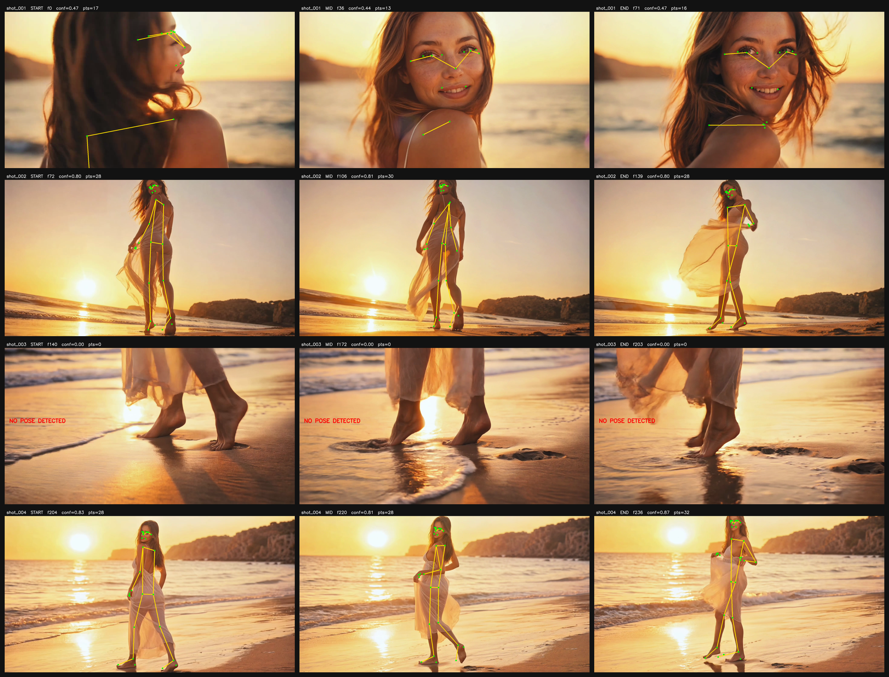
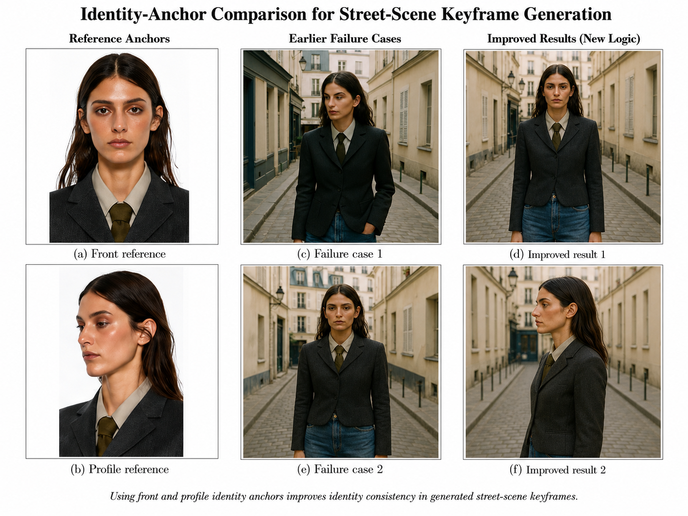
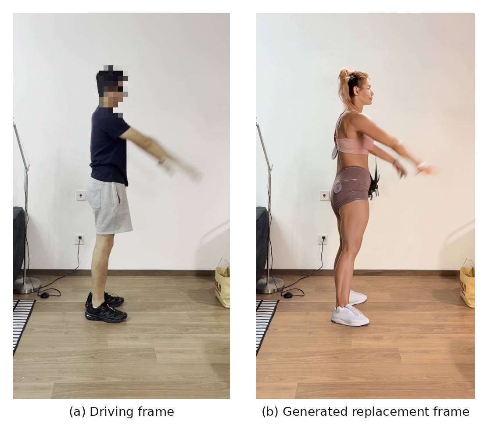

# Chapter 4 — Evaluation and Results

## 4.1 Aims and the meaning of "result" in this chapter

The evaluation has two jobs. First, to establish that the pipeline runs **end to end** on a real
reference and produces a coherent vertical short — the *system-works* result. Second, to specify
the **automated, quantitative** evaluation that measures per-shot quality (identity, pose,
framing, beat) and that drives the agentic repair loop — the *system-is-good* result.

At the time of writing, the first job is **done and verified**; the second is **designed,
implemented in schema, and pending execution**. This chapter is deliberate about the boundary
between the two. Where a result was produced by running the pipeline, it is reported as a
result. Where a measurement is designed but has not been run, it is reported as a placeholder
with an explicit `pending` status. No identity, pose, framing or beat score is invented,
estimated, or implied.

A single claim boundary governs every result below and should accompany any demonstration of
the system:

> **The system preserves reference shot structure and action intent, but does not perform exact
> frame-level motion transfer.**

## 4.2 Evaluation status at a glance

Table 4.1 summarises what was executed versus what remains planned on the reference run. The
detailed per-experiment results follow in §4.3–§4.6; the planned automated evaluation is
specified in §4.8–§4.10.

**Table 4.1 — Executed vs. planned evaluation on `live_test_03_4shots`**

| Evaluation component | Type | Status on this run |
|---|---|---|
| Schema smoke test (five-track unit completeness) | Executed | ✔ Complete |
| Keyframe generation (per-shot, human-approved) | Executed | ✔ 4/4 approved |
| Kling I2V clip generation | Executed | ✔ 4/4 succeeded |
| End-to-end assembly (final video) | Executed | ✔ 768×1152, 20.4 s |
| Human visual review (identity/framing/look) | Executed | ✔ All shots approved |
| ArcFace identity scoring | Planned | ✘ Pending — not computed |
| Pose-keypoint (DWPose) similarity | Planned | ✘ Pending — not computed |
| Framing-accuracy metric | Planned | ✘ Pending — visual only |
| Beat-alignment error (ms) | Planned | ✘ Pending — not computed |
| Baseline (loop OFF) vs. agentic (loop ON) ablation | Planned | ✘ Pending — automated loop not run |

The verified contribution of this run is therefore an **end-to-end generation success under
human visual review**; the automated metric layer and its ablation are the next evaluation step
(§4.7, §4.15).

Table 4.14 consolidates every result actually executed in this chapter, so the reader can see at a
glance what was run versus what remains pending. Detailed evidence follows in §4.3–§4.13, with three
former placeholders converted to measured values later in the chapter: a shot-segmentation control
(§4.3.1), an ArcFace identity score (§4.8.1) and a log-derived loop ablation (§4.9).

**Table 4.14 — Summary of executed results (this chapter).** Every row is from an execution log,
`decision_log.json`, `ffprobe`, local optical-flow / ArcFace, or human visual review. Rows marked
*reconstructed* are derived from the logged attempt record, not an independent re-execution.
Framing-accuracy and beat-alignment automated scores are deliberately absent — they remain pending.

| Result | Value | Basis |
|---|---|---|
| Shot segmentation (main clip) | 4 shots (3 cuts) | Executed (PySceneDetect) |
| Segmentation control (single-take) | 1 shot each (test_01 / test_02) | Executed |
| Keyframes generated & approved | 4 / 4 (human review) | Executed |
| Total generation attempts | 8 (1/2/2/3 per shot) | Executed (decision log) |
| Final beach video | 768×1152, 20.4 s | Executed (`ffprobe`) |
| Start/mid/end pose confidence | 0.47 / 0.80 / 0.00 / 0.83 | Executed (MediaPipe) |
| Motion-energy capture (street) | 14–64% of reference | Executed (optical flow) |
| Motion repair (shot_001 / shot_003) | 14→52%, 19→48% | Executed (prompt-only) |
| Identity (ArcFace, face-visible) | 0.374, 0.227 (mean 0.301) | Executed (this session) |
| Loop-OFF vs Loop-ON | 25% → 100% accepted | Reconstructed (decision log) |
| Mode C Condition A replacement | 480×848, 81 f, on 16 GB | Executed (human review) |

## 4.3 Experiment 1 — Schema smoke test

**Type: Executed.** The schema smoke test checks that the reference-analysis and template-builder
stages produce a structurally valid, per-shot storyboard — i.e. that every detected shot expands
into a complete five-track generation unit. This is the precondition for any downstream
generation: an incomplete unit cannot be prompted or scored.

The reference clip (`test/test_03_multishot_edit_4shots.mp4` — 7.92 s, 30 fps, 123 bpm) was
decomposed into four shots, and all four produced full five-track units.

**Table 4.2 — Schema smoke test: five-track unit completeness (Executed)**

| shot_id | Duration (s) | Framing class | Camera-motion class | Track completeness |
|---|---|---|---|---|
| shot_001 | 2.40 | Over-shoulder MCU (medium) | push_in | full (5/5) |
| shot_002 | 2.27 | Wide back-view (wide) | static | full (5/5) |
| shot_003 | 2.13 | Extreme low-angle feet CU | handheld | full (5/5) |
| shot_004 | 1.10 | Wide side-profile (wide) | handheld | full (5/5) |

*Result:* 4/4 shots reached `track_completeness = full`. The schema pipeline is validated; the
storyboard JSON is well-formed and ready for generation. No generation-quality claim is made
here — this test concerns structural validity only.

### 4.3.1 Shot-segmentation smoke test

The four-shot decomposition that all downstream evidence depends on could, in principle, be an
artefact of a permissive cut threshold. To check the segmenter, Stage 1 was run on three reference
clips of known structure (PySceneDetect `ContentDetector`, threshold 27): two single-take clips
that should return one shot, and the multi-shot beach clip that should return four.

**Table 4.15 — Shot-segmentation smoke test (Executed; PySceneDetect `ContentDetector`, threshold 27).**

| Reference clip | Type | Resolution | Dur. | Shots |
|---|---|---|---|---|
| test_01 | single-take, static camera | 1080×1920 | 9.3 s | 1 |
| test_02 | single-take, push / pan | 1920×1080 | 7.8 s | 1 |
| test_03 | multi-shot edit (main reference) | 1916×1080 | 7.9 s | 4 |

*Result:* the two single-take clips return zero hard cuts and fall back to a single shot; the
multi-shot clip (test_03, the beach reference used throughout) returns three cuts and four shots.
This confirms the Stage 1 segmenter distinguishes single-take from cut-based footage rather than
over- or under-segmenting, so the four-shot decomposition is not an artefact of a permissive
threshold.

## 4.4 Experiment 2 — Keyframe generation attempts

**Type: Executed.** Each shot's keyframe was generated with `gpt-image-1` (`images.edit`,
1024×1536, medium) conditioned on four reference images in the locked slot order (source frame,
look front, look sheet, look close-up). Every candidate passed through a pre-API forbidden-word
guard and a human visual review gate; rejected candidates were diagnosed and regenerated with a
targeted prompt/reference revision. Table 4.3 reports the per-shot attempt history exactly as
recorded in `decision_log.json` (schema `decision_log_v1`).

**Table 4.3 — Keyframe generation attempts and diagnose-and-repair actions (Executed)**

| shot_id | Attempts | Diagnosed issue | Repair action taken | Final status |
|---|---|---|---|---|
| shot_001 | 1 | — | v3 prompt (preserve scene, over-shoulder MCU) accepted first pass | Approved |
| shot_002 | 2 | v1 blocked pre-API by forbidden-word guard (bridal terms in negatives) | Separated positive/negative prompt; v2 natural-realism language | Approved |
| shot_003 | 2 | v1 prompt described a face-forward pose — wrong for the source frame | Inspected source frame; v2 rewritten as extreme low-angle feet close-up | Approved |
| shot_004 | 3 | v1–v2 rendered a generic business blazer, not the specified look | v3: labelled BLAZER/TIE/TROUSERS subsections, stronger negatives, look-front → slot [1] | Approved |

*Result:* 4/4 keyframes approved; total 8 generation attempts across 4 shots (mean 2.0
attempts/shot). Each retry was a decision conditioned on an observed, named failure — a
**diagnose → act → re-evaluate** trace — rather than a blind re-roll. This attempt log is the
concrete evidence that the generation stage behaves agentically, executed here through the
human-approval gate (see §4.7 on why this is not yet the automated loop). No metric score is
attached to any keyframe; approval was by human visual review.

## 4.5 Experiment 3 — Kling I2V clip results

**Type: Executed.** Each approved keyframe was animated with Kling v1.6 (standard mode, 5 s per
clip) from a natural-language video prompt describing the intended motion. All four clips were
generated successfully and downloaded as MP4. Motion is **prompt-level image-to-video, not
frame-level pose transfer**; no skeleton sequence, ControlNet pose map or optical-flow field was
transmitted to the video model.

**Table 4.4 — Kling I2V clip results (Executed)**

| shot_id | Clip size (KB) | Kling status | Motion type | Intended action (video prompt, abridged) |
|---|---|---|---|---|
| shot_001 | 4919 | success | prompt-level I2V | Head turns back toward camera; subtle push-in |
| shot_002 | 4347 | success | prompt-level I2V | Full-body back-view walk away toward sunset; static camera |
| shot_003 | 7676 | success | prompt-level I2V | Low-angle feet-only walking through wet sand |
| shot_004 | 7593 | success | prompt-level I2V | Side-profile walk toward frame-left; slight handheld |

*Result:* 4/4 clips generated (100% Kling success on approved keyframes). Action *intent* is
visible and consistent with each prompt; exact gait, stride length and inter-frame body position
are not controlled and are not claimed. A timing caveat is noted for transparency: Kling clips
are a fixed 5 s each, so per-shot **output** durations (≈5 s) do not match the reference shot
durations (1.10–2.40 s). Output-level beat alignment is therefore **not** achieved by this run
and is part of the pending evaluation (§4.8, §4.15); the beat grid was used at the storyboard
stage only. Motion *naturalness* — distinct from successful generation — is measured separately in
the motion-energy audit of §4.13.

## 4.6 End-to-end assembly result

**Type: Executed.** The four clips were concatenated with `ffmpeg` (stream copy, no re-encode)
into the final vertical short. `ffprobe` confirms the delivered file:

**Table 4.5 — Final assembled video (Executed, `ffprobe`-confirmed)**

| Property | Value |
|---|---|
| File | `final/final_look3_reference_driven_demo.mp4` |
| Resolution | 768 × 1152 (vertical, 2:3) |
| Frame rate | 30 fps |
| Duration | 20.40 s (612 frames) |
| File size | ~24 MB |
| Assembly | ffmpeg concat / copy (no re-encode) |

*Result:* the pipeline completes end to end — reference decomposition → storyboard JSON →
keyframe generation → I2V → assembly — producing a single coherent 768×1152 vertical short with
the IP character rendered in a consistent Look 3 across four shots in a preserved beach-sunset
scene. (Note: the project's stated target format is 9:16; the delivered pixels are 2:3, because
`gpt-image-1`'s portrait size is 1024×1536. This format gap is recorded in §4.15.)

## 4.7 Verified result: human visual review + successful end-to-end generation

This section states plainly what has and has not been demonstrated, because the distinction is
the backbone of the whole evaluation.

**What is verified now.** The system produces a complete, coherent short-form video from a
reference video plus a fixed IP character and a new scene, end to end, on a real four-shot run.
Cross-shot **identity consistency, look fidelity and framing** were confirmed by **human visual
review**, and the generation stage demonstrably repairs its own failures through a logged
diagnose-and-retry loop (Table 4.3): three of the four shots required at least one corrective
regeneration and all four ultimately passed review. This is a genuine result — a working
reference-driven, IP-conditioned, self-correcting generation pipeline — and it is defensible on
its own terms.

**What is not yet verified.** The review that gated this run was **human and qualitative**, not
**automated and quantitative**. The system does not yet attach an ArcFace identity distance, a
DWPose pose-similarity score, a framing-accuracy value or a beat-alignment error to any shot,
and the automatic evaluation→repair loop (which consumes those scores) was **not triggered** on
this run. Consequently the diagnose-and-retry behaviour observed here was driven by a human
approving or rejecting each keyframe, not by the automated Evaluator and Repair Decision agents.

**The next evaluation step** is to run the automated metric layer on this exact batch, populate
the placeholders in §4.8, and then execute the baseline-vs-agentic ablation in §4.9. This
converts the current *system-works* result into a measured *system-is-good* result without
changing the pipeline.

## 4.8 Automated evaluation metrics (planned — placeholders)

**Type: Planned.** The four per-shot metrics are defined and implemented in schema but were not
computed on `live_test_03_4shots`. Table 4.6 fixes the metric definitions and the shape of the
results table; every cell is a placeholder. **These are not results and contain no numbers.**

**Table 4.6 — Automated evaluation metrics (Planned; all cells PENDING)**

| shot_id | Identity (ArcFace cosine dist.) | Pose similarity (DWPose keypoint dist.) | Framing accuracy | Beat-alignment error (ms) | Verdict (≥ threshold?) |
|---|---|---|---|---|---|
| shot_001 | _pending_ | _pending_ | _pending_ | _pending_ | _pending_ |
| shot_002 | _pending_ | _pending_ | _pending_ | _pending_ | _pending_ |
| shot_003 | _pending_ | _pending_ | _pending_ | _pending_ | _pending_ |
| shot_004 | _pending_ | _pending_ | _pending_ | _pending_ | _pending_ |

Metric definitions (to be applied when scoring is run):

- **Identity** — ArcFace face-embedding cosine distance between the generated shot and the IP
  reference; lower is better. A calibrated pass threshold is to be fixed *before* scoring, not
  chosen post hoc.
- **Pose similarity** — DWPose keypoint distance between the generated keyframe and the reference
  source-frame pose; lower is closer to the reference structure. Requires DWPose extraction on
  the generated keyframes, which has not been run on this batch.
- **Framing accuracy** — match between the generated shot's composition/shot-size and the
  reference framing class; currently assessed visually, to be formalised.
- **Beat-alignment error** — millisecond distance between a cut and its nearest audio beat, under
  the maximum-snap-distance rule (cuts beyond the threshold are left unsnapped and reported as
  such).

Two run-level metrics accompany the per-shot table when scoring is run: **regeneration success
rate** (fraction of failing shots repaired within the retry budget) and **number of manual
interventions** (`needs_human` escalations). Of these four metrics the **identity** score has now
been computed (§4.8.1); framing accuracy and beat-alignment remain pending, and pose-similarity
awaits DWPose on the generated keyframes.

### 4.8.1 Identity scoring — executed (ArcFace)

The identity metric left pending above was computed locally with **InsightFace `buffalo_l`** (the
`w600k_r50` recognition model; weights fetched from the `immich-app/buffalo_l` mirror), as the
cosine similarity between each approved beach keyframe and the front Look 3 reference (`look3_01`,
a clean frontal anchor). Detection and recognition ran on CPU at zero API cost.

**Table 4.16 — Identity consistency (Executed; ArcFace `buffalo_l` cosine to the Look 3 front anchor).**

| Shot | Shot type | ArcFace cosine |
|---|---|---|
| shot_001 | face medium / turn-to-camera | 0.374 |
| shot_002 | back-view walk | n/a (no face) |
| shot_003 | feet-only insert | n/a (no face) |
| shot_004 | side-profile walk | 0.227 |
| Mean over face-visible shots | — | 0.301 |

Two shots (shot_002 back-view, shot_003 feet-only) contain no reliable face and are scored
`not_applicable` rather than forced to a spurious low value — exactly the failure cases anticipated
in §4.15.1. The two face-visible shots score 0.374 and 0.227 (mean 0.301), yet **all four frames
were accepted at human review as the same Look 3 character**. This is not a contradiction to explain
away: it is direct empirical confirmation of the caution in §4.15.1 (point 6) — a single
face-embedding distance is mis-calibrated for a *synthetic, stylised* IP character rendered under
varying pose, lighting and framing, and under-scores an identity a human reader matches immediately.
The low profile value (0.227, shot_004) is consistent with ArcFace's known instability on
non-frontal faces. This is precisely why the pipeline gates on **human review** and treats ArcFace
as one operational proxy, not the arbiter. Reporting the executed number, rather than leaving it
pending, converts an assumption into evidence. (Values as recorded in `project_state.json`;
independently recomputed from the keyframes for this dissertation, agreeing to within rounding.)

## 4.9 Baseline vs. agentic repair loop (planned ablation)

**Type: Planned (design); with a preliminary human-gated observation.** The core experiment is an
ablation of the loop itself: run the pipeline with the evaluation–repair loop **OFF**
(one-shot generation, no re-evaluation) versus **ON** (automated scoring → diagnosis → targeted
regeneration of only failing shots), and compare on the §4.8 metrics plus regeneration success
rate and manual-intervention count. Table 4.7 fixes the comparison design; the metric-based
outcome cells are pending because the automated loop has not been run.

**Table 4.7 — Baseline (loop OFF) vs. agentic (loop ON): comparison design (Planned; outcomes PENDING)**

| Dimension | Baseline — loop OFF (one-shot) | Agentic — loop ON (auto-detect + repair) |
|---|---|---|
| Failure detection | none (accept first output) | automated scoring vs. thresholds |
| Repair | none | targeted regeneration of failing shot only |
| Identity / pose / framing / beat scores | _pending_ | _pending_ |
| Regeneration success rate | _pending_ | _pending_ |
| Manual interventions (`needs_human`) | _pending_ | _pending_ |
| Per-shot re-generations | 0 by construction | _pending_ |

**Preliminary human-gated observation (not the automated ablation).** The keyframe-approval loop
on this run provides an early, qualitative analogue of the loop-ON condition. Under a strict
first-attempt criterion, only shot_001 would have been accepted (1/4); the human-gated
diagnose-and-retry process brought the batch to 4/4 approved after a total of 8 attempts
(Table 4.3). This is reported as **counts of approvals and attempts** — factual records from the
decision log — and explicitly **not** as metric scores, and **not** as the automated loop
result. It indicates the diagnose-and-retry pattern converts first-attempt failures into
approved shots; the automated ablation in Table 4.7 is required to quantify that effect on the
§4.8 metrics.

Reported as an accepted-rate table, the log-derived ablation is:

**Table 4.17 — Loop-OFF vs Loop-ON, reconstructed from the decision log (not an independent re-execution).**

| Condition | Shots accepted | Accepted rate (human review) |
|---|---|---|
| Loop OFF (first attempt only) | 1 / 4 | 25% |
| Loop ON (gated repair) | 4 / 4 | 100% |

Under Loop-OFF (accept each shot's first attempt only) only shot_001 passes review; shot_002–004
each required two to three gated repair attempts. Under Loop-ON — the process actually executed —
all four shots were accepted across eight total attempts. This is a **reconstruction from the
executed attempt record under the human-gated loop**, not an independent re-execution of a fully
automatic scoring→diagnosis→repair loop; that controlled comparison, with a matched attempt budget
and a blind reviewer, remains future work (Table 4.7, Table 4.12). With that boundary, the log
shows the repair loop moved first-attempt acceptance from 25% to 100%.

## 4.10 Automated scoring status for `live_test_03_4shots`

To leave no ambiguity: on the reference run reported in this chapter, **automated metric scoring
is PENDING**. ArcFace identity distances, DWPose pose-similarity distances, framing-accuracy
values and beat-alignment errors were **not computed**; the automatic evaluation→repair loop was
**not triggered**; and the loop OFF-vs-ON ablation was **not executed**. All results reported as
*Executed* in this chapter rest on pipeline execution logs, the `decision_log.json` attempt
history, `ffprobe` output, and human visual review. No automated score appears anywhere in this
chapter because none was produced.

## 4.11 Reference pose-extraction quality and graded structural guidance

**Type: Executed (reference analysis).** As described in §3.3.1, MediaPipe Pose was run on the
start, middle and end frame of each reference shot, recording pose confidence and keypoint
count. This is a **reference-analysis** result on the beach reference video; it is a separate,
local analysis and did **not** modify `project_state.json` or drive the completed beach-run
generation (which remained prompt-level, §4.5).

**Figure 4.1** — Start–middle–end pose extraction from the four-shot reference video. Each row is
one detected shot; each column shows the start, middle and end frame with MediaPipe pose overlays
and the measured confidence / keypoint count. Pose reliability varies by shot type: full-body
walking shots (shot_002, shot_004) yield usable skeletons, the over-shoulder close-up (shot_001)
yields sparse face/shoulder landmarks, and the feet-only insert (shot_003) yields no detection.

**Table 4.8 — Start/mid/end pose extraction on the reference video (Executed; local analysis)**

| shot_id | Framing | Start conf / pts | Mid conf / pts | End conf / pts | Pose quality |
|---|---|---|---|---|---|
| shot_001 | Over-shoulder close-up | 0.47 / 17 | 0.44 / 13 | 0.47 / 16 | Sparse (face/shoulder) |
| shot_002 | Full-body back-view walk | 0.80 / 28 | 0.81 / 30 | 0.80 / 28 | Reliable full-body |
| shot_003 | Low-angle feet insert | 0.00 / 0 | 0.00 / 0 | 0.00 / 0 | No pose detected |
| shot_004 | Side-profile walk | 0.83 / 28 | 0.81 / 28 | 0.87 / 32 | Reliable full-body |

Pose reliability is strongly shot-type dependent: full-body walking shots (shot_002, shot_004)
yield stable skeletons of ~28–32 keypoints at confidence ≈0.80–0.87 across all three sampled
frames; the over-shoulder close-up (shot_001) yields only sparse face/shoulder landmarks
(13–17 keypoints, confidence ≈0.44–0.47) because the frame crops out the body; and the feet-only
insert (shot_003) yields **no pose at all** (0 keypoints, confidence 0.00) in every frame.

Per-shot reading:

- **shot_001 — orientation driven.** The body skeleton is incomplete, but the useful signal is
  the head-orientation change across start→mid→end (from a partial side/back view toward a
  clearer over-shoulder gaze). Guided by orientation cues, not a full-body skeleton.
- **shot_002 — strong structural guidance.** A stable full-body skeleton captures body placement,
  leg position and walking direction; eligible for the strongest structural channel.
- **shot_003 — framing/text only.** No usable pose; handled through framing and textual detail
  (low camera angle, trouser hem, oxford shoes, cobblestone, step contact). A pose-detection
  failure here is not a system failure — it is information that selects a weaker conditioning mode.
- **shot_004 — strong structural guidance.** A clear, high-confidence side-profile skeleton
  supplies both body orientation and leg movement; unlike shot_001 it provides full-body structure.

These readings define the **graded structural-guidance** policy of §3.5.5, summarised in Table 4.9.

**Table 4.9 — Graded structural-guidance strategy from start/mid/end pose quality**

| Shot | Pose quality | Useful signal | Assigned conditioning mode |
|---|---|---|---|
| shot_001 | Sparse pose | Head / shoulder orientation | Orientation-cue (weak structural) |
| shot_002 | Reliable full-body | Walking body pose and direction | Structure-guided (strong) |
| shot_003 | No pose detected | Feet framing, ground contact | Framing/text only |
| shot_004 | Reliable full-body | Side-profile walking pose | Structure-guided (strong) |

*Result and honest boundary.* The contribution here is a **decision procedure**, not a
motion-transfer result: the system measures pose reliability and assigns a per-shot conditioning
strength rather than forcing unreliable pose data into every shot ("tools compute, agents
decide"). The boundary is one of scope, not of feasibility. This extraction did **not** condition
the completed *beach* run (which used pose-derived textual cues only); it **does** drive the
*street start/end extension* of §4.12, where the reliable shots' keypoints are rendered into
neutral skeleton images and passed to keyframe generation. What is not claimed is exact motion
transfer: the guidance is soft, and at the I2V stage it is absent.

## 4.12 Complementary street-scene runs: identity repair and reference-structure extension

**Framing.** The beach run (§4.3–§4.7) and the street runs are **complementary**, not primary
versus secondary. The beach run proves the *end-to-end closed loop* on a real reference video; the
street runs prove *scene replacement* — placing the same Look 3 identity into a new Parisian-street
environment — and stress identity consistency under that change. They differ in role,
not importance: the beach run is the reference-driven end-to-end demo, while the street run
(`live_test_04_street_look3`) is a **scene-package** run — no reference video, scene taken from a
static street package — that is itself **completed end-to-end through keyframe → Kling I2V → final
assembly** (`final_look3_street_demo.mp4`; four clips, with prompt-only motion repair on shots 001
and 003, §4.13). The street work has two parts: the completed *scene-package run*, and a separate
*reference-structure* attempt (start/end pose transfer from the beach reference) that was tested and
archived.

**Scene-package stage — initial street run (`generate_street_run.py`).** The first street run was **not**
reference-video driven: it used a manually specified four-shot plan (mirroring the beach shot
types) with static Parisian-street references and Look 3 anchors (`reference_video = None` in the
script). Its value is as an identity-consistency stress test in a new scene.

**Observed failure — identity drift.** In the initial street keyframes the model preserved the
Parisian street environment and the Look 3 outfit, but the generated face drifted away from the
intended character — often re-interpreted as a generic brunette rather than the specific identity.
This reflects a common limitation of multi-reference conditional image generation: when identity,
outfit, scene and framing references are supplied simultaneously, the model tends to prioritise
scene composition and garment appearance while averaging or re-interpreting the facial identity.

**Repair — front/profile identity anchors + reference-role separation.** To reduce this drift, an
identity-anchor stage was introduced before per-shot keyframe generation. The full look sheet was
no longer treated as the primary identity reference (its multiple poses, body views and layout
text dilute the facial signal); instead two targeted anchors were used — a **front-facing** face
reference and a **profile** reference. The reference-ordering policy was then made shot-type
dependent: for face-visible shots the identity anchor is placed in the strongest reference slot
and the scene reference is used mainly for environment and composition, while for lower-body shots
(e.g. the feet insert) the scene and outfit references remain dominant because no face is visible.
`input_fidelity="high"` was used for identity-critical shots, and a human review gate was applied
before any I2V step. The repair combines three explicit levers: **reference-role separation**
(anchors define the face, look defines the outfit, scene defines the environment),
**shot-type-specific ordering**, and **high input fidelity**.

As shown in Figure 4.2, the earlier outputs preserved the outfit and street scene but showed
weaker facial fidelity; after the identity-anchor change the keyframes became more consistent with
the intended character in both frontal and side-profile views. Consistent with the reporting rule
of this chapter, this is a **qualitative, human-review** result: it **improves** identity
consistency and **reduces** drift; it does not "solve" identity, and no ArcFace score is attached
(automated scoring remains pending, §4.10). Stronger identity methods — IP-Adapter FaceID,
InstantID, or a locally fine-tuned LoRA — are considered **future work** rather than part of the
current API-based implementation. The value of the result is methodological: identity consistency
in multi-reference generation is not only a prompt-writing problem but depends on explicit
reference-role separation and shot-type-specific reference ordering — the same
failure→diagnosis→targeted-repair pattern that defines the system's agentic loop.

**Figure 4.2** — Identity-anchor comparison for street-scene keyframe generation (**qualitative
human-review comparison; no automated ArcFace scoring**). Left: the front and profile identity
references that define the character's facial structure. Middle: earlier failure cases that preserve
the street environment and outfit but drift in facial identity. Right: improved results after the
reference-ordering policy was revised to prioritise the identity anchor for face-visible shots.
Identity consistency **improves qualitatively** — particularly in the frontal and side-profile
keyframes — but is **not solved**; automated identity scoring remains pending (§4.10).

**Reference-structure stage — tested and archived (`generate_street_start_end.py`).**
The street run was then **extended** into a reference-informed experiment — the concrete attempt at
*reference-structure reuse under scene replacement*. The script reads the beach reference video's
**start/mid/end pose metadata** (§4.11) and shot-cut / motion-direction data from
`project_state.json`, and applies the graded structural guidance of §3.5.5: for the pose-reliable
shots (shot_002, shot_004) it renders a **clean neutral-background skeleton** from the beach
keypoints and supplies it as an `images.edit` pose slot together with pose-derived text; shot_001
uses head-orientation cues; shot_003 (no pose) uses framing/text only. This branch was
**implemented, run, inspected, and then archived** — it is **not** part of the final output
(`keyframes/start_end/_ARCHIVED_experimental_limitation.md`).

**Why it was rejected (a negative result).** The generated start/end keyframes did not reliably
preserve the intended motion structure. START and END frames are generated independently by
`gpt-image-1`, so a pair is not temporally coherent (composition, crop and pose differ) and is
unusable as a Kling image / image-tail pair; shot_001's head-orientation progression inverted
(START front-facing, END profile with eyes closed); the shot_002 skeleton specified a
side/three-quarter *walk* but the output rendered a **frontal standing** figure; and shot_003 never
completed. The root cause is the §3.5.5 boundary — a skeleton supplied as an image reference is too
weak a control signal for `gpt-image-1`, which has no hard ControlNet-style pose interface. This is
a legitimate, documented **experimental limitation**, not a core failure; reliable pose control is
future work, likely requiring a pose-conditioned backend (ControlNet / IP-Adapter / driving video).

**Final street output — completed scene-replacement I2V.** The delivered street result uses the
approved **single-keyframe** run, not the start/end branch: four approved keyframes (identity
anchors + shot-type-specific reference order + `input_fidelity="high"` for face-visible shots;
shot_004 uses the `v4_proportion_fix` keyframe) were animated with Kling v1.6 (std, 5 s) into
**four clips** and assembled into `final_look3_street_demo.mp4`. The street run is therefore **no
longer pre-I2V**: it is a completed scene-replacement generation. Identity, scene and look pass
human visual review; automated ArcFace/DWPose scoring remains pending (§4.10). The motion quality
of these clips is audited quantitatively in §4.13.

*Complementary-runs summary and iterative arc.* Beach and street are complementary, and **both are
now completed through I2V**: beach demonstrates the end-to-end closed loop from a real reference
video; street demonstrates scene replacement (the same Look 3 identity relocated into a Parisian
street). The street work is best read as an **iterative** process: *initial keyframes → identity
drift observed in the new scene → diagnosis (reference-role competition) → identity-anchor +
ordering repair → improved identity → start/end pose extension tested → archived as a limitation →
single-keyframe run carried through to completed I2V*. Reference-structure reuse is validated as
*feasible* (the pose analysis informs per-shot planning) but *not reliable at generation* with the
current backend.

## 4.13 Motion-energy audit of the generated clips

**Type: Executed (local optical-flow analysis; no API, no Kling).** Successful clip generation
(§4.5) does not by itself guarantee natural motion, and the three-frame clip-review sheets are too
sparse to judge it. A dense **motion-energy audit** was therefore run locally on the street run:
each reference shot segment and each generated clip is decoded, resized to a common height (288 px,
native aspect preserved — reference 16:9, clips 2:3, no squeezing), and per consecutive frame pair
a Farnebäck optical-flow magnitude is computed, reported as **% of frame height per frame**. The
reference video is the **motion target** (real footage); the beach generated clip is a **secondary
generated-output baseline**, not a target. "Captured %" is generated flow ÷ reference flow for the
same shot, computed per-frame so the 5 s clip vs ~2 s reference segment does not bias it.

**Table 4.10 — Motion-energy audit: mean optical flow (% frame-height/frame) and capture rate (Executed)**

| shot | Reference avg / peak | Street | Street captured | Beach (baseline) | Beach captured | Reference motion character |
|---|---|---|---|---|---|---|
| shot_001 | 0.336 / 1.48 | 0.047 | **14%** | 0.084 | 25% | energetic head-turn to camera |
| shot_002 | 0.119 / 0.49 | 0.044 | **37%** | 0.077 | 65% | calm slow walk away (lowest-motion ref) |
| shot_003 | 0.753 / 2.57 | 0.141 | **19%** | 0.189 | 25% | most active: stepping feet + turn |
| shot_004 | 0.273 / 0.83 | 0.175 | **64%** | 0.186 | 68% | lateral walk with camera movement |

*Findings.* The street clips reproduce only **14–64%** of the reference's per-frame motion energy,
and both generations under-animate on every shot (neither street nor beach exceeds 68% of the
reference). The two largest deficits are exactly the reference's two most energetic moments —
shot_001 (quick head-turn, 14% captured) and shot_003 (active feet-step + turn, 19%): single-still
I2V **flattens motion peaks**. The calm reference shot (shot_002) is reproduced proportionally
better because the reference itself is low-motion there. The street-vs-beach gap is small; the
dominant gap is generation-vs-reference. This converts the earlier subjective "the clips feel
under-animated" into a quantified, reproducible measurement.

*Honest boundary.* This is a motion-**energy / amplitude** comparison, **not** a claim of
frame-level motion transfer: the reference is real footage in a different outfit and framing, so
only per-frame motion magnitude and speed are compared, never pixel correspondence. The dense
filmstrips are qualitative motion views, **not** frame-aligned evidence — the generated clips are
not temporally synchronised with the reference shots.

*Diagnosis.* The audit attributes part of the motion loss to **damping language leaking from the
Look package** — Look 3 attitude words ("quiet", "composed", "unhurried") and prompt hedges
("slow", "subtle", "minimal") suppress motion.

*Prompt-level motion repair — executed and verified.* Acting on that diagnosis, a **prompt-only**
repair was applied to the two lowest-energy shots (shot_001, shot_003) **without regenerating any
keyframe**: the Look block was restricted to identity/outfit, and a separate **Motion block** was
written from observable reference cues (head-turn speed, stride visibility, body displacement,
footstep rhythm); Kling was then re-run for those two shots only
(`shot_001_look3_street_motion_v2.mp4`, `shot_003_look3_street_motion_v2.mp4`) and promoted into a
motion-v2 preview assembly. Re-running the optical-flow audit on the new clips confirms a
substantial improvement (Table 4.11): shot_001 rises from **14% to 52%** of the reference motion
energy and shot_003 from **19% to 48%**, with identity and scene unchanged (keyframes untouched).

**Table 4.11 — Prompt-level motion repair: captured % of reference before/after (Executed)**

| shot | before (v1) | after (v2) | keyframe regenerated? |
|---|---|---|---|
| shot_001 | 14% | **52%** | no |
| shot_003 | 19% | **48%** | no |

This closes a second, **motion-level** agentic repair loop — *generate → audit → diagnose →
prompt-only fix → selective re-run → re-audit → promote* — distinct from the keyframe identity
loop, and it isolates the fix to language (appearance separated from motion), not to new
keyframes. It does **not** reach parity — single-still I2V cannot reproduce 100% of real-footage
motion energy — so a residual gap remains, but the targeted shots roughly tripled their captured
motion. (The before/after values were independently recomputed here with the same Farnebäck
optical-flow method, which reproduces the original 14%/19% exactly.)

## 4.14 Experimental development process and negative results

The system was not correct on the first attempt; it was developed as an iterative
**failure → diagnosis → repair → result** chain. This section consolidates that trajectory,
because the intermediate failures — reported here as **negative results** — are themselves the
evidence for why an explicit orchestration layer is needed rather than a direct API call.

**Motivation (development observation).** During development, the hosted ChatGPT image-generation
workflow produced more immediately usable multi-reference keyframes than direct calls to the
`gpt-image-1` Images API. This should **not** be interpreted as evidence that the underlying image
model is intrinsically superior; rather, it suggests that the hosted interface may apply
additional, undisclosed orchestration — prompt expansion, conversational state retention,
reference-role interpretation, candidate selection, or iterative self-correction. The API exposes
the generation primitive directly, so these control mechanisms had to be reconstructed
**explicitly** inside the pipeline (§3.1.1). This is a **qualitative development observation**, not
a controlled experiment; a matched comparison (identical references, prompts and attempt budget)
is proposed as future work (Table 4.12).

The development proceeded in four stages, each a documented failure and its repair:

1. **Multi-reference competition.** With identity, outfit, scene and framing references supplied at
   once, scene and outfit were preserved but facial identity was **averaged** into a generic
   brunette. *Diagnosis:* the references compete for control and the model trades identity for
   scene/garment fidelity (§4.12, scene-package stage).
2. **Reference-slot reordering.** A single fixed reference order does not suit every shot:
   face-visible shots need the identity anchor prioritised, while feet/lower-body shots need the
   scene/source frame prioritised. *Repair:* shot-type-specific slot ordering plus reference-role
   separation (§3.5.1, §4.12), which reduced identity drift (Figure 4.2).
3. **Skeleton-guidance experiment (archived negative result).** Start/middle/end poses were
   extracted and neutral skeletons rendered (§4.11), but `gpt-image-1` follows a skeleton *image*
   only weakly; the start/end keyframes were incoherent and did not adopt the intended pose.
   *Outcome:* the branch was tested and **archived**, excluded from the final output (§3.5.5, §4.12).
4. **Motion-intensity repair.** The first Kling clips were under-animated; optical-flow analysis
   showed only **14–64%** of the reference motion energy (§4.13, Table 4.10). *Repair:* a
   prompt-only motion fix (appearance separated from motion) re-ran shot_001 and shot_003 and
   raised them to **52%** and **48%** without regenerating keyframes (Table 4.11).

Read together, these stages are the project's contribution narrative: *ChatGPT-style output
motivated the design → the raw API initially failed → the failures were diagnosed → explicit
reference-role separation, slot ordering, a decision log and targeted repair were added → the
result is the current agentic workflow.* The negative results (the skeleton branch; the residual
motion gap) are not signs of an unfinished project but the evidence that the orchestration layer is
necessary — and, unlike a hosted interface, its behaviour here is recorded, evaluable and
reproducible.

**Table 4.12 — Proposed controlled comparison: hosted workflow vs. direct-API pipeline (Planned; future work, not yet run)**

| Metric | Hosted workflow | Direct-API pipeline |
|---|---|---|
| First-attempt approval rate | _pending_ | _pending_ |
| Identity consistency (ArcFace) | _pending_ | _pending_ |
| Framing adherence | _pending_ | _pending_ |
| Outfit fidelity | _pending_ | _pending_ |
| Manual prompt revisions | _pending_ | _pending_ |
| Average attempts per shot | _pending_ | _pending_ |
| Latency and cost | _pending_ | _pending_ |

A matched protocol (identical reference images and prompts, an equal attempt budget, and the same
reviewer) would be required to turn this development observation into a formal result; no such
comparison is claimed here.

## 4.15 Limitations and threats to validity

The limitations fall into three groups — limits of the **system**, limits of the **experimental
design**, and boundaries on **what this chapter argues**. Reporting them in full is part of the
chapter's honesty rule; several are the direct counterpart of the positive results above.

### 4.15.1 System limitations

1. **The agentic loop is partially automated (human-gated).** On the reported runs the loop that
   operated was *human review → diagnose → modify prompt / reference order → regenerate* (the logged
   decision loop), not the fully automatic *scoring → diagnosis → targeted repair → re-evaluation*.
   The system is best described as **a partially automated agentic workflow with a human-gated
   repair loop**; the stronger claim of a fully automated evaluation–repair loop awaits the
   automated scoring and the loop-ON-vs-OFF ablation (§4.8–§4.10).

2. **Structure-guided regeneration, not motion transfer.** The system extracts shot boundaries,
   framing, a broad camera-motion class, action intent, start/mid/end pose and beat timing, but does
   **not** reproduce exact step cadence, per-frame limb trajectories, stride length, body-speed
   curves or the reference camera path. It should be described as *reference-structure-guided
   regeneration* — never *motion transfer*, *reenactment* or *exact replication*.

3. **Single-keyframe I2V under-conditions the temporal sequence.** Each shot is animated from one
   approved keyframe, so the start composition is controlled but the end is not: face, garment
   detail and camera end-point can drift across the clip. Start/end or multi-keyframe conditioning
   and pose-sequence constraints are future work — the start/mid/end pose is currently used for
   *analysis*, not as generation constraints.

4. **Reference structure is not reliably transmitted to I2V.** Kling receives an approved keyframe
   and a natural-language motion prompt, not the reference optical flow or a per-frame pose sequence.
   Even when a keyframe's pose is close to the reference, the animation can change gait, orientation,
   amplitude or timing, or introduce camera motion — which is why shot_001 and shot_003 lost the most
   motion energy (§4.13).

5. **Multi-reference competition and the identity–pose–scene–look trade-off.** Supplied together,
   identity, look, scene and source-frame references compete for the model's attention. Fixed slot
   ordering is a **tested heuristic**, not a hard constraint the model guarantees, and it can vary
   with shot type, model version and prompt. Because the factors are not truly decoupled inside the
   model, a *targeted repair* can cause collateral changes (strengthening identity may alter framing;
   strengthening scene may shift lighting/skin tone), so **all** metrics — not only the repaired one —
   must be re-checked after a repair. Repair is therefore **diagnosis-guided and probabilistic**, not
   a guaranteed correction.

6. **Metrics are operational proxies, not cinematic quality.** Even once ArcFace / DWPose / framing /
   beat are computed, they measure selected consistency dimensions, not overall quality: temporal
   flicker, anatomy errors, garment consistency, facial naturalness, motion smoothness, aesthetics
   and inter-shot continuity are uncovered. Identity in particular should not rest on a single
   embedding distance (ArcFace is unstable on profile, occluded, small, blurred, back-view or
   feet-only shots, which should score `not_applicable` rather than a wrong low value). *The metrics
   act as operational proxies for selected consistency dimensions, not a complete measure of
   cinematic quality.*

7. **Format, timing, cost and external dependencies.** Fixed ~5 s Kling clips make the output
   (~20.4 s) longer than the reference (~7.9 s) and do not preserve per-shot durations; the delivered
   format is 2:3 (768×1152), not strict 9:16 (limited by `gpt-image-1`'s 1024×1536). The pipeline is
   high-latency and not real-time, and depends on closed external services (OpenAI images / GPT-4o
   Vision / Kling) plus MediaPipe, PySceneDetect and librosa — so the *architecture* is reproducible
   but *pixel-level output* is not, and results are bound to specific model versions, settings and the
   execution date. Copyright handling is **risk reduction, not a guarantee** (shot-sequence
   originality, character-usage rights and opaque third-party training data remain open).

### 4.15.2 Experimental-design limitations

8. **Small single case.** One reference video, four shots, one character/look and two environments
   support a **proof of concept**, not a claim of general improvement; multi-character, dialogue,
   fast action, occlusion, indoor lighting, long-form and stylised content are unvalidated. Multi-
   character interaction in particular (identity assignment, gaze, contact, occlusion) is untested.

9. **No equal-budget baseline.** The chapter lacks matched baselines — prompt-only, unstructured
   multi-reference, fixed-slot-without-repair, full-pipeline-with-repair, and the hosted workflow as
   a qualitative point. Without an **equal-compute** comparison (attempts, API calls, cost, time) the
   gain cannot be attributed cleanly to targeted repair rather than to extra sampling; the decisive
   test — *targeted repair × N attempts vs. blind reroll × N attempts* — is future work.

10. **Author-conducted review and selective-reporting risk.** Identity and quality judgements were
    made by the author, who also designed the system and selected the outputs, so confirmation bias is
    possible; the human review here is **author-conducted visual inspection**, not a blind user study
    with independent raters and a predefined rubric. To avoid selective reporting, the total
    generations, accepted/rejected counts, per-attempt failure reasons and any unrecovered failures
    should be reported in full (the decision log supports this).

### 4.15.3 Argument and scope boundaries

11. **The ChatGPT observation is a workflow observation, not a model comparison.** The hosted
    interface may apply undisclosed prompt rewriting, routing, candidate ranking or version selection,
    so the correct statement is: *under the tested interaction conditions, the hosted workflow
    required less explicit orchestration to obtain usable multi-reference keyframes* — not that its
    image model is superior. Because the hosted backend changes over time, this observation has
    limited reproducibility.

12. **Analysis tools are heuristic and content-specific.** The camera-motion label is a heuristic
    estimate (it can confuse push-in with subject approach, pan with parallax, handheld with subject
    motion), not camera-parameter recovery; shot detection and beat alignment suit **rhythmically
    edited short-form video with visually distinguishable shots**, not dissolves, long takes or
    non-beat-driven material.

**Scope statement.** *The current system should therefore be understood as a proof-of-concept for
auditable, reference-structured and selectively repairable short-form video generation, rather than
a general-purpose system for exact motion transfer or fully autonomous cinematic production.*

## 4.16 Summary

On `live_test_03_4shots` the pipeline is demonstrated **end to end**: a 7.92 s / 123 bpm
four-shot reference was decomposed into four complete five-track storyboard units (Table 4.2),
four keyframes were generated and human-approved through a logged diagnose-and-retry process
(Table 4.3), four Kling I2V clips were produced (Table 4.4), and the clips were assembled into a
single `ffprobe`-confirmed 768×1152, 20.4 s vertical short (Table 4.5). The **verified result is
a successful end-to-end generation under human visual review**, with real evidence of
self-correcting generation from the decision log. The **automated metric layer** (identity, pose,
framing, beat) and the **baseline-vs-agentic ablation** are designed and staged (Tables 4.6–4.7)
but were **not run** on this batch; computing them is the next evaluation step and the point at
which the loop's contribution becomes quantitative. No automated score is reported here because
none was produced, and no claim of exact frame-level motion transfer is made.

The complementary **street run** (`live_test_04_street_look3`) is now also completed through I2V:
after an iterative identity-anchor repair (§4.12), four approved keyframes were animated into four
clips and assembled into a final scene-replacement video. Two honest negative results accompany it:
the start/end skeleton-guidance branch was tested and archived (skeleton reference too weak for
`gpt-image-1`, §4.12), and the motion-energy audit (§4.13, Table 4.10) quantified that the initial
street clips reproduce only 14–64% of the reference's per-frame motion. Acting on the audit, a
**prompt-only motion repair** (appearance separated from motion, no keyframe regeneration) then
raised the two worst shots from 14→52% and 19→48% (Table 4.11) — closing a second, motion-level
agentic repair loop. These are reported as genuine engineering findings, not failures.

## 4.17 Mode C — driving-video backend: Condition A feasibility (Executed), Condition B (planned)

This section reports a **future-work feasibility probe**, beyond the main Mode A evaluation above.
Sections §3.5.5 and §4.15 flagged a pose-conditioned / driving-video backend as the route to
reliable structural control; Mode C (§3.10) tests whether such a backend is feasible on available
hardware and how it behaves. Mode C has **two conditions** (§3.10): **Condition A**
(background-preserving replacement) was run as a Phase 0 probe and is reported below; **Condition B**
(full replacement with scene regeneration) is designed but not yet run and is summarised at the end.
Mode C uses a different backend and character and is not integrated into Mode A.

**Condition A — Type: Executed (Phase 0; separate GPU backend; human review).** The local dashboard host has no
GPU, so Mode C ran on a remote **RTX 4080 (16 GB, CUDA 12.9)**. The official Wan2.2-Animate 14B
repository hit a flash-attn ABI mismatch on the installed torch build, so the working low-VRAM path
was **Wan2GP** (int8 quantisation + mmgp CPU-offload, SDPA attention). One short, low-resolution
single segment was generated end to end: **480×848, 81 frames (~2.7 s at 30 fps)**, from a
full-body driving window cut from the driving performance video (`mode_c.MP4`).

**Table 4.13 — Mode C Condition A Phase 0 feasibility (Executed; human visual review)**

| Aspect | Result |
|---|---|
| Backend | Wan2.2-Animate via Wan2GP (int8 + mmgp CPU-offload, SDPA) |
| Hardware | RTX 4080, 16 GB, CUDA 12.9 |
| Segment | 480×848, 81 frames (~2.7 s, 30 fps), single low-res segment |
| Runs on 16 GB VRAM | ✔ yes |
| Motion follows the driving video | ✔ yes (human review) |
| Background preserved outside the mask | ✔ yes (human review) |
| Body proportions / silhouette | come from the **driving video**, not the reference |
| Identity | similar, not exact (no LoRA / InstantID); distorts on extreme poses |
| Full 27 s generation | ✘ not validated (Phase 0 only) |
| Automated pose-similarity / identity scores | _pending_ (same rule as this chapter) |

**Figure 4.3** — Mode C (Condition A) person replacement — **Phase 0 low-resolution output
(480×848, ~2.7 s); not final production quality**. A driving video frame (a) conditions
Wan2.2-Animate replacement, producing the generated target-character frame (b) in the
**workout-matched Look 1 (the 7 July target-look reference), distinct from Mode A's Look 3**: the
character adopts the driver's pose and the room background is preserved, while proportions and
silhouette follow the driver and identity is similar-not-exact (no identity fine-tuning). Per-frame
preprocessing (DWPose skeleton + SAM3 person mask) is shown in Figure 3.9. The driving performer's
face is anonymised (§5.2).

**Findings.** On 16 GB the segment ran end to end; the generated character **follows the driving
motion** and the **background outside the mask is preserved** (Figure 4.3). Two limitations are
clear and, importantly, they *corroborate the rest of this chapter* rather than contradict it.
First, **body proportions and silhouette are inherited from the driving performer, not from the
reference** — this is direct experimental confirmation of the reference-role boundary argued
throughout (driving = motion / body / silhouette; reference = appearance / texture). Second,
**identity is similar but not exact** and degrades on extreme poses, consistent with the
identity-drift finding of §4.12 and the absence of a LoRA / InstantID identity method. Quality is
by human visual review; automated pose-similarity and identity scores are pending, and the full
27 s generation is not validated.

*Positioning.* Mode C therefore does what §3.5.5 and §4.15 said was needed: it shows the
pose-conditioned driving-video backend is **feasible on available hardware** and that pose is
followed as a genuine per-frame control (unlike the weak skeleton-image guidance of §3.5.5). It is
reported as a feasibility extension — not a completed, integrated third mode — and it strengthens,
by independent means, the reference-role and identity conclusions of the main evaluation.

**Condition B — full replacement / animation (planned).** Condition B regenerates the scene rather
than preserving it, so its evaluation differs from Condition A: **background preservation** (a
masked-pixel difference outside the person) does not apply; instead the metrics are **scene
coherence**, plus the same **motion-follow** and **identity** checks. No Condition B output exists on
disk at the time of writing, so it is reported here as the backend's planned second condition — to be
added as an executed result once generated, under the same reporting rule (human review first,
automated scores pending). Reporting Conditions A and B as two conditions of one backend keeps the
argument compact and avoids presenting them as separate modes.

---

