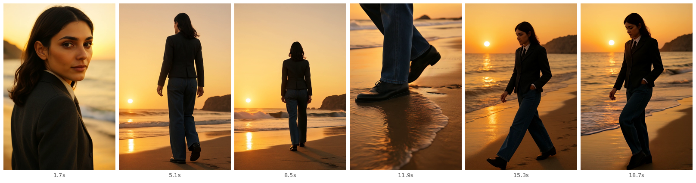
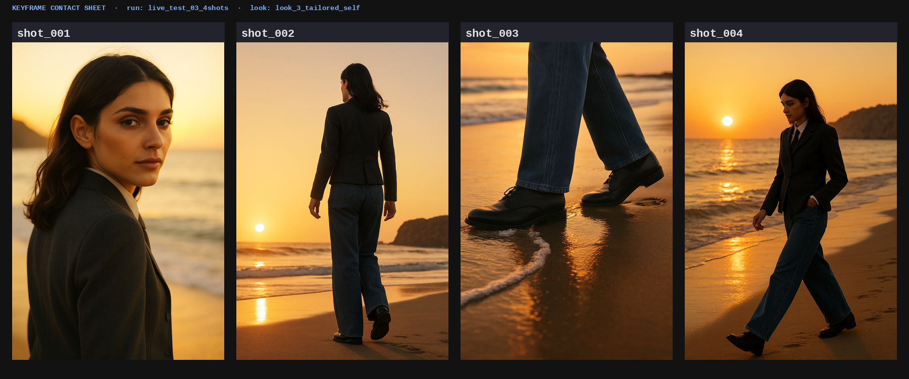
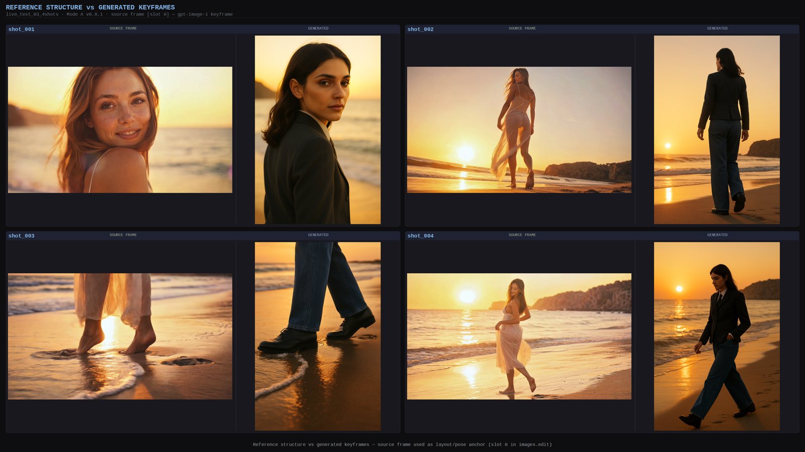

# Appendix A — Results Showcase

This appendix collects the concrete artefacts produced by the system so that the delivered work can
be inspected directly rather than only described. All material is from the completed end-to-end beach
run (`live_test_03_4shots`), the strongest executed evidence in the dissertation; the figures are the
system's own outputs, not illustrations.

## A.1 End-to-end output: the assembled beach short

Figure A.1 samples the final assembled vertical short (768×1152, 20.4 s) at even intervals across its
four shots. The character identity, look (the charcoal-blazer "Look 3") and seaside scene hold across
an over-shoulder close-up, a back-view walk, a low-angle feet insert and a side-profile walk — the
four shot types decomposed from the reference — demonstrating the identity/look/scene consistency the
pipeline is designed to preserve.

**Figure A.1** — Frame grid from the final assembled beach short (`final_look3_reference_driven_demo.mp4`), sampled at 1.7 s, 5.1 s, 8.5 s, 11.9 s, 15.3 s and 18.7 s. One coherent character across the four reference-derived shot types.

## A.2 Approved keyframes

Figure A.2 is the keyframe contact sheet: the four per-shot keyframes that passed the human review
gate and were then animated to video. These are the "key poses" of the pose-to-pose strategy (§2.1),
generated first and approved before any image-to-video step.

**Figure A.2** — The four approved keyframes (`gpt-image-1`, `images.edit`, 1024×1536), one per shot, produced across eight logged generation attempts (1 / 2 / 2 / 3 per shot) before assembly.

## A.3 Reference structure vs. regenerated content

Figure A.3 places the reference frames beside the regenerated keyframes for the same shots. It makes
the central "extract structure, regenerate content" principle (§3.8, §5.1) visible: shot framing,
body orientation and composition are carried over, while the character, look and rendered pixels are
newly generated and share none of the reference's content.

**Figure A.3** — Reference frames (top) vs. the system's regenerated keyframes (bottom) for the corresponding shots. Structure is reused; content is regenerated with the project-owned IP character.

## A.4 Decision-log excerpt (state file)

The pipeline's agentic behaviour is recorded in a single readable state file, `decision_log.json`.
The excerpt below is the record for `shot_002` exactly as written by the run — the shot whose first
keyframe attempt was blocked by the pre-API forbidden-word guard and regenerated. It shows the fields
that make the loop auditable: the generation attempt count and diagnosis, the I2V record, and — under
the executed-versus-pending reporting rule — the automatic-evaluation state left honestly as
`pending` rather than fabricated.

> `shot_id`: shot_002 · `framing`: wide
> `keyframe_generation`: { `attempts`: 2, `status`: approved, `model`: gpt-image-1 / images.edit / 1024×1536, `notes`: "v1 blocked by forbidden-word guard (bride/bridal in negative instructions); v2 natural-realism language, approved" }
> `kling_i2v`: { `model`: kling-v1-6 / std / 9:16 / 5s, `motion_type`: prompt-level I2V (not pose transfer), `status`: success }
> `evaluation`: { `status`: pending, `note`: "Evaluation not yet run. Awaiting user approval to start." }
> `repair`: { `status`: not_run, `note`: "No repair triggered — evaluation pending." }

Across the four shots the state file records eight keyframe-generation attempts (1 / 2 / 2 / 3), each
diagnosed and repaired at the keyframe stage under human review, four successful I2V clips, and a
consistent `evaluation: pending` state — the complete, honest decision record that doubles as the
dissertation's evaluation data (§4.4, §4.9).
