# 两个站里的"水"：怎么做

activetheory.net 和 alche.studio 里所有看起来像水、液体、流动的效果，一共 6 种。每种都配了原站截图、原理，以及一个能直接在浏览器打开的最小 demo（`demos/*.html`，需要联网加载 three.js）。

**先说结论：** 6 种里只有"鼠标流体"一种是真在算流体，其余都是假的：法线图滚动、镜面反射、噪声、贴图、视频。做水，**先学会"用一张图去推歪另一张图的采样坐标"**，这一招覆盖了 80% 的情况。

| # | 效果 | 在哪个站 | 真正的做法 | demo |
|---|---|---|---|---|
| 1 | 有倒影的积水 | activetheory 树场景 | 镜面反射 + 4 层滚动法线图扰动 | `01_mirror_water.html` |
| 2 | 鼠标搅动画面 | 两个站都有 | 小网格流体模拟（256 宽），速度图用来扭画面 | `02_mouse_fluid.html` |
| 3 | 彩虹液态薄膜 → 全屏 | alche Vision 段 | 域扭曲噪声 + 余弦调色板；顶点插值铺满全屏 | `03_liquid_film.html` |
| 4 | 水下看到的焦散光网 | activetheory CleanRoom | 原站：一张静态碎冰图；demo：Worley 边缘噪声 | `04_caustics.html` |
| 5 | 粉色"液态光带" | activetheory 首页 | 视频贴在弯曲平面上，径向淡出，再加 Bloom | （见下文代码） |
| 6 | 作品切换像水一样滑过 | alche 作品区 | 两张图软边混合，加格子随机错位 | （见 alche 报告） |

---

## 1. 镜面水（activetheory 树场景）

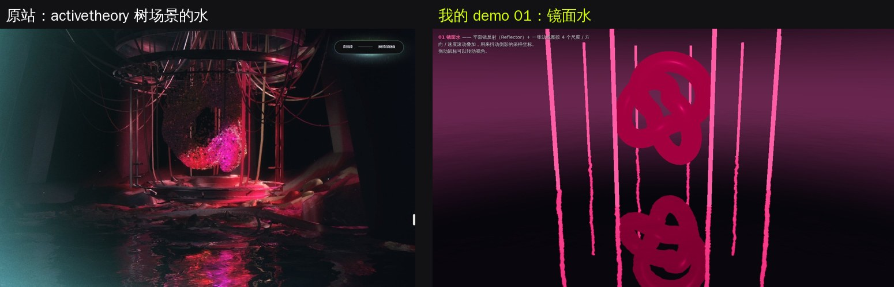

原站连续几帧（看倒影怎么抖）：

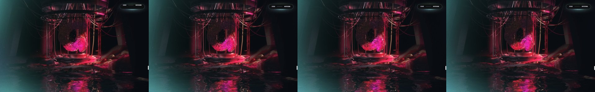

我的 demo 01：

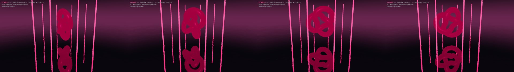

**原理（3 步）：**
1. **倒影：** 用 three.js 自带的 `Reflector`。它会从一个"镜像相机"（相机沿水面翻转到水下）再渲染一遍场景，得到一张倒影图。原站这张图是 1024×1024。
2. **波纹：** 用**同一张**可平铺的法线图，按 4 种不同的缩放、方向、速度滚动，然后相加。4 层方向各不相同，所以看不出重复，而且像水面各处在往不同方向流。
3. **核心一行：** 用这个法线的 xz 分量去推歪倒影的采样坐标：`uv += N.xz * 0.03`。倒影于是被揉碎，变成水面上抖动的光带。

最后按菲涅尔混合：平视时越像镜子，往下看时越暗。再加一点高光和 Bloom，就是原站的样子。

**关键代码（demo 01 里的片元 shader）：**
```glsl
vec3 waterNormal(vec2 p) {
  float t = uTime * 0.2;
  vec3 n = texture2D(tNormal, p * 1.00 + vec2( t/17.,  t/29.)).rgb
         + texture2D(tNormal, p * 0.97 - vec2(-t/19.,  t/31.)).rgb
         + texture2D(tNormal, p * 0.11 + vec2( t/101., t/97.)).rgb
         + texture2D(tNormal, p * 0.10 - vec2( t/109.,-t/113.)).rgb;
  n = n * 0.5 - 1.0;
  return normalize(vec3(n.x, 1.5, n.y));
}
void main() {
  vec3 N = waterNormal(vWorldPos.xz * 0.35);
  vec2 uv = vMirrorCoord.xy / vMirrorCoord.w;   // 这个像素在倒影图上的位置
  uv += N.xz * uStrength;                        // ★ 用法线推歪倒影
  vec3 refl = texture2D(tDiffuse, uv).rgb;
  ...
}
```

**怎么调：**

| 参数 | 作用 |
|---|---|
| `uStrength` | 扭曲强度。0.01 像镜子，0.05 像风吹过的水，0.1 像雨天 |
| `uScale` | 波纹大小。数值越大，波纹越细碎 |
| `uSpeed` | 流速 |

**注意：**
- 倒影里只有水面上方的物体，所以水面上方一定要有亮的东西（发光柱、霓虹），不然水是黑的。
- 天空太黑时，给场景加一个很暗的渐变天空（demo 里有），整片水面才能映出波纹。
- 法线图可以用现成的（three.js 官方示例里就有 `waternormals.jpg`），也可以像 demo 一样用代码生成。

---

## 2. 鼠标流体（两个站都在用）

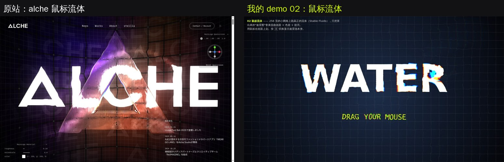

activetheory 原站（鼠标划过，粒子被推开、白色小管子沿轨迹飞）：

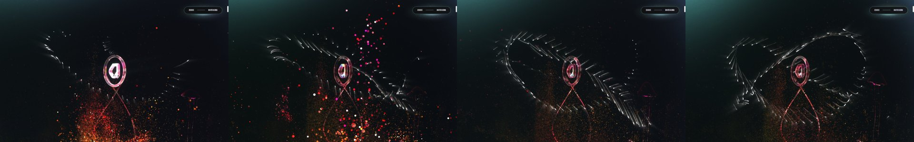

alche 原站（鼠标划过，LED 墙和 Logo 被搅动）：

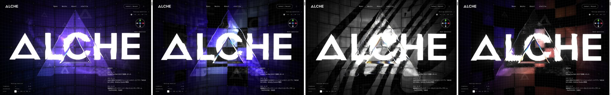

我的 demo 02：

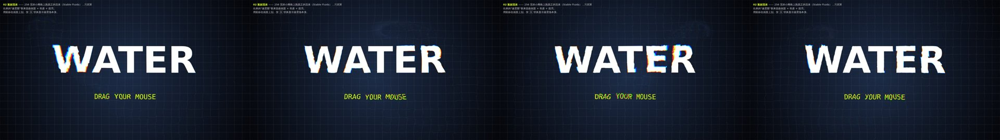

**原理：**
1. 在一张**很小的网格**上（256 宽）跑真正的流体模拟（Stable Fluids 算法）。每帧 7 步，全在 shader 里算：
   1. **注入：** 把鼠标这一帧的移动写进速度场（一个高斯斑）。
   2. **旋度：** 找出哪里在打转。
   3. **涡度增强：** 把打转放大，让流体有漩涡。
   4. **散度：** 计算每个格子流进和流出的差。
   5. **压力迭代：** 4–8 次。
   6. **减压力梯度：** 这一步让它像水而不是烟。
   7. **平流：** 速度场沿着自己流动，并慢慢衰减。
2. **结果只当数据用：** 流体本身不画出来，只输出一张"速度图"。
3. **最后一个 pass：**
   - 用速度图推歪画面：`uv -= v * 0.00012`。
   - R/G/B 各推不同距离，形成色差。
   - 流过的地方稍微提亮。

**两个站的参数：**

| 参数 | alche | activetheory | demo |
|---|---|---|---|
| 网格宽度 | 256 | 256 | 256 |
| 压力迭代次数 | 4 | 5 | 8 |
| 涡度 curl | 0.02（它的单位不同） | 30 | 20 |
| 速度衰减 | 0.99 | 0.98 | 0.98 |

**速度图可以给所有东西用：**
- alche 用它点亮 LED 格子的侧面、弯曲网格线。
- activetheory 用它推开 100 万个粒子。

**手机上：** alche 在手机上直接关掉流体。你也可以这样做。

**更简单的替代方案（做不出来时先用这个）：** 一张鼠标轨迹纹理。每帧把上一帧乘 0.95（慢慢变淡），再在鼠标位置画一个圆点，最后用它去推歪画面。没有漩涡，但有 70% 的效果。

---

## 3. 液态彩虹薄膜 → 铺满全屏（alche Vision 段）

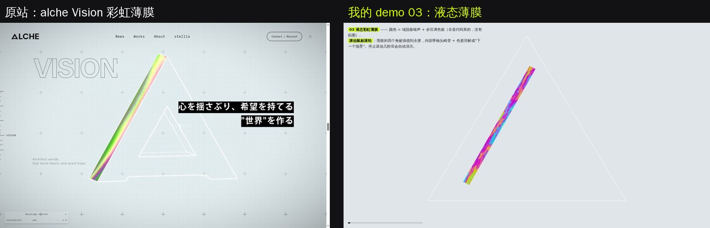

原站过程（彩虹条 → 铺满全屏的液态金属 → 下一段）：

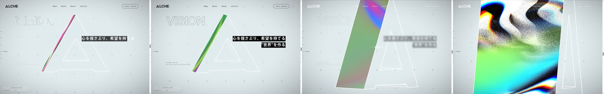

我的 demo 03（细条 → 长大 → 溶解成下一个场景 → 变干净）：

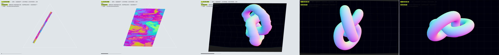

**原理：**
1. **颜色：域扭曲噪声。** 用噪声的结果去扭噪声的坐标，扭两次，就会出现液体被拉丝的形状：`f = fbm(p + 3*fbm(p + 3*fbm(p)))`。
2. **彩虹色：余弦调色板。** 一行代码：`0.5 + 0.5*cos(6.283*(t + vec3(0, .33, .67)))`，把噪声值映射成镭射色。
3. **铺满全屏：** 这块屏幕只是一个四边形。顶点 shader 里算好两套位置，一套是"细长斜条"，一套是"全屏"，按滚动进度 `mix` 过去：
   ```glsl
   gl_Position = vec4(mix(stripPos, fullScreenPos, progress), 0., 1.);
   ```
4. **溶解到下一个场景：**
   - 下一个场景先渲到一张图（RT）。
   - 用噪声做溶解门槛，一块一块地"化开"，不是整体淡入。
   - 同时带镜头畸变和色差，进度越接近 1，画面越干净。

---

## 4. 焦散光纹（activetheory CleanRoom 天花板）

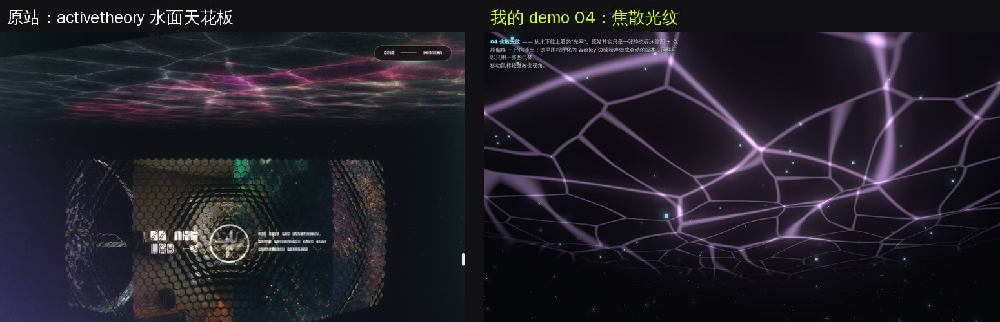

我的 demo 04：

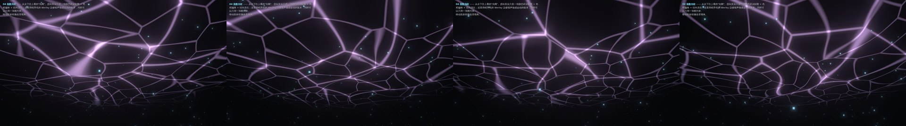

**原站做法（很偷懒，但有效）：**
- 一张**静态的碎冰底色图**放大铺在天花板上。
- 按离中心的距离偏移色相，径向淡出。
- 再叠 30% 的视频。
- 它不会动，但因为镜头在动，看起来像水面。

**demo 做法（会动的版本）：**
- 用 Worley 噪声（细胞噪声）：**两个细胞交界的地方**就是一条亮线。
- 让细胞中心慢慢游动，光网就会流动。
- 两层不同大小的叠加，交叉处最亮，像真的焦散。
- 再用一点噪声把线扭弯。

```glsl
vec2 w = worley(p, t);                       // w.x = 最近点距离，w.y = 第二近
float line = smoothstep(0.05, 0.0, w.y - w.x);   // 交界线
```

也可以照原站那样只用一张图：找一张"焦散"或"碎冰"纹理，两层以不同速度滚动后相乘，效果也很好。

---

## 5. 粉色"液态光带"（activetheory 首页）

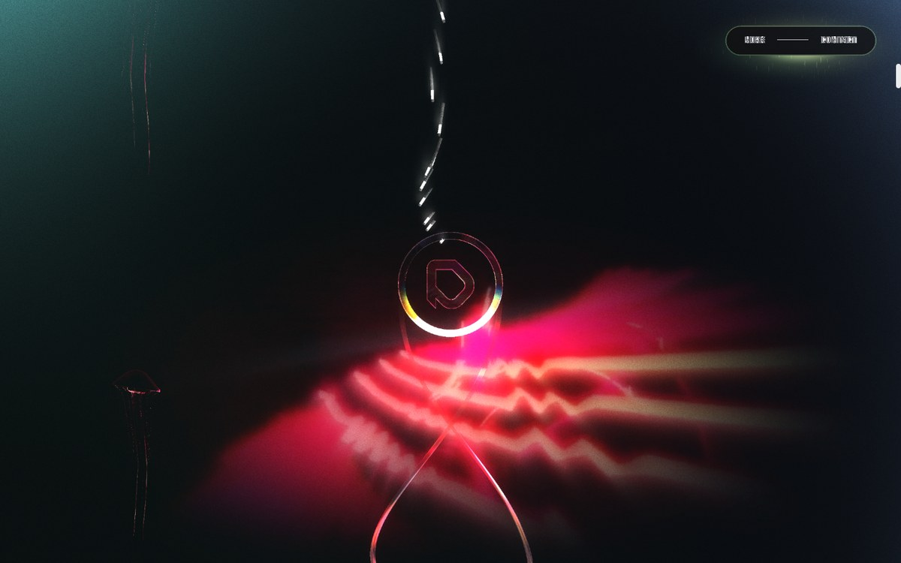

**原理：**
- 这不是模拟，是**一段预先做好的视频**（`reel.mp4`），贴在一块很大的平面上。
- 顶点 shader 把平面两边往后弯：`pos.z -= (smoothstep(1., 0., abs(uv.x - .5)) - .5) * 20.`。
- 片元里做径向淡出。
- 它同时被画进"折射"和"体积光"两张图，所以前面的玻璃 Logo 会折射它，它还会拖出光束。

**你要做的话：**
- 用 After Effects、Blender 或 TouchDesigner 做一段 10–20 秒的抽象流体循环视频。
- 用 `THREE.VideoTexture` 贴到一块弯曲的平面上，径向淡出，再加 Bloom。

```js
const video = Object.assign(document.createElement('video'), { src: 'flow.mp4', loop: true, muted: true, playsInline: true });
video.play();
const tex = new THREE.VideoTexture(video);
const mat = new THREE.ShaderMaterial({
  uniforms: { tMap: { value: tex } }, transparent: true, blending: THREE.AdditiveBlending, depthWrite: false,
  vertexShader: `varying vec2 vUv; void main(){ vUv = uv; vec3 p = position;
    p.z -= (smoothstep(1., 0., abs(uv.x - .5)) - .5) * 20.; gl_Position = projectionMatrix * modelViewMatrix * vec4(p, 1.); }`,
  fragmentShader: `uniform sampler2D tMap; varying vec2 vUv; void main(){
    vec3 c = texture2D(tMap, vUv).rgb * smoothstep(.5, .05, length(vUv - .5)); gl_FragColor = vec4(c, 1.); }`,
});
scene.add(new THREE.Mesh(new THREE.PlaneGeometry(30, 12, 100, 1), mat));
```

---

## 6. 作品切换像水一样滑过（alche 作品区）

在 alche 那份报告的 §4 和 `shader_1_ledwall.png` 里。一句话概括：
- 两张作品图按横向进度做软边混合：`smoothstep(x-.03, x+.03, progress)`。
- 每个 LED 格子的采样坐标随机错开一点。
- 效果像液体流过，同时带故障感。

---

## 学习顺序建议

1. **先玩 demo 02（鼠标流体）。** 把 `P` 里的参数一个个改大改小，看效果怎么变；按 D 看速度场。它是两个站共用的"灵魂"效果。
2. **再做 demo 01（镜面水）。** 把你自己的模型放到水面上方。
3. **demo 03** 学的是"顶点插值 + 噪声溶解"的转场思路，不只能用于水。
4. **demo 04 和光带视频**是加分项。

**把 demo 搬进你自己项目的方法：**
- 每个 demo 都是单个 HTML 文件，`<script type="module">` 里的代码可以直接复制进你的 three.js 项目。
- 把"被扭曲的画面"（demo 02 的 `tScene`、demo 03 的 `nextRT`）换成**你自己场景渲染出来的 RenderTarget** 就行。

## 文件

```
water-guide/
├─ 水效果做法.md          ← 本文件
├─ demos/                 可以直接用浏览器打开（需要联网加载 three.js）
│  ├─ 01_mirror_water.html   拖动鼠标转视角
│  ├─ 02_mouse_fluid.html    鼠标划动；按 D 看速度场
│  ├─ 03_liquid_film.html    滚轮控制展开；不动会自动演示
│  └─ 04_caustics.html       移动鼠标微调视角
├─ videos/                demo 实际运行的录屏
└─ screenshots/           原站参考图（ref_*）、demo 截图（demo_*）、并排对比（compare_*）
```

> 原站截图只作学习参考。demo 全部是自己写的代码，没有使用两个站的任何素材，可以直接用在你的项目里。
